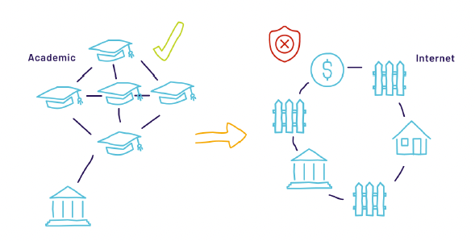
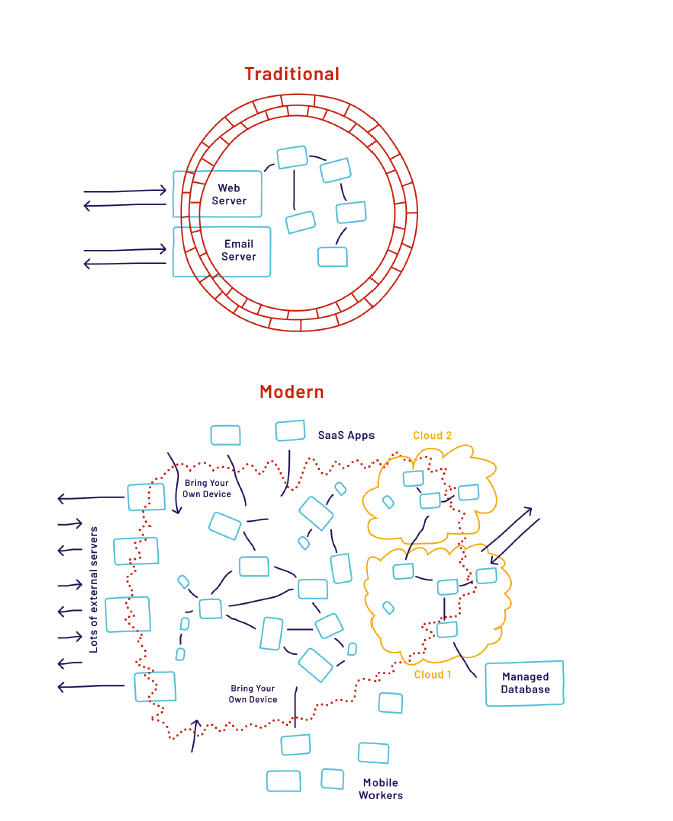
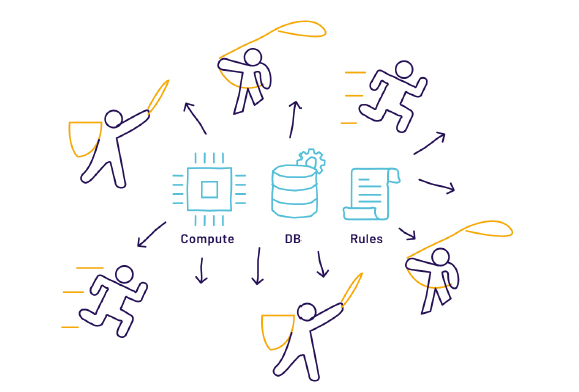
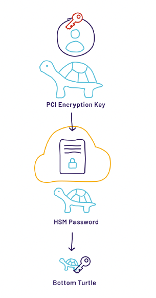
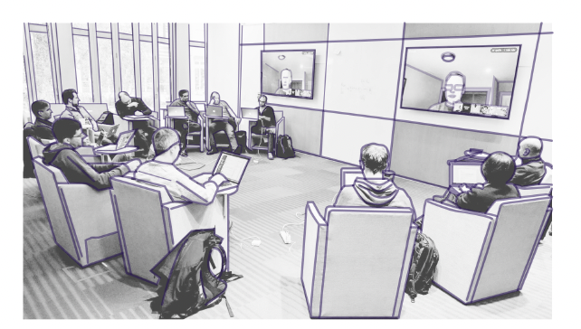

# Capítulo 1 — História e Motivação para o SPIFFE

<em>Este capítulo contextualiza a motivação para o surgimento do SPIFFE e a forma como foi criado.</em>

## Motivação e Necessidade Avassaladora

Não chegamos onde estamos hoje sem antes passar por algumas dores do crescimento.

Quando a internet se tornou amplamente disponível em 1981, havia apenas 213 servidores distintos e a segurança mal era considerada uma preocupação \[1\]. Com o aumento do número de computadores interconectados, a segurança continuou sendo um ponto fraco: vulnerabilidades facilmente exploráveis levaram a ataques em massa, como o Morris Worm \[2\], que comprometeu a maioria dos servidores Unix na internet em 1988, e o worm Slammer \[3\], que se espalhou por centenas de milhares de servidores Windows em 2003.

Com o passar das décadas, os padrões convencionais de defesa de perímetro existentes não são adequados às arquiteturas computacionais nem aos limites em constante evolução da tecnologia moderna. Soluções pontuais e tecnologias foram se empilhando umas sobre as outras para cobrir as rachaduras crescentes em que os conceitos básicos de segurança de rede não acompanharam as tendências de modernização.

Então, por que o modelo de perímetro ainda é tão prevalente e o que precisamos fazer para corrigir suas deficiências?

Ao longo dos anos, observamos três tendências consideráveis que evidenciam os padrões convencionais de perímetro como obstáculos ao futuro das redes:

- O software não roda mais em servidores individuais controlados pela organização. Desde 2015, novos softwares são tipicamente construídos como uma coleção de microsserviços que podem ser escalados individualmente ou migrados para provedores de hospedagem na nuvem. Se você não consegue traçar uma linha precisa ao redor dos serviços que precisam ser protegidos, é impossível construir uma barreira ao redor deles.

\[1\] - <https://tools.ietf.org/html/rfc1296>\
\[2\] - <https://spaf.cerias.purdue.edu/tech-reps/823.pdf>

\[3\] - <https://www.caida.org/publications/papers/2003/sapphire/sapphire.html>

\[4\] - <https://nvd.nist.gov/vuln/search/statistics>

Você não pode confiar em tudo, nem mesmo no software da própria empresa. Antes, achávamos que as vulnerabilidades de software eram como moscas que poderíamos enxotar individualmente; agora parecem mais um enxame de abelhas. Em média, o National Vulnerability Database \[4\] reporta mais de 15.000 novas vulnerabilidades de software por ano. Se você escreve ou compra um software, ele provavelmente terá vulnerabilidades em algum momento.

- Você também não pode confiar plenamente nas pessoas — elas cometem erros, ficam insatisfeitas e têm acesso total aos serviços internos. Primeiro, dezenas de milhares de ataques bem-sucedidos anualmente baseiam-se em phishing ou no roubo de credenciais válidas de funcionários. Segundo, com o advento das aplicações em nuvem e das equipes de trabalho móveis, os funcionários podem acessar recursos legitimamente a partir de diversas redes. Construir uma barreira não faz mais sentido quando as pessoas precisam cruzá-la constantemente apenas para realizar seu trabalho.

Como você pode ver, a segurança de perímetro não é mais uma solução realista para as organizações de hoje. Quando rigorosamente aplicada, ela impede as organizações de usar microsserviços e a nuvem; quando é frouxa, permite a entrada de invasores. Em 2004, o Jericho Fórum reconheceu a necessidade de um sucessor do perímetro de segurança. Dez anos depois, em 2014, o Google publicou um estudo de caso sobre a arquitetura de segurança BeyondCorp (<https://research.google/pubs/pub43231/>). No entanto, nenhuma das duas abordagens alcançou adoção generalizada.

**A Rede Costumava Ser Amigável, Enquanto Ficávamos Entre Nós**

O caso de uso original da internet era focado na academia, com a intenção de compartilhar informações, não de impedir o acesso. À medida que outras organizações começaram a usar sistemas computacionais em rede para casos de uso sensíveis aos negócios, dependiam fortemente de perímetros físicos e attestations físicas para garantir que os indivíduos que acessavam a rede estivessem autorizados a fazê-lo. O conceito de ameaça interna confiável ainda não existia. À medida que as redes evoluíram de casos de uso acadêmicos para casos de uso orientados a negócios e o software evoluiu de monólitos para microsserviços, a segurança tornou-se uma barreira ao crescimento.

*Figura 1.1: Evolução das redes, dos confins do campus universitário à rede global de redes.*

Inicialmente, os métodos convencionais de proteção contra acesso físico a computadores, com paredes e guardas, foram emulados por meio de firewalls, segmentação de rede, espaço de endereços privados e ACLs. Isso fazia sentido na época, especialmente considerando o número limitado de pontos que precisavam de controle.

Com a proliferação das redes e o aumento dos pontos de acesso para usuários e parceiros de negócios, a verificação de identidade física (com paredes e guardas) foi virtualizada por meio da troca segura e do gerenciamento de chaves, credenciais e tokens — tudo o que se tornou cada vez mais problemático à medida que a tecnologia e as necessidades evoluíram.

## Adotando a nuvem pública

A migração das operações convencionais on-premises e de data center para a nuvem pública amplificou os problemas existentes. Com a nova liberdade de criar recursos computacionais na nuvem, as equipes de desenvolvimento e de operações dentro das organizações passaram a colaborar mais de perto, formando novas equipes em torno do conceito de DevOps, focado na implantação e no gerenciamento automatizados de software.

O ambiente dinâmico e em rápida evolução da nuvem pública permitiu que as equipes implantassem com muito mais frequência — passando de uma implantação a cada poucos meses para muitas por dia. A capacidade de provisionar e desprovisionar recursos sob demanda possibilitou a criação, em alta velocidade, de conjuntos de serviços especializados, focados e independentemente implantáveis, com um escopo de responsabilidade menor — coloquialmente chamados de microsserviços. Isso, por sua vez, aumentou a necessidade de identificar e acessar serviços em diferentes clusters de implantação.

Esse ambiente altamente dinâmico e elástico rompeu os conceitos aceitos de segurança de perímetro, exigindo uma melhor interação no nível de serviço, independentemente da rede subjacente. A aplicação convencional de limites usava IPs e portas para autenticação, autorização e auditabilidade — o que, sob os paradigmas de computação em nuvem, não se mapeava mais claramente aos workloads.

Padrões impulsionados pela adoção da nuvem pública, como API gateways e load balancers gerenciados para workloads com múltiplos serviços, reforçaram a necessidade de identidades independentes da topologia de rede e do caminho. Proteger a integridade dessas comunicações serviço a serviço tornou-se cada vez mais importante, especialmente para equipes que precisavam de uniformidade entre os workloads.

*Figura 1.2: À medida que as redes de uma organização aumentam em complexidade — com nuvem, SaaS e trabalhadores móveis —, construir e manter a segurança de perímetro torna-se cada vez mais insustentável.*

## Houston, temos um problema

À medida que as organizações adotam novas tecnologias — como containers, microsserviços, computação em nuvem e funções serverless —, uma tendência se torna clara: há um número maior de partes menores de software. Isso tanto aumenta o número de vulnerabilidades potenciais que um invasor pode explorar quanto torna o gerenciamento das defesas de perímetro cada vez mais impraticável.

A pressão para fazer mais e mais rápido significa que cada vez mais componentes são implantados em infraestruturas automatizadas, frequentemente em detrimento da segurança. Contornar processos manuais — como tickets de regras de firewall ou mudanças em security groups — não é incomum. Nesse novo mundo moderno, os controles de acesso orientados à rede tornam-se rapidamente desatualizados e exigem manutenção constante, independentemente do ambiente de implantação.

*Figura 1.3: Os ambientes de infraestrutura e as demandas operacionais associadas a eles tornam-se cada vez mais complexos com a proliferação de novas inovações tecnológicas.*

O gerenciamento dessas regras e exceções pode ser automatizado; no entanto, precisa ocorrer rapidamente, o que pode ser desafiador em infraestruturas maiores. Além disso, a topologia de rede — como o Network Address Translation (NAT) — pode tornar isso difícil e sujeito a falhas. À medida que a infraestrutura se torna maior e mais dinâmica, sistemas com humanos no loop simplesmente não escalam. Afinal, ninguém quer pagar por uma equipe que fique mexendo nas regras de firewall o dia todo, sem conseguir acompanhar o ritmo.

A dependência de detalhes específicos de localização — como nomes de servidores, nomes de DNS e detalhes de interfaces de rede — apresenta várias deficiências em um mundo de aplicações dinamicamente agendadas e elasticamente escaladas. Embora os construtos de rede sejam amplamente utilizados, o modelo é um análogo ineficaz de identidade de software. Avançando para a camada de aplicação, o uso de combinações convencionais de nome de usuário e senha, ou de outras credenciais fixas, confere algum grau de identidade, mas trata mais de autorização do que de autenticação.

Integrar a segurança e introduzir feedbacks mais cedo nos ciclos de vida de desenvolvimento de software oferece aos desenvolvedores maior controle operacional sobre os mecanismos pelos quais seus workloads podem ser identificados e podem trocar informações. Com essa mudança, as decisões de política de autorização podem ser delegadas aos responsáveis individuais de serviços ou produtos — aqueles mais adequados para tomar decisões relevantes para o componente em questão.

## Reimaginando o Controle de Acesso

A lista cada vez maior de problemas enfrentados pelas organizações — antes da adoção da nuvem pública e, de forma ainda mais dolorosa, como resultado dessa adoção — reforçou a ideia de que os perímetros convencionais são insuficientes e de que soluções melhores precisam existir. Em última análise, a desintegração significou que as organizações precisavam descobrir como identificar seu software e habilitar o controle de acesso serviço a serviço.

### Segredos como solução

Segredos compartilhados, como senhas e chaves de API, oferecem uma alternativa simples para o controle de acesso em sistemas distribuídos. Mas essa solução traz muitos problemas. Senhas e API keys podem ser facilmente comprometidas (tente pesquisar no GitHub por termos como "client_secret" e veja o que acontece). Em organizações de grande porte, pode ser difícil fazer a rotação de segredos em resposta a um comprometimento, pois cada serviço precisa ser informado sobre a mudança de forma coordenada — e deixar um serviço de fora pode causar indisponibilidade.

Ferramentas e repositórios de segredos, como um Vault, foram desenvolvidos para mitigar as dificuldades do gerenciamento e do ciclo de vida desses segredos. E embora muitas outras ferramentas existam para tentar resolver esse problema, elas tendem a oferecer soluções ainda mais limitadas com resultados medíocres. Com todas essas opções, sempre retornamos ao mesmo problema: como os workloads devem obter acesso a esse repositório de segredos? Alguma API key, senha ou outro segredo ainda será necessário.

Todas essas soluções acabam com um problema de "tartarugas até o fundo":

- Habilitar o controle de acesso a um recurso — como um banco de dados ou um serviço — requer um segredo, como uma chave de API ou uma senha.

- Essa chave ou senha precisa ser protegida; por exemplo, você poderia protegê-la com criptografia. Mas então você ainda precisa se preocupar com uma chave de descriptografia.

- Essa chave de descriptografia poderia ser armazenada em um repositório de segredos, mas você ainda precisaria de alguma credencial — como uma senha ou uma chave de API — para acessá-lo.

- Em última análise, proteger o acesso a um segredo resulta em um novo segredo que você precisa proteger.

Para quebrar esse ciclo, precisamos encontrar uma tartaruga do fundo — ou seja, algum segredo que forneça acesso ao restante dos segredos de que precisamos para autenticação e controle de acesso. Uma opção é provisionar manualmente segredos nos serviços durante a implantação. No entanto, isso não escala bem em ecossistemas altamente dinâmicos. À medida que as organizações migram para a computação em nuvem, com pipelines de implantação rápidos e recursos escaláveis automaticamente, torna-se inviável provisionar segredos manualmente à medida que novas unidades de computação são criadas. E quando um segredo é comprometido, invalidar a credencial antiga pode representar o risco de derrubar todo o sistema.

Embutir um segredo na aplicação para que ele não precise ser provisionado manualmente tem implicações de segurança ainda piores. Segredos embutidos no código-fonte tendem a aparecer em repositórios públicos. Embora o segredo pudesse ser embutido em imagens de máquina durante o build, essas imagens ainda podem ser acidentalmente enviadas para um repositório público de imagens ou extraídas do repositório interno como segunda etapa de uma kill chain.

Queremos uma solução que não inclua segredos de longa duração (que podem ser facilmente comprometidos e são difíceis de rotacionar) e que não exija o provisionamento manual de segredos para workloads. Para alcançar isso — seja em hardware ou no provedor de nuvem —, deve haver uma raiz de confiança (root of trust) sobre a qual se construa uma solução automatizada centrada na identidade de software (workload). Essa identidade, então, serve de base para todas as interações que exigem autenticação e autorização. Para evitar criar outra tartaruga do fundo, o workload precisa ser capaz de obter essa identidade sem segredo nem qualquer outra credencial.

*Figura 1.4: Não mais 'tartarugas até o fundo' — com uma sólida 'fundação' de identidade.*

### Passos em direção ao futuro

Múltiplas iniciativas para resolver o problema de identidade de software foram desenvolvidas desde 2010. O Low Overhead Authentication Service (LOAS) do Google — posteriormente denominado Application Layer Transport Security (ALTS) \[1\] — estabeleceu um novo formato de identidade e um protocolo de rede para receber a identidade de software do ambiente de execução e aplicá-la a todas as comunicações de rede. Esse modelo foi chamado de "dial tone security" (segurança por discagem).

Em outro exemplo, a solução desenvolvida internamente pela Netflix — com o codinome Metatron \[2\] — estabelece identidade de software instância a instância, aproveitando as APIs de nuvem para atestar a imagem de máquina em execução nas instâncias e a integração com CI/CD para estabelecer vínculos criptográficos entre imagens de máquina e identidade de código. Essa identidade de software assume a forma de certificados X.509 para realizar autenticação mútua na comunicação de serviço a serviço, incluindo o acesso ao serviço de segredos desenvolvido como parte dessa solução, que habilita o gerenciamento de segredos sobre essa fundação.

Diversos outros esforços na indústria — incluindo os de empresas como o Facebook \[3\] — comprovam a necessidade de um sistema assim e ressaltam a dificuldade de sua implementação.

### A Visão de um Secure Production Identity Framework For Everyone (SPIFFE)

Antes que uma solução generalizada pudesse existir, era necessário estabelecer princípios a serem codificados em um framework. Refletindo sobre sua experiência com diversas tecnologias em empregos anteriores que facilitavam a vida das equipes de engenharia, o engenheiro-fundador do Kubernetes, Joe Beda, lançou, em 2016, um chamado à ação para criar uma solução de identidade para produção — uma solução construída especificamente para resolver um problema comum, que pudesse ser aproveitada por muitos tipos diferentes de sistemas, superando as soluções intermediárias de fazer PKI de forma difícil. Esse enorme esforço colaborativo entre empresas para desenvolver um novo padrão de identidade de serviços baseado em PKI deu origem ao SPIFFE.

O artigo de Beda foi apresentado no GlueCon em 2016 e expôs um problema difícil com os seguintes parâmetros:

- Resolver o Secret Zero, aproveitando a introspecção baseada no kernel, para obter informações sobre o chamador sem que ele precise apresentar credenciais.

- Usar X.509, pois a maioria dos softwares já é compatível com esse padrão.

- Efetivamente dissociar o conceito de identidade dos localizadores de rede.

\[1\] - https://cloud.google.com/security/encryption-in-transit/application-layertransport-security/

\[2\] - https://www.usenix.org/sites/default/files/conference/protectedfiles/enigma_haken_slides.pdf

\[3\] - https://engineering.fb.com/security/service-encryption/

Após a introdução do conceito SPIFFE, realizou-se uma reunião no campus da Netflix com especialistas em identidade de serviços para discutir o formato e a viabilidade da proposta original. Muitos dos participantes haviam implementado, continuado a aprimorar e resolvido novamente o problema de identidade de workloads, o que evidencia uma oportunidade de colaboração comunitária. Os participantes desejavam alcançar interoperabilidade entre si e com outras organizações. Esses especialistas perceberam que haviam implementado soluções semelhantes para resolver o mesmo problema e que poderiam trabalhar juntos para definir um padrão comum.

Os objetivos iniciais para resolver o problema de identidade de workloads foram: estabelecer uma especificação aberta e uma implementação de produção correspondente. O framework precisava oferecer interoperabilidade entre diferentes implementações e softwares prontos para uso (off-the-shelf), estabelecendo, em seu núcleo, uma raiz de confiança em um ambiente não confiável — exorcizando a confiança implícita. E, finalmente, migrar de uma identidade centrada na rede para alcançar maior flexibilidade e melhores propriedades de escalabilidade.

*Figura 1.5: Onde tudo começou: a reunião de 2016 na Netflix, na qual especialistas em segurança começaram a esboçar os conceitos do SPIFFE.*
