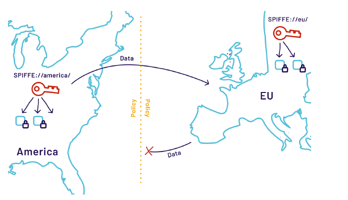

# Capítulo 2 — Benefícios

*Os benefícios de implantar SPIFFE e SPIRE em sua infraestrutura, sob as perspectivas de negócio e tecnologia.*

## Para Todos, em Todo Lugar

SPIFFE e SPIRE têm como objetivo fortalecer a identificação padronizada de componentes de software, aproveitável em sistemas distribuídos por qualquer pessoa, em qualquer lugar. O cenário tecnológico de infraestrutura moderno é intrincado. Os ambientes tornam-se cada vez mais heterogêneos, com combinações de investimentos em hardware e em software. Manter a segurança do software padronizando como os sistemas definem, atestam e mantêm a identidade do software — independentemente de onde ou por quem é implantado — confere inúmeros benefícios.

<strong>💼 Para Líderes de Negócio</strong>

SPIFFE e SPIRE podem reduzir significativamente os custos associados ao overhead de gerenciar e emitir documentos de identidade criptográfica (como certificados X.509), além de acelerar o desenvolvimento e a implantação ao eliminar a necessidade de os desenvolvedores compreenderem as tecnologias de identidade e autenticação exigidas para proteger a comunicação serviço a serviço.

<strong>🔌 Para Provedores de Serviço e Fornecedores de Software</strong>

SPIFFE e SPIRE resolvem um problema crítico de identidade comum ao interconectar diversas soluções em um produto. O SPIFFE pode ser usado como base para os recursos TLS de um produto e para o gerenciamento/autenticação de usuários de uma só vez. Em outro exemplo, o SPIFFE pode substituir a necessidade de gerenciar e emitir API tokens para acesso à plataforma, trazendo rotação automática e eliminando o ônus de armazenamento e gerenciamento desses tokens.

<strong>🛡️ Para Profissionais de Segurança</strong>

SPIFFE e SPIRE entregam autenticação mútua em ambientes não confiáveis sem a necessidade de trocar segredos. Limites de segurança e administrativos podem ser facilmente delineados, e a comunicação pode ocorrer entre eles quando e onde a política permitir — além de resolver o problema de root of trust e conformidade regulatória.

<strong>⚙️ Para Desenvolvedores, Ops e DevOps</strong>

SPIFFE e SPIRE são compatíveis com inúmeras ferramentas ao longo do ciclo de vida de desenvolvimento de software e entregam abstração do gerenciamento de identidade com interoperabilidade para workloads e aplicações cloud native. Desenvolvedores podem focar diretamente na lógica de negócio, sem se preocupar com certificados, chaves privadas e JSON Web Tokens (JWTs).

## Para Líderes de Negócio

### Organizações modernas têm necessidades modernas

No ambiente de negócios atual, entregar rapidamente experiências inovadoras ao cliente por meio de aplicações e serviços diferenciados é essencial para a vantagem competitiva. Como resultado, as organizações testemunham uma mudança na forma como as aplicações e os serviços são arquitetados, construídos e implantados. Novas tecnologias, como nuvem e containers, ajudam as organizações a lançar produtos mais rapidamente e em escala. Os serviços precisam ser desenvolvidos em alta velocidade e implantados em uma ampla variedade de plataformas. À medida que o desenvolvimento acelera, esses sistemas tornam-se cada vez mais interdependentes e interconectados para oferecer uma experiência consistente ao cliente.

As organizações podem ser impedidas de alcançar alta velocidade e conquistar participação de mercado por razões como a conformidade regulatória, a escassez de expertise e os desafios de interoperabilidade entre equipes, organizações e soluções existentes.

### O impacto da interoperabilidade

À medida que os sistemas evoluem, a necessidade de interoperabilidade cresce indefinidamente. Equipes desconexas constroem serviços isolados e desconhecidos entre si, embora eventualmente precisem tornar-se conscientes uns dos outros. Aquisições ocorrem, exigindo que novos sistemas, ou até mesmo nunca vistos, sejam integrados aos sistemas existentes. Relacionamentos de negócio são estabelecidos, o que demanda novos canais de comunicação com serviços que podem residir nas camadas mais profundas da stack. Todos esses desafios giram em torno da questão: "Como conecto todos esses serviços de forma segura, cada um com suas próprias propriedades e histórico únicos?"

A integração tecnológica resultante de convergências organizacionais pode ser um desafio quando diferentes stacks tecnológicas precisam se integrar e interoperar. Alinhar-se em um padrão comum e aceito pela indústria para comunicação sistema a sistema com identidade e autenticação simplifica os aspectos técnicos da interoperabilidade e integração plena entre múltiplas stacks.

O SPIFFE traz uma compreensão compartilhada sobre o que constitui a identidade de software. Ao aproveitar ainda mais o SPIFFE Federation, componentes em sistemas distintos de diferentes organizações ou equipes podem estabelecer confiança para se comunicarem de forma segura, sem o overhead adicional de construções como túneis VPN, certificados avulsos ou credenciais compartilhadas.

### Conformidade e auditabilidade

A auditabilidade na implementação SPIRE garante que identidades que executam ações não podem ser repudiadas, graças à aplicação da autenticação mútua no ambiente. Além disso, os documentos de identidade emitidos pelo SPIFFE/SPIRE habilitam o uso pervasivo de TLS com autenticação mútua, resolvendo efetivamente um dos desafios mais difíceis associados a projetos dessa natureza. Benefícios adicionais do TLS com autenticação mútua incluem a criptografia nativa dos dados em trânsito entre serviços, protegendo não apenas a integridade das comunicações, mas também a confidencialidade de dados sensíveis ou proprietários.

*Figura 2.1: Atendendo a objetivos de conformidade e regulatórios de forma integrada ao SPIFFE.*

Outro requisito comum de conformidade é imposto pelo Regulamento Geral de Proteção de Dados (GDPR), que exige que os dados da União Europeia (UE) residam inteiramente na UE, sem transitar ou ser processados por entidades fora de sua jurisdição. Com múltiplas raízes de confiança, organizações globais podem garantir que entidades da UE se comuniquem apenas com outras entidades da UE.

### \
Equipe de especialistas

Garantir que as equipes de desenvolvimento, segurança e operações estejam equipadas com o conhecimento e a experiência certos para lidar adequadamente com sistemas sensíveis à segurança continua sendo um desafio significativo. As empresas precisam ser capazes de contratar desenvolvedores com conjuntos de habilidades baseados em padrões, reduzindo o tempo de onboarding e melhorando o time-to-market com menor risco.

Resolver o problema de entregar identidade criptográfica a cada instância de software de forma automatizada — e habilitar a rotação de credenciais a partir da raiz — representa um grande desafio. Para as equipes de segurança e operações, a expertise necessária para implementar tais sistemas é escassa. Manter operações do dia a dia sem depender do conhecimento comunitário ou da indústria agrava o problema, levando a indisponibilidades e a conflitos entre equipes.

Não se pode esperar razoavelmente que desenvolvedores conheçam ou se tornem especialistas em questões práticas de segurança, especialmente no que diz respeito à identidade de serviços em ambientes organizacionais. Além disso, o pool de profissionais de segurança com profundidade de conhecimento em desenvolvimento, operações e execução de cargas de trabalho é limitado. Aproveitar um padrão e uma especificação abertos para resolver problemas críticos de identidade permite que indivíduos sem experiência prévia ampliem seu conhecimento por meio de uma comunidade bem apoiada e em crescimento de usuários e profissionais de SPIFFE/SPIRE.

### Economia de custos

A adoção do SPIFFE/SPIRE possibilita economia de custos em várias frentes, incluindo a redução do lock-in na nuvem ou em plataforma, a melhoria da produtividade dos desenvolvedores e a menor dependência de expertise especializada, entre outros.

Ao abstrair as interfaces de identidade dos provedores de nuvem em um conjunto de APIs comuns bem definidas, construídas sobre padrões abertos, o SPIFFE reduz significativamente o ônus de desenvolver e manter aplicações conscientes da nuvem. Como o SPIFFE é agnóstico de plataforma, pode ser implantado praticamente em qualquer lugar. Esse diferencial economiza tempo e dinheiro quando uma mudança de tecnologia de plataforma é necessária e pode até fortalecer as posições de negociação com provedores de plataforma existentes. Historicamente, os serviços de gerenciamento de identidade e acesso são o comando e controle de todas as implantações de uma organização — os provedores de serviços de nuvem sabem disso e exploram essa restrição como o principal mecanismo de lock-in.

Há também economias significativas na produtividade dos desenvolvedores. Dois aspectos importantes do SPIFFE/SPIRE desbloqueiam essas economias: a emissão e o gerenciamento totalmente automatizados de identidade criptográfica e de seu ciclo de vida associado, e a uniformidade e o descarregamento da autenticação e da criptografia de comunicação, serviço a serviço. Ao remover os processos manuais associados ao primeiro aspecto, e o tempo gasto em pesquisa e tentativa/erro no segundo, os desenvolvedores podem focar melhor no que importa para eles: a lógica de negócio.

|  |  |
|----|----|
| **Impulsionando a Produtividade dos Desenvolvedores — Métrica** | **Valor** |
| Tempo médio gasto por dev para obter credenciais e configurar protocolos de autenticação/confidencialidade por componente de aplicação (horas) | 2 |
| Redução no tempo gasto pelo dev para obter credenciais por componente | 95% |
| Tempo médio gasto pelo dev para aprender e implementar controles de API gateways, secret stores, etc. (horas) | 1 |
| Redução no tempo dos devs para aprender e implementar controles de API gateways, secret stores, etc. | 75% |
| Número de novos componentes de aplicação desenvolvidos no ano | 200 |
| Horas economizadas projetadas com maior produtividade dos devs | 530 |

Como vimos historicamente, organizações do Fortune 50 que empregam engenheiros altamente qualificados e especializados levaram décadas para resolver esse problema de identidade. Adicionar SPIFFE/SPIRE ao catálogo de soluções cloud native de uma organização permite construir sobre anos de talento hiper especializado em segurança e desenvolvimento sem o custo correspondente.

Com uma comunidade robusta que suporta implantações de algumas dezenas a centenas de milhares de nós, a experiência do SPIFFE/SPIRE, ao operar em ambientes complexos e de grande escala, pode atender às necessidades da organização.

## Para Provedores de Serviço e Fornecedores de Software

Reduzir o ônus imposto ao cliente durante o uso de um produto é sempre o objetivo número um de qualquer bom product manager. É importante compreender as implicações práticas de funcionalidades que parecem inofensivas à primeira vista. Por exemplo, se um produto de banco de dados precisa suportar TLS por exigência de conformidade do cliente, pode parecer simples adicionar alguns parâmetros configuráveis ao produto e considerar o trabalho encerrado.

Infelizmente, isso transfere desafios significativos ao cliente. Desafios semelhantes surgem até mesmo no gerenciamento aparentemente simples de usuários. Considere as seguintes dores do cliente que ambas as funcionalidades comuns introduzem por padrão:

- Quem gera os certificados e as senhas, e como?

- Como eles são distribuídos com segurança para as aplicações que precisam deles?

- Como o acesso a chaves privadas e senhas é restrito?

- Como esses segredos são armazenados para que não vazem para os backups?

- O que acontece quando um certificado expira ou quando uma senha precisa ser trocada? O processo é disruptivo?

- Quantas dessas tarefas necessariamente envolvem um operador humano?

> 

Todas essas perguntas precisam ser respondidas antes que essas funcionalidades sejam viáveis do ponto de vista do cliente. Frequentemente, as soluções inventadas ou implementadas pelo cliente são operacionalmente dolorosas.

Esses ônus para o cliente são muito reais. Algumas organizações têm equipes inteiras dedicadas a gerenciá-los. Ao simplesmente suportar SPIFFE, todas as preocupações acima são aliviadas. O produto pode se integrar à infraestrutura existente e obter suporte ao TLS gratuitamente. Além disso, a identidade do cliente (usuário) conferida pelo SPIFFE pode eliminar a necessidade de gerenciar diretamente as credenciais do usuário, como senhas.

### Gerenciamento de acesso à plataforma

Acessar um serviço ou plataforma — como um serviço SaaS — envolve desafios semelhantes. Em última análise, esses desafios se resumem à dificuldade inerente do gerenciamento de credenciais, especialmente quando a credencial é um segredo compartilhado.

Considere os tokens de API por um momento: o uso de tokens de API é comum entre provedores de SaaS para autenticar chamadores de API não humanos. Eles são, de fato, senhas e cada um deve ser cuidadosamente gerenciado pelo cliente. Todos os desafios listados anteriormente se aplicam aqui. Plataformas que suportam autenticação SPIFFE aliviam grandemente os ônus do cliente associados ao acesso à plataforma, resolvendo de uma só vez os problemas de armazenamento, emissão e ciclo de vida. Aproveitando o SPIFFE, o problema reduz-se simplesmente a conceder a um determinado workload os privilégios desejados.

## Para profissionais de segurança

A inovação técnica não pode ser um obstáculo a produtos seguros. As ferramentas e os controles de segurança precisam de integração fluida com produtos e métodos modernos que não comprometam a autonomia do desenvolvimento de software nem representem um ônus para o sucesso da organização. As organizações precisam de produtos de software fáceis de usar que ofereçam segurança adicional às ferramentas existentes.

O SPIRE não é a solução definitiva para todos os problemas de segurança. Ele não elimina a necessidade de práticas de segurança robustas e de defesa em profundidade ou de segurança em camadas. No entanto, aproveitar o SPIFFE/SPIRE para fornecer uma root of trust em redes não confiáveis permite que as organizações deem um passo significativo em direção a uma arquitetura zero trust como parte de uma estratégia de segurança abrangente.\
https://csrc.nist.gov/publications/detail/sp/800-207/final

### Segurança por padrão (Secure-by-default)

O SPIRE pode ajudar a mitigar diversas ameaças importantes do OWASP. (https://owasp.org/www-project-top-ten/ . Para reduzir a probabilidade de violação decorrente de comprometimento de credenciais, o SPIRE fornece uma identidade fortemente atestada para autenticação em toda a infraestrutura. A automação que mantém a promessa de garantia torna a plataforma segura por padrão, removendo um ônus adicional de configuração para as equipes de desenvolvimento.

Para organizações que buscam resolver os problemas de root of trust e de identidade em seus produtos ou serviços, o SPIFFE/SPIRE também atende às necessidades de segurança do cliente ao habilitar a autenticação mútua TLS pervasiva, garantindo comunicações seguras entre workloads, independentemente de onde estejam implantados. Além disso, como todo produto open source, a comunidade e os contribuidores por trás da base de código fornecem múltiplos pares de olhos para examinar o código antes e depois do merge — uma implementação da "Lei de Linus" (https://en.wikipedia.org/wiki/Linus%27s_law) que vai além do princípio de quatro olhos para garantir que possíveis bugs ou problemas de segurança conhecidos sejam detectados antes de chegarem à distribuição.

### Aplicação de políticas

As APIs do SPIRE fornecem um mecanismo para que as equipes de segurança apliquem políticas de autenticação consistentes entre plataformas e unidades de negócio de forma fácil de usar. Quando combinado com uma política bem definida, as interações entre serviços podem ser mantidas ao mínimo, garantindo que apenas workloads autorizados possam se comunicar entre si. Isso restringe a superfície de ataque potencial de uma entidade maliciosa e pode acionar alertas na regra de negação padrão do motor de política.

O SPIRE utiliza um poderoso motor de atestação multifatorial que opera em tempo real para determinar, com certeza, a emissão de identidades criptográficas. Ele também emite, distribui e renova automaticamente credenciais de curta duração para garantir que a arquitetura de identidade da organização reflita com precisão o estado operacional dos workloads.

### Zero trust

Adotar um modelo zero trust na arquitetura reduz o raio de impacto (blast radius) em caso de violação. A autenticação mútua e a revogação de confiança podem impedir que um servidor de aplicação front-end comprometido exfiltre dados de bancos de dados não relacionados que possam estar disponíveis na rede ou dentro de um cluster. Embora seja improvável em organizações com segurança de rede rigorosa, o SPIFFE/SPIRE certamente adiciona camadas de defesa para mitigar vulnerabilidades e pontos de exposição decorrentes de firewalls mal configurados ou de logins padrão não alterados. Ele também desloca as decisões de segurança de endereços IP e números de porta — que podem ser manipulados de forma indetectável — para identificadores criptográficos que contam com mecanismos de verificação de integridade.

### Logging e monitoramento

O SPIRE pode ajudar a melhorar a observabilidade da infraestrutura. Eventos críticos do SPIRE — como requisições e emissões de identidade — são eventos registráveis que ajudam a fornecer uma visão mais completa da infraestrutura. O SPIRE também gera eventos para uma variedade de ações, incluindo registros de identidade, cancelamentos de registro, tentativas de atestação, emissão de identidade e rotações. Esses eventos podem ser agregados e enviados à solução de gerenciamento de informações e eventos de segurança (SIEM) da organização para monitoramento centralizado.

**Para Dev, Ops e DevOps**

*Embora seja possível quantificar melhorias na produtividade do desenvolvedor ou mesmo da operação ao adotar e suportar SPIFFE/SPIRE independentemente do ambiente, o resultado é que isso alivia grande parte do trabalho repetitivo (toil) que as equipes enfrentam, reintroduzindo foco, fluxo e satisfação no trabalho diário.*

### Foco

A segurança não pode ser um obstáculo à inovação técnica. As ferramentas e os controles de segurança precisam de integração fluida com produtos e métodos modernos que não comprometam a autonomia do desenvolvimento nem representem ônus para a equipe de operações.

SPIFFE e SPIRE fornecem um plano de controle de identidade de serviços uniforme disponível por meio de uma API consistente entre plataformas e domínios, para que a equipe possa se concentrar em entregar aplicações e produtos sem preocupações ou configurações especiais para o destino. Cada desenvolvedor pode aproveitar essa API para autenticar de forma segura e fácil entre plataformas e domínios.

Os desenvolvedores também podem solicitar e receber identidades para construir controles adicionais específicos da aplicação, enquanto operadores e equipes de DevOps podem gerenciar e escalar identidades de forma automatizada, implementando e executando simultaneamente políticas que consomem essas identidades. Além disso, as equipes podem usar o OIDC Federation para correlacionar identidades SPIFFE com vários sistemas de autenticação em nuvem, como o AWS IAM, reduzindo a necessidade de gerenciar segredos complexos.

### Fluxo

Toda credencial já gerada sofre do mesmo problema: em algum momento, precisará ser trocada ou revogada. Quando chega a hora, o processo costuma ser manual e doloroso — e, assim como nas implantações, quanto menos frequente, mais doloroso se torna. A falta de familiaridade com o processo e as indisponibilidades decorrentes de falta de agilidade ou de procedimentos de atualização complicados são comuns.

Quando a rotação é necessária, frequentemente exige trocas de contexto custosas para operadores e desenvolvedores. O SPIFFE/SPIRE aborda isso ao tratar a rotação como uma função central crítica. Ela é totalmente automatizada e ocorre regularmente sem intervenção humana. A frequência de rotação é uma escolha do operador e envolve trade-offs; no entanto, não é incomum que credenciais SPIFFE rotem a cada hora. Essa abordagem frequente e automatizada minimiza as interrupções de operadores e desenvolvedores decorrentes do gerenciamento do ciclo de vida das credenciais.

É importante observar que não apenas a rotação é automatizada. A emissão inicial da credencial — mais comumente na forma de um certificado X.509 — também é totalmente automatizada. Isso agiliza o fluxo do desenvolvedor, retirando da checklist a tarefa de gerar ou obter a credencial ao iniciar um novo serviço.

### Interoperabilidade

Desenvolvedores e integradores não precisam mais se frustrar com a falta de interoperabilidade entre as soluções de identidade segura e de autenticação da organização. O SPIRE fornece um modelo de plugins que permite a desenvolvedores e integradores estender o SPIRE para atender às suas necessidades. Essa capacidade é particularmente importante se a organização requer um conjunto de APIs proprietárias para gerar as chaves do SPIRE, ou se as chaves de assinatura intermediárias do SPIRE devem residir em um Key Management Service (KMS) proprietário específico. Os desenvolvedores também não precisam se preocupar em desenvolver wrappers customizados para novos workloads a serem incorporados, pois a organização adere a uma especificação aberta.

Muitas equipes têm receio de alterar ou remover regras de firewall que permitem o tráfego entre redes por causa do potencial efeito adverso sobre a disponibilidade de sistemas críticos. Os operadores podem limitar o escopo das identidades e de suas políticas associadas às aplicações em vez de aplicá-las globalmente. Identidades e políticas de escopo local dão aos operadores a confiança para realizar mudanças sem medo de causar impacto em sistemas dependentes.

### Melhoria do trabalho diário

Sem um sistema robusto de identidade de software, o gerenciamento de acesso de serviço a serviço é frequentemente realizado por meio de controles de nível de rede (por exemplo, políticas baseadas em IP/porta). Infelizmente, essa abordagem gera uma quantidade significativa de trabalho operacional repetitivo associado ao gerenciamento de listas de controle de acesso de rede (ACLs). À medida que a infraestrutura elástica sobe e desce e as topologias de rede mudam, essas ACLs precisam de atenção e manutenção constantes. Elas podem até impedir a ativação de nova infraestrutura, pois os sistemas existentes precisam ser informados sobre a existência das novas partes.

SPIFFE e SPIRE visam reduzir esse trabalho repetitivo, pois o conceito de identidade de software é relativamente estável em comparação com o arranjo de hosts e de workloads em uma rede. Além disso, eles abrem caminho para delegar a decisão de autorização aos próprios donos do serviço, que estão em melhor posição para tomá-las. Por exemplo, donos de serviço que desejam conceder acesso a um novo consumidor não precisam se preocupar com detalhes de nível de rede na criação da política de acesso — eles simplesmente declaram o nome do serviço ao qual desejam conceder acesso e seguem em frente.

SPIFFE/SPIRE também melhora a observabilidade, o monitoramento e, em última análise, a aderência aos Service Level Objectives (SLOs). Ao normalizar a identidade de software em muitos tipos diferentes de sistemas — não necessariamente apenas containerizados ou cloud-native — e ao fornecer uma trilha de auditoria das emissões e do uso de identidade, o SPIFFE/SPIRE pode melhorar significativamente a consciência situacional antes, durante e após um incidente. Equipes mais maduras podem até descobrir que melhoram sua capacidade de prever problemas antes que afetem a disponibilidade do serviço.
