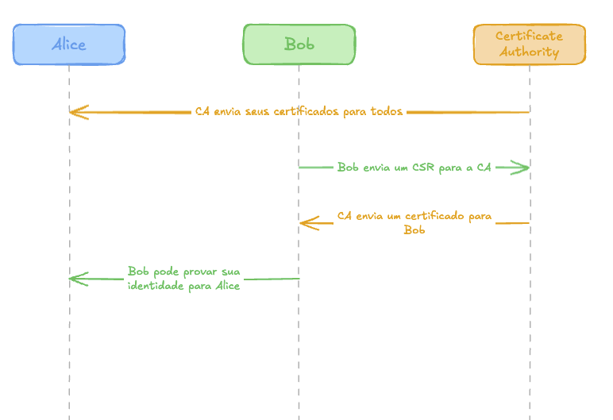
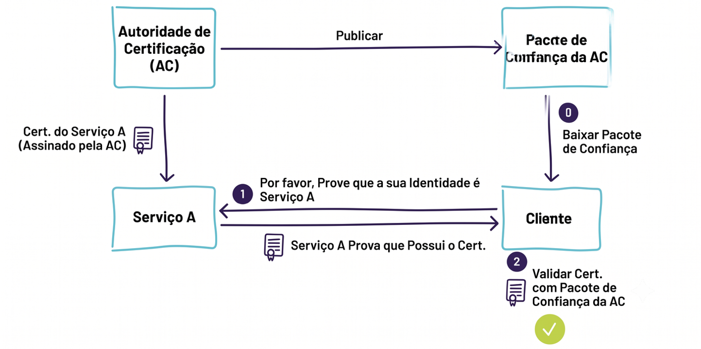
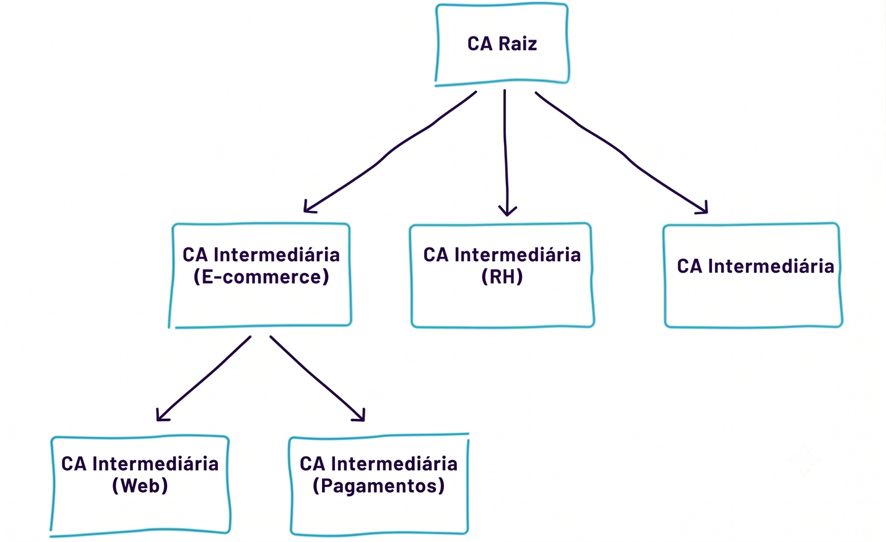

# Capítulo 3 — Conceitos Gerais de Identidade

## O que é uma identidade?

Para os seres humanos, a identidade é complexa. Humanos são indivíduos únicos que não podem ser clonados nem ter suas mentes substituídas por código alternativo e que podem carregar múltiplas identidades sociais ao longo de suas vidas. Os serviços de software também são complexos.

Um único programa pode escalar para milhares de nós ou ter seu código alterado muitas vezes ao dia à medida que um sistema de build envia novas atualizações. Nesse ambiente em rápida mudança, uma identidade deve representar o propósito específico e lógico do serviço (por exemplo, um banco de dados de faturamento de clientes) e estar associada a uma autoridade estabelecida ou root of trust (por exemplo, mycompany.example.org ou a autoridade emissora para meus workloads de produção).

Após a emissão de identidades para todos os serviços de uma organização, elas podem ser usadas para autenticação — comprovando que um serviço é o que afirma ser. Uma vez que os serviços podem se autenticar mutuamente, eles podem usar as identidades para autorização (controlar quem pode acessar esses serviços) e para confidencialidade (manter em sigilo os dados que trocam entre si). Embora o SPIFFE não inclua autenticação, autorização ou confidencialidade em si, as identidades que ele emite podem ser usadas para todas essas finalidades.

Designar identidades de serviço para uma organização é semelhante a projetar qualquer outra parte da infraestrutura da organização: depende intimamente das necessidades desta. Quando um serviço escala, muda de código ou de localização, pode ser lógico que ele mantenha a mesma identidade.

## Identidade Confiável

Agora que definimos identidade, como a representamos? Como sabemos que, quando um software (ou workload) reivindica sua identidade, essa reivindicação é confiável? Para começar a explorar essas questões, precisamos discutir como uma identidade é estabelecida.

### Identidade para Humanos

*Vamos explicar esses conceitos com algo que todos compartilhamos: nossas identidades no mundo real.*

**<u>Documentos de identidade</u>**

Se um nome é a identidade de uma pessoa, a prova dessa identidade é um documento de identidade. Um passaporte é um documento que permite a uma pessoa comprovar sua identidade — portanto, é um documento de identidade. Assim como passaportes de países diferentes, diferentes tipos de documentos de identidade de software podem ter aparências distintas e nem sempre contêm as mesmas informações. Mas para serem úteis, todos geralmente contêm ao menos algumas informações comuns, como o nome do usuário.

Qual é a diferença entre um passaporte e um guardanapo com seu nome rabiscado?

A diferença mais significativa é a fonte. Com passaportes, confiamos em que a autoridade emissora verificou sua identidade e temos a capacidade de validar que o passaporte foi emitido por essa autoridade confiável (validação). Quanto ao guardanapo, não sabemos de onde veio e não temos como confirmar se é do restaurante que você diz que é. Também não podemos confiar que o restaurante tenha escrito o nome correto no guardanapo ou verificado a exatidão do seu nome quando você o comunicou.

**<u>Confiar em uma autoridade emissora</u>**

Confiamos em um passaporte porque implicitamente confiamos em uma autoridade que os emite. Confiamos no processo pelo qual eles emitem esses documentos de identidade: eles têm registros e controles para garantir que a identidade seja emitida apenas ao indivíduo correto. Confiamos na governança desse processo, portanto, sabemos que os passaportes emitidos pela autoridade são uma representação fiel da identidade de alguém.

**<u>Verificando o documento de identidade</u>**

Dado isso, como podemos diferenciar um passaporte real de um falso? É aqui que entra a verificação. As organizações precisam de uma forma de verificar se o documento de identidade foi emitido pela autoridade em que confiam. Isso é feito tipicamente por meio de marcas d'água difíceis de replicar, mas fáceis de verificar.

**<u>Autenticando a pessoa que apresenta o documento</u>**

Os passaportes contêm diversas informações sobre a pessoa que a identidade representa. Em primeiro lugar, incluem uma foto da pessoa, que pode ser usada para verificar se quem apresenta o passaporte é a mesma pessoa visível na foto. Também podem incluir outros atributos físicos da pessoa — como altura, peso e cor dos olhos. Todos esses atributos podem ser usados para autenticar uma pessoa que apresenta um passaporte.

<strong>Resumindo</strong>

Passaportes são nossos documentos de identidade, e os usamos para nos identificarmos mutuamente porque confiamos na Autoridade Emissora e temos uma forma de verificar que o documento se origina dessa autoridade. Por fim, podemos autenticar a pessoa que apresenta o passaporte cruzando o conteúdo do passaporte com a pessoa que o porta.

**Identidade no Mundo Digital: Identidades Criptográficas**

Voltando à identidade de workloads, como os conceitos acima se mapeiam para sistemas computacionais? Em vez de passaportes, são usados documentos de identidade digitais. Certificados X.509, JSON Web Tokens (JWTs) assinados e tickets Kerberos são exemplos de documentos de identidade digital. Documentos de identidade digital podem ser verificados por meio de técnicas criptográficas. Então, o sistema computacional pode ser autenticado, assim como uma pessoa com um passaporte.

Uma das técnicas mais úteis e prevalentes para isso é a Infraestrutura de Chave Pública (PKI — Public Key Infrastructure). Uma PKI é definida como um conjunto de funções, políticas, hardware, software e procedimentos necessários para criar, gerenciar, distribuir, usar, armazenar e revogar certificados digitais, bem como para gerenciar a criptografia de chave pública. Com PKI, documentos de identidade digital podem ser validados localmente, offline, contra um conjunto pequeno e estático de trust bundles raiz.

### Uma Visão Geral do X.509

Quando o Setor de Padronização de Telecomunicações da União Internacional de Telecomunicações (ITU-T) (https://www.itu.int/en/ITU-T/about/) lançou, em 1988, o padrão X.509 para PKI, ele era extraordinariamente ambicioso para a época e ainda é considerado assim. O padrão originalmente previa a emissão de certificados para humanos, servidores e outros dispositivos, formando um enorme sistema de comunicação globalmente integrado e seguro. Embora o X.509 nunca tenha alcançado o escopo originalmente pretendido, ele é a base esperada para praticamente todos os protocolos de comunicação segura.

**<u>Como o X.509 funciona com uma única autoridade</u>**

O fluxo a seguir ilustra o processo de solicitação e uso de um certificado:

1.  O computador de Bob precisa de um certificado. Ele gera uma chave privada aleatória e também uma solicitação de assinatura de certificado (CSR — Certificate Signing Request), que inclui informações básicas sobre seu computador, como o nome do computador (vamos chamá-lo de bobsbox). Um CSR é um pouco como um pedido de passaporte.

2.  Bob envia seu CSR a uma Autoridade Certificadora (CA). A CA valida que Bob é realmente Bob. A forma exata como essa validação ocorre pode variar — pode envolver um humano verificando os papéis de Bob ou uma verificação automática.

3.  A CA então cria um certificado, codificando as informações apresentadas no CSR e adicionando uma assinatura digital, que atesta que a CA verificou que as informações contidas são verdadeiras e corretas. Ela envia o certificado de volta para Bob.

4.  Quando Bob quer estabelecer comunicações seguras com Alice, seu computador pode apresentar seu certificado e demonstrar criptograficamente que possui a chave privada de Bob — sem jamais compartilhar o conteúdo dessa chave privada com ninguém.

5.  O computador de Alice pode verificar se o certificado de Bob é realmente o de Bob, verificando se a Autoridade Certificadora o assinou. Ela confia que a Autoridade Certificadora verificou adequadamente a identidade de Bob antes de assinar o certificado.

*Figura 3.1: Ilustração de Bob solicitando um certificado à Autoridade Certificadora e usando-o para provar sua identidade a Alice.*

*Figura 3.2: PKI 'em poucas palavras'.*

**<u>X.509 com autoridades certificadoras intermediárias</u>**

*Figura 3.3: Ilustração de autoridades certificadoras intermediárias.*

Em muitos casos, a CA que assinou um determinado certificado não é amplamente conhecida. Em vez disso, a CA possui sua própria chave e certificado, que são assinados por outra CA. Ao assinar esse certificado de CA, a CA pai certifica que a CA de ordem inferior está autorizada a emitir identidades digitais. Essa autorização de CAs de ordem inferior por CAs de ordem superior é conhecida como delegação.

A delegação pode ocorrer repetidamente, com CAs de ordem inferior delegando ainda mais seu poder, formando uma árvore arbitrariamente alta de autoridades certificadoras. A CA de ordem mais alta é conhecida como CA raiz e deve possuir um certificado amplamente reconhecido. Todas as outras CAs na cadeia são conhecidas como CAs intermediárias. O benefício dessa abordagem é que menos chaves precisam ser amplamente conhecidas, permitindo que a lista mude com menos frequência.

<strong>⚠ Vulnerabilidade importante do X.509</strong>

Qualquer CA pode assinar qualquer certificado, sem restrições. Se um atacante decidir criar sua própria CA intermediária e conseguir aprovação de qualquer CA intermediária existente, ela pode efetivamente emitir qualquer identidade que quiser. É vital que cada CA amplamente conhecida seja completamente confiável, e que cada CA intermediária para a qual deleguem também seja completamente confiável.

## Ciclo de Vida do Certificado e da Identidade

Existem vários recursos adicionais na PKI que tornam o gerenciamento e a autenticação de identidades digitais mais fáceis e seguros: delegação de autoridade, revogação de identidade e tempos de vida limitados para documentos de identidade, entre outros.

### Emissão de identidade

Sempre há um momento em que uma nova identidade deve ser emitida. Humanos nascem, novos serviços de software são escritos e, em cada um desses casos, precisamos emitir uma identidade onde não havia nenhuma antes.

Primeiro, um serviço precisa solicitar uma nova identidade. Para um humano, isso pode ser um formulário em papel. No contexto de software, trata-se de um documento X.509 chamado Certificate Signing Request (CSR), criado com a respectiva chave privada. O CSR é semelhante a um certificado, mas como ainda não foi assinado por nenhuma Autoridade Certificadora, ninguém o reconhecerá como válido. O serviço então envia o CSR com segurança à Autoridade Certificadora.

Em seguida, a Autoridade Certificadora verifica cada detalhe do CSR em relação ao serviço para o qual foi solicitado o certificado. Originalmente, esse processo era manual: humanos verificavam a documentação e tomavam decisões individualmente. Hoje, as verificações e o processo de assinatura são frequentemente totalmente automatizados — quem já usou a popular Autoridade Certificadora Let's Encrypt conhece bem esse processo.

Uma vez satisfeita, a Autoridade Certificadora anexa sua assinatura digital ao CSR, transformando-o em um certificado completo e enviando-o de volta ao serviço. Junto com a chave privada gerada anteriormente, o serviço pode se identificar com segurança em todo o mundo.

### Revogação de certificado

O que acontece se um serviço for comprometido? E se o laptop de Bob for hackeado, ou Bob deixar a empresa e não devesse mais ter acesso?

Esse processo de revogação de certificado é chamado de desfazer a confiança. A Autoridade Certificadora mantém um arquivo chamado Lista de Revogação de Certificados (CRL — Certificate Revocation List) com os IDs únicos dos certificados revogados e distribui uma cópia assinada do arquivo para quem solicitar.

A revogação é complicada por vários motivos. Primeiro, a CRL precisa ser hospedada e servida a partir de um endpoint em algum lugar, introduzindo desafios para garantir que o endpoint esteja ativo e acessível. Quando não está… a PKI para de funcionar? Na prática, a maioria dos softwares falha de forma aberta, continuando a confiar em certificados quando as CRLs estão indisponíveis — o que as torna efetivamente inúteis.

Em segundo lugar, as CRLs podem tornar-se grandes e difíceis de gerenciar. Um certificado revogado deve permanecer na CRL até expirar, e certificados geralmente têm longa duração (na ordem de anos). Isso pode levar a problemas de desempenho no serviço, no download e processamento das próprias listas. Diversas tecnologias foram desenvolvidas para tornar a revogação de certificados mais simples e confiável, como o Online Certificate Status Protocol (OCSP). A variedade de abordagens torna a revogação de certificados um desafio contínuo.

### Expiração de certificado

Todo certificado tem uma data de expiração embutida. As datas de expiração são uma parte vital da segurança do X.509 por vários motivos: gerenciar a obsolescência, limitar a possibilidade de mudança na identidade indicada pelo certificado, limitar o tamanho das CRLs e reduzir a possibilidade de roubo da chave.

Os certificados existem há muito tempo. Quando foram desenvolvidos pela primeira vez, muitas CAs usavam o algoritmo de hash MD2, de 1989, que foi rapidamente considerado inseguro. Se esses certificados ainda fossem válidos, atacantes poderiam falsificá-los.

Outro aspecto importante de um tempo de vida limitado é que a CA tem apenas uma única chance de validar a identidade do solicitante, mas essas informações não têm garantia de permanecerem corretas ao longo do tempo. Por exemplo, nomes de domínio frequentemente mudam de propriedade e são uma das informações mais críticas que geralmente constam em um certificado.

Se as listas de revogação de certificados estiverem em uso, cada certificado ainda válido tem potencial para ser revogado. Se os certificados durassem para sempre, a lista de revogação poderia crescer indefinidamente. Para manter a CRL pequena, os certificados precisam expirar. Por fim, quanto mais longo o tempo de vida de um certificado, maior o risco de que a chave privada — seja dele ou de qualquer certificado que o leve à raiz — seja roubada.

### Renovação frequente de certificados

Um meio-termo para resolver os desafios impostos pela revogação é confiar mais na expiração. Se o tempo de vida do certificado for muito curto (talvez apenas algumas horas), a CA pode repetir com frequência quaisquer verificações que originalmente realizou. Se os certificados forem renovados com frequência suficiente, as CRLs podem nem ser necessárias — já que pode ser mais rápido simplesmente aguardar a expiração do certificado.

|  |  |
|----|----|
| **⏱ Ciclo de vida mais curto** | **🗓 Ciclo de vida mais longo** |
| Se um documento for roubado, sua validade é mais curta | Menor carga sobre as Autoridades Certificadoras (humanas e automatizadas) |
| CRLs menores — e talvez desnecessárias | Menor carga sobre a rede |
| Menos documentos de identidade em circulação ao mesmo tempo (mais fácil de rastrear) | Maior resiliência caso um nó não consiga renovar seu certificado por falta de conectividade |

### Outro tipo de identidade criptográfica: JSON Web Tokens (JWT)

Outro documento de identidade de chave pública, os JSON Web Tokens (RFC7519), também se comportam como um sistema semelhante à PKI. Em vez de certificados, usa um token JSON e tem uma estrutura chamada JSON Web Key Set, que atua como um CA Bundle para autenticar os tokens JSON. Existem diferenças importantes entre certificados e JWTs que estão além do escopo deste livro, mas, assim como os certificados X.509, a autenticidade de um JWT pode ser verificada por meio de PKI.

### A confiabilidade de identidades externas

Qualquer que seja o tipo de identidade utilizado, alguma autoridade confiável precisa emiti-la. Em muitos casos, nem todos confiam nas mesmas autoridades ou no processo pelo qual foram emitidas. A carteira de motorista de Alice, do Estado de Nova York, é uma identificação válida em Nova York, mas não é válida em Londres, pois as autoridades londrinas não confiam no governo do Estado de Nova York. No entanto, o passaporte americano de Bob é válido em Londres, porque as autoridades britânicas confiam nas autoridades do governo americano, e as autoridades londrinas confiam nas autoridades britânicas.

A situação é idêntica no âmbito dos Documentos de Identidade Digital. Alice e Bob podem ter certificados assinados por CAs completamente independentes, desde que ambos confiem nessas CAs, e assim podem se autenticar mutuamente. Isso não significa que Alice precisa confiar em Bob — apenas que ela pode identificá-lo com segurança.

## Como a identidade de software pode ser usada

Uma vez que um software possui um documento de identidade digital, esse documento pode ser utilizado para diversos fins. Já discutimos o uso de documentos de identidade para autenticação. Eles também podem ser usados para TLS mútuo, autorização, observabilidade e medição.

|  |  |
|----|----|
| **Uso** | **Descrição** |
| 🔐 Autenticação | Provar que um serviço é quem afirma ser, usando X.509 ou JWTs em protocolos de autenticação serviço a serviço. |
| 🔒 Confidencialidade e Integridade | Via TLS: impede que atacantes vejam ou alterem mensagens em trânsito. TLS mútuo autentica ambos os lados da conexão. |
| ✅ Autorização | Após autenticar uma identidade, ela é usada para controlar quais serviços podem fazer requisições. Ocorre sempre após a autenticação. |
| 👁 Observabilidade | Identidades únicas por serviço permitem rastrear comunicações misteriosas ou não documentadas e criar trilhas de auditoria. |
| 📊 Medição (Metering) | Em arquiteturas de microsserviços, identidades únicas permitem gerenciar cotas de requisições por segundo ou negar acesso completamente. |

### Autenticação

O uso mais comum de um documento de identidade é como base para autenticação. Para identidades de software, existem vários protocolos de autenticação que usam certificados X.509 ou JWTs para provar a identidade de um serviço a outro.

### Confidencialidade e integridade

Confidencialidade significa que os atacantes não podem ver o conteúdo de uma mensagem, enquanto a integridade significa que não podem alterá-la em trânsito. O Transport Layer Security (TLS) é um protocolo amplamente utilizado para estabelecer conexões seguras que fornece autenticação, confidencialidade e integridade das mensagens sobre uma conexão de rede não confiável, usando certificados X.509.

Uma característica do TLS é que quaisquer das partes da conexão podem ser autenticadas por meio de certificados. Como exemplo: quando você se conecta ao site do seu banco, seu navegador autentica o banco usando um certificado X.509 apresentado por ele, mas o seu navegador não apresenta um certificado ao banco (você faz login com nome de usuário e senha, não com um certificado).

Quando dois softwares se comunicam, é comum que ambos os lados da conexão tenham certificados X.509 e se autentiquem mutuamente. Isso é chamado de TLS com autenticação mútua (mutual TLS).

### Autorização

Uma vez autenticada, uma identidade digital pode ser usada para autorizar o acesso a serviços. Tipicamente, cada serviço teria uma allowlist de outros serviços com permissão para fazer requisições a ele. A autorização só pode ocorrer após a autenticação.

### Observabilidade

A identidade também pode ser útil para aumentar a observabilidade na infraestrutura da sua organização. Em grandes organizações, é surpreendentemente comum que serviços antigos ou descontinuados se comuniquem de maneiras misteriosas e não documentadas. Identidades únicas para cada serviço podem resolver esse problema em conjunto com ferramentas de observabilidade. Para fins de logging, uma identidade irrefutável do solicitante pode ser útil caso algo dê errado posteriormente.

### Medição (Metering)

Em arquiteturas de microsserviços, uma necessidade comum é limitar as requisições para que um microsserviço rápido não sobrecarregue outro lento. Se cada microsserviço tiver uma identidade única, essa identidade pode ser usada para gerenciar uma cota de requisições por segundo, a fim de resolver esse problema, ou para negar o acesso por completo.

## Resumo do Capítulo

<strong>Principais conceitos deste capítulo</strong>

Tanto humanos quanto softwares têm identidades, e ambos podem usar documentos de identidade para prová-las. Para humanos, os passaportes são uma forma típica de documento de identidade. Para software, a forma mais comum de documento de identidade digital é o certificado X.509. Certificados são emitidos por Autoridades Certificadoras, que precisam validar adequadamente as entidades para as quais criam certificados e gerenciar o ciclo de vida deles. Após a emissão do certificado, quem o usa precisa confiar na autoridade certificadora que o emitiu. Uma vez disponíveis documentos de identidade digital confiáveis, eles têm muitos usos diferentes: criar uma conexão TLS com autenticação mútua (que inclui autenticação, confidencialidade e integridade), autorização, observabilidade e medição de tráfego. Com autenticação, confidencialidade, integridade e autorização, as conexões entre serviços são seguras.

