# Capítulo 4 — Introdução aos Conceitos SPIFFE e SPIRE

## O que é SPIFFE?

O Secure Production Identity Framework for Everyone (SPIFFE) é um conjunto de padrões open source para identidade de software. Para alcançar identidade de software interoperável, de forma agnóstica às organizações e plataformas, o SPIFFE define as interfaces e os documentos necessários para obter e validar a identidade criptográfica de maneira totalmente automatizada.

O SPIFFE é composto por cinco partes:

|  |  |
|----|----|
| **Componente** | **Descrição** |
| SPIFFE ID | String no formato URI que representa de forma única a identidade de um serviço ou workload. |
| SVID (SPIFFE Verifiable Identity Document) | Documento de identidade criptograficamente verificável que prova a identidade de um serviço a outro. Suporta os formatos X509-SVID e JWT-SVID. |
| Workload API | API local no nó (não em rede) usada pelos workloads para obter seus SVIDs e trust bundles sem precisar de autenticação prévia. |
| Trust Bundle | Documento contendo as chaves públicas de um trust domain, usado para validar SVIDs. Não contém segredos — apenas chaves públicas. |
| SPIFFE Federation | Mecanismo pelo qual trust bundles são compartilhados entre trust domains diferentes, permitindo comunicação segura entre organizações ou ambientes distintos. |

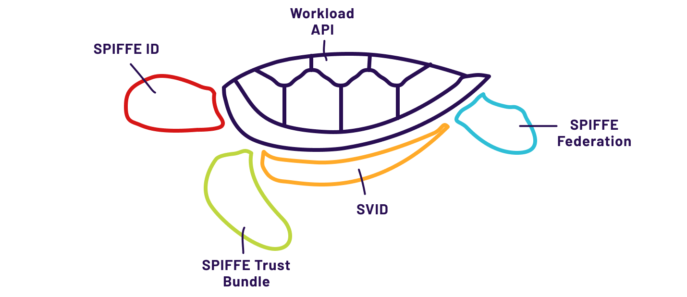

*Figura 4.1: Os cinco componentes do SPIFFE.*

### O que o SPIFFE não é

O SPIFFE destina-se a identificar servidores, serviços e outras entidades não humanas que se comunicam em uma rede de computadores. O que todos esses casos têm em comum é que as identidades devem ser emitidas automaticamente, sem necessidade de intervenção humana. Embora seja possível usar o SPIFFE para identificar pessoas ou outros seres, o projeto deixou intencionalmente esses casos de uso fora de seu escopo — nenhuma consideração especial foi feita para além de robôs e máquinas.

O SPIFFE entrega identidades e informações relacionadas aos serviços e gerencia o ciclo de vida dessas identidades, mas seu papel é limitado ao de um provedor: ele não utiliza diretamente as identidades entregues. É responsabilidade do serviço utilizar qualquer identidade SPIFFE que receber. Existem diversas soluções que usam identidades SPIFFE para habilitar camadas de autenticação — como comunicação criptografada de ponta a ponta ou autorização e controle de acesso de serviço a serviço, porém, essas funções também são consideradas fora do escopo do projeto SPIFFE.

## O SPIFFE ID

Um SPIFFE ID é uma string que funciona como o nome único de um serviço. Ele é modelado como um URI e é composto por várias partes: o prefixo spiffe:// (como o esquema do URI), o nome do trust domain (como o componente de host) e o nome ou identidade do workload específico (como o componente de caminho).

Um SPIFFE ID simples pode ser:

|                                 |
|---------------------------------|
| spiffe://exemplo.com/meuservico |

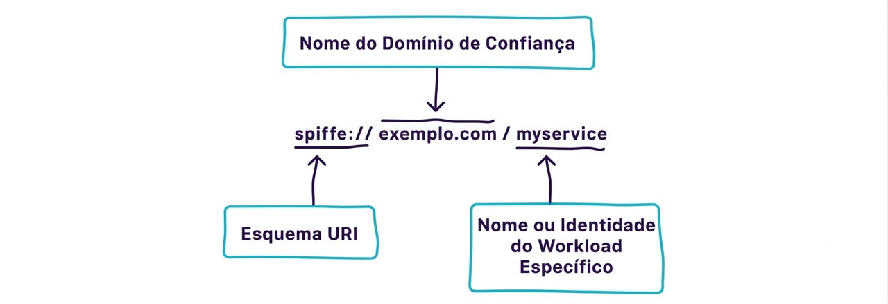

*Figura 4.2: Um exemplo de SPIFFE ID e sua composição.*

O primeiro componente de um SPIFFE ID é o esquema URI spiffe://. Embora pareça trivial, incluí-lo é um detalhe importante, pois permite distinguir um SPIFFE ID de uma URL ou de outro tipo de localizador de rede.

O segundo componente é o nome do trust domain (example.com). Em alguns casos, haverá apenas um trust domain para toda a organização. Em outros casos, pode ser necessário ter muitos trust domains — cujas semânticas são abordadas mais adiante neste capítulo.

O componente final é a parte do nome do próprio workload, representada pelo caminho do URI. O formato exato dessa parte do SPIFFE ID é específico de cada site. As organizações têm liberdade para escolher um esquema de nomenclatura que faça mais sentido para elas. Por exemplo:

spiffe://exemplo.com/bizops/rh/processamento-fiscal/retencao

spiffe://exemplo.com.br/pagamentos/checkout/api

<strong>⚠ Cuidado ao sobrecarregar o SPIFFE ID de significado</strong>

O propósito principal de um SPIFFE ID é representar a identidade de um workload de forma flexível e fácil de consumir tanto por humanos quanto por máquinas. Deve-se ter cautela ao tentar imbuir significado demais no formato de um SPIFFE ID. Por exemplo, tentar codificar atributos que serão usados individualmente como metadados de autorização pode gerar desafios de interoperabilidade e flexibilidade. Em vez disso, recomenda-se o uso de um banco de dados separado (lookaside).

## O SPIFFE Trust Domain

As especificações SPIFFE introduzem o conceito de trust domain. Trust domains são usados para gerenciar fronteiras administrativas e de segurança dentro e entre organizações, e todo SPIFFE ID tem o nome de seu trust domain embutido nele.

Concretamente, um trust domain é uma porção do namespace de SPIFFE ID em que um conjunto específico de chaves públicas é considerado autoritativo. Como diferentes trust domains têm autoridades emissoras distintas, o comprometimento de um trust domain não resulta no comprometimento de outro. Essa é uma propriedade importante que permite a comunicação segura entre partes que podem não confiar plenamente umas às outras — por exemplo, entre os ambientes de staging e de produção, ou entre uma empresa e outra.

A capacidade de validar identidades SPIFFE em múltiplos trust domains é conhecida como SPIFFE Federation, apresentada mais adiante neste capítulo.

**O SPIFFE Verifiable Identity Document (SVID)**

O SVID é um documento de identidade criptograficamente verificável, usado para provar a identidade de um serviço a outro. SVIDs incluem um único SPIFFE ID e são assinados por uma autoridade emissora que representa o trust domain em que o serviço reside.

Em vez de inventar um novo tipo de documento que os softwares precisariam aprender a suportar, o SPIFFE opta por utilizar tipos de documentos já amplamente usados e bem compreendidos. No momento da escrita deste livro, dois tipos de documentos de identidade são definidos para uso como SVID pelas especificações SPIFFE: X.509 e JWT.

### X509-SVID

Um X509-SVID codifica uma identidade SPIFFE em um certificado X.509 padrão. O SPIFFE ID correspondente é definido como um tipo de URI no campo de extensão Subject Alternative Name (SAN). Embora apenas um campo URI SAN seja permitido em um X509-SVID, o certificado pode conter qualquer número de campos SAN de outros tipos, incluindo DNS SANs.

\[1\] - <https://tools.ietf.org/html/rfc5280>

<strong>✅ X509-SVID é o formato recomendado</strong>

X509-SVIDs são recomendados onde quer que seja possível, pois têm melhores propriedades de segurança do que JWT-SVIDs. Especificamente, quando usados em conjunto com TLS, um certificado X.509 não pode ser gravado e reproduzido por um intermediário (ataque de replay).

*A utilização de X509-SVID pode ter requisitos adicionais, favor consultar a seção X509-SVID da especificação (ver: https://github.com/spiffe/spiffe/blob/master/standards/X509-SVID.md)*

### JWT-SVID

Um JWT-SVID codifica uma identidade SPIFFE em um JWT padrão [conforme https://tools.ietf.org/html/rfc7519](https://tools.ietf.org/html/rfc7519) — especificamente, um JWS, https://tools.ietf.org/html/rfc7515 . JWT-SVIDs são usados como bearer tokens de portador para provar a identidade a outros serviços na camada de aplicação. Ao contrário dos X509-SVIDs, JWT-SVIDs são suscetíveis a uma classe de ataque conhecida como replay attack (https://en.wikipedia.org/wiki/Replay_attack) na qual um token é obtido e reutilizado por uma parte não autorizada.

O SPIFFE define três mecanismos obrigatórios para mitigar esse vetor de ataque:

- JWT-SVIDs devem ser transmitidos apenas por canais seguros.

- O audience claim (claim aud) deve ser definido como a correspondência exata da string para a qual o token foi destinado.

- Todos os JWT-SVIDs devem incluir uma data de expiração, limitando o período durante o qual um token roubado permanece válido.

<strong>⚠ JWT-SVIDs: use com cautela</strong>

Apesar das mitigações, JWT-SVIDs ainda são fundamentalmente vulneráveis a replay attacks e devem ser usados com cautela. Dito isso, são uma parte importante do conjunto de especificações SPIFFE, pois permitem que a autenticação SPIFFE funcione em cenários onde não é possível estabelecer um canal de comunicação ponta a ponta.

*A utilização de JWT-SVID pode ter requisitos adicionais, favor consultar a seção JWT-SVID da especificação (ver:https://github.com/spiffe/spiffe/blob/master/standards/JWT-SVID.md).*

## O SPIFFE Trust Bundle

Um trust bundle SPIFFE é um documento que contém as chaves públicas de um trust domain. Cada tipo de SVID tem uma forma específica de ser representado neste bundle (por exemplo, para SVIDs X509, certificados de CA que representam as chaves públicas são incluídos). Todo trust domain SPIFFE tem um bundle associado, e o material desse bundle é usado para validar SVIDs que alegam residir nesse trust domain.

Como o trust bundle não contém segredos — apenas chaves públicas —, pode ser compartilhado publicamente sem risco de comprometimento de dados sigilosos. Apesar disso, ele precisa ser distribuído com segurança para proteger seu conteúdo contra modificações não autorizadas. Em outras palavras, a confidencialidade não é necessária, mas a integridade é.

Os bundles SPIFFE são formatados como um JWK Set (documento JWKS) e são compatíveis com tecnologias de autenticação existentes, como o OpenID Connect (OIDC) ( https://openid.net/connect/). O formato JWKS é flexível e amplamente adotado para representar diversos tipos de chaves e documentos criptográficos, o que oferece alguma preparação para o futuro caso novos formatos de SVID sejam definidos.

## SPIFFE Federation

Frequentemente, é desejável permitir a comunicação segura entre serviços em diferentes domínios de confiança. Em muitos casos, não é possível colocar todos os serviços em um único trust domain. Um exemplo comum é o de duas organizações diferentes que precisam se comunicar. Outro pode ser uma única organização que precisa estabelecer fronteiras de segurança — talvez entre um ambiente em nuvem menos confiável e serviços on-premises altamente confiáveis.

Para isso, cada serviço deve possuir o bundle do trust domain externo a partir do qual o serviço remoto se origina. Como resultado, os trust domains SPIFFE devem expor, ou de outra forma compartilhar, o conteúdo de seus bundles, permitindo que serviços em trust domains externos validem as identidades do trust domain local. O mecanismo usado para compartilhar o conteúdo do bundle de um trust domain é conhecido como bundle endpoint.

Bundle endpoints são serviços HTTP simples protegidos por TLS. Operadores que desejam federar com trust domains externos devem configurar sua implementação SPIFFE com o nome do trust domain externo e a URL do bundle endpoint, permitindo que o conteúdo do bundle seja periodicamente buscado.

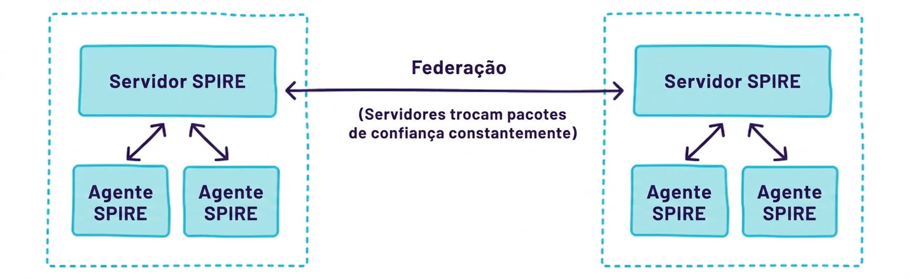

*Figura 4.3: Arquitetura de uma empresa com dois trust domains diferentes conectados por federação. Cada SPIRE Server só pode assinar SVIDs para seu próprio trust domain.*

## A SPIFFE Workload API

A SPIFFE Workload API é uma API local, sem uso de rede, que os workloads usam para obter seus documentos de identidade atuais, trust bundles e informações relacionadas. Crucialmente, essa API não requer autenticação — não impõe nenhum requisito ao workload de possuir qualquer credencial pré-existente.

Fornecer essa funcionalidade como uma API local permite que as implementações SPIFFE criem soluções criativas para identificar chamadores sem exigir autenticação direta — por exemplo, aproveitando recursos fornecidos pelo sistema operacional. A Workload API é exposta como um servidor gRPC e usa um stream bidirecional, permitindo que atualizações sejam enviadas ao workload conforme necessário.

<strong>🔑 Sem credencial prévia necessária</strong>

A Workload API não exige que o workload chamador tenha qualquer conhecimento de sua própria identidade, nem que possua alguma credencial ao chamar a API. Isso elimina a necessidade de implantar quaisquer segredos de autenticação junto ao workload — resolvendo o problema do 'secret zero'.

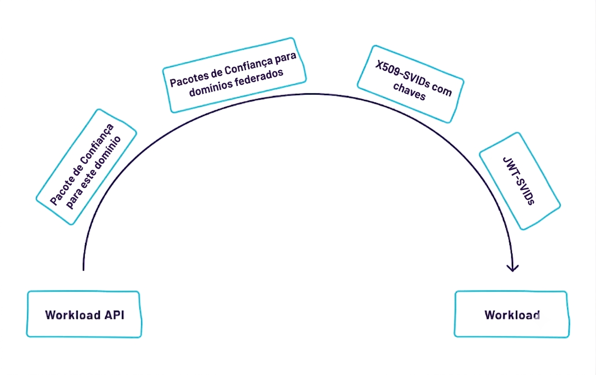

*Figura 4.4: A Workload API fornece informações e meios para aproveitar as identidades SPIFFE.*

## O Que é SPIRE?

O SPIFFE Runtime Environment (SPIRE) é uma implementação open source pronta para produção de todos os cinco componentes da especificação SPIFFE. O projeto SPIRE — assim como o SPIFFE — é hospedado pela Cloud Native Computing Foundation (CNCF).

O SPIRE tem dois componentes principais: o servidor (SPIRE Server) e o agente (SPIRE Agent). O servidor é responsável por autenticar os agentes e emitir SVIDs, enquanto o agente é responsável por servir a SPIFFE Workload API. Ambos os componentes são escritos com uma arquitetura orientada a plugins para que possam ser facilmente estendidos e adaptar-se a uma vasta gama de configurações e plataformas diferentes.

## Arquitetura do SPIRE

### SPIRE Server

O SPIRE Server gerencia e emite todas as identidades em um trust domain SPIFFE. Ele usa um data store para armazenar informações sobre seus agentes e workloads, entre outras coisas. O SPIRE Server é informado sobre os workloads que gerencia por meio de registration entries — regras flexíveis para atribuir SPIFFE IDs a nós e workloads. O servidor pode ser gerenciado via API ou comandos CLI.

<strong>🔒 O SPIRE Server é um componente crítico de segurança</strong>

Como o servidor possui as chaves de assinatura de SVIDs, ele é considerado o componente mais sensível de todo o sistema. Deve-se ter cuidado especial ao decidir sobre seu posicionamento na infraestrutura. É fortemente recomendado que os SPIRE Servers sejam colocados em hardware distinto dos workloads não confiáveis que gerenciam.

**<u>Data stores</u>**

O SPIRE Server usa um data store para acompanhar seus registration entries atuais e o status dos SVIDs que emitiu. Atualmente, vários bancos de dados SQL diferentes são suportados. O SPIRE vem com SQLite — um banco de dados embutido em memória — para fins de desenvolvimento e testes.

**<u>Autoridades upstream (Upstream Authorities)</u>**

Todos os SVIDs em um trust domain são assinados pelo SPIRE Server. Por padrão, o SPIRE Server gera um certificado autoassinado para assinar SVIDs, a menos que uma interface de plugin Upstream Certificate Authority seja configurada. Essa interface de plugin permite que o SPIRE obtenha seu certificado de assinatura de outra Autoridade Certificadora.

Em muitos casos simples, usar um certificado autoassinado é suficiente. No entanto, para instalações maiores, pode ser desejável aproveitar Autoridades Certificadoras preexistentes e a natureza hierárquica dos certificados X.509 para fazer vários SPIRE Servers — e outros softwares que geram certificados X.509 — trabalharem juntos. Em algumas organizações, a autoridade certificadora upstream pode ser uma CA central que a organização usa para outros fins.

### SPIRE Agent

O SPIRE Agent tem apenas uma função — embora muito importante: servir a Workload API. No curso de cumprir essa tarefa, ele resolve problemas relacionados, como determinar a identidade dos workloads que o chamam e apresentar-se com segurança ao SPIRE Server.

Agentes não requerem gerenciamento ativo da forma que os SPIRE Servers requerem. Embora precisem de um arquivo de configuração, os SPIRE Agents recebem informações sobre o trust domain local e os workloads que podem chamá-los diretamente do SPIRE Server. Ao definir novos workloads em um determinado trust domain, os registros são simplesmente definidos ou atualizados no SPIRE Server, e as informações sobre o novo workload se propagam automaticamente para os agentes apropriados.

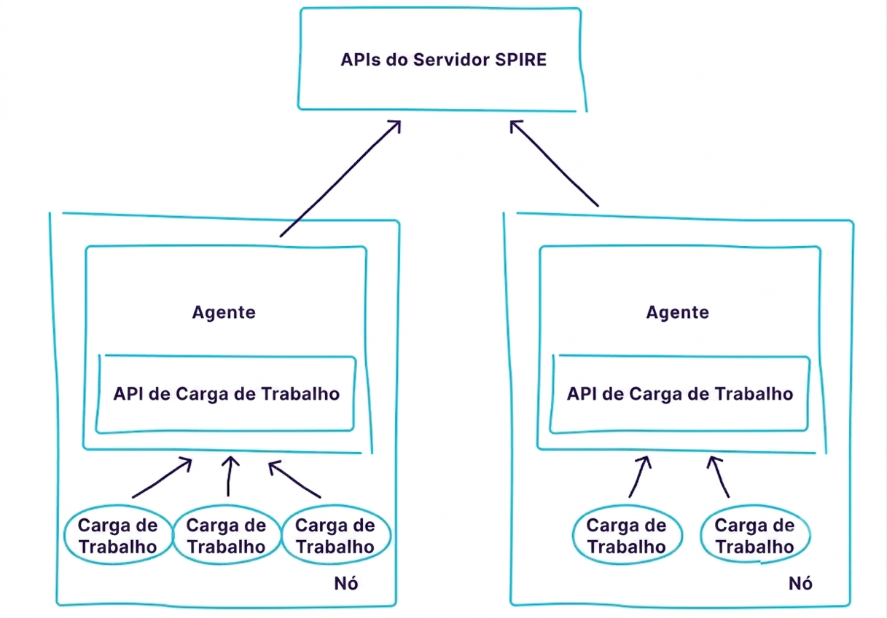

*Figura 4.5: O SPIRE Agent expõe a SPIFFE Workload API e trabalha em conjunto com os SPIRE Servers para emitir identidades aos workloads.*

**<u>Arquitetura de plugins</u>**

O SPIRE é construído como um conjunto de plugins para que possa crescer facilmente e acomodar novos node attestors, workload attestors e upstream authorities.

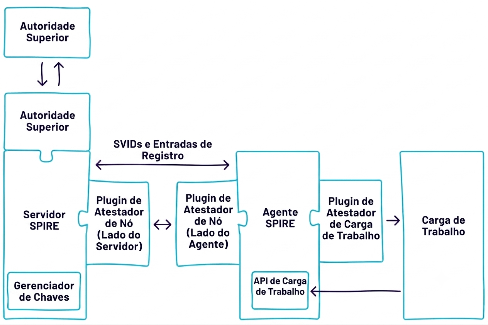

*Figura 4.6: Interfaces de plugins do SPIRE. O servidor inclui os plugins Node Attestor, KeyManager e Upstream Authority, enquanto o agente inclui os plugins Node Attestor e Workload Attestor.*

**<u>Gerenciamento de SVIDs</u>**

O SPIRE Agent usa sua identidade obtida durante a node attestation para autenticar-se no SPIRE Server e obtém SVIDs para os workloads que está autorizado a gerenciar. Como os SVIDs têm tempo limitado, o agente também é responsável por renová-los conforme necessário e comunicar essas atualizações aos workloads relevantes. O trust bundle também rotaciona, e essas atualizações são rastreadas pelos agentes e comunicadas aos workloads. O agente mantém um cache em memória de todas essas informações, para que os SVIDs possam ser servidos mesmo se o SPIRE Server estiver indisponível — garantindo também que as respostas da Workload API sejam performáticas, sem necessidade de uma roundtrip ao servidor a cada chamada.

**Attestation**

Attestation é o processo pelo qual informações sobre workloads e sobre o ambiente são coletadas e confirmadas. Em outras palavras, é o processo de provar com certeza a identidade de um workload, usando as informações disponíveis como evidência.

Existem dois tipos de attestation no SPIRE: node attestation e workload attestation. A node attestation afirma atributos que descrevem nós (por exemplo, se é membro de um grupo de auto-scaling da AWS ou em qual região do Azure o nó reside), e a workload attestation afirma atributos que descrevem o workload (por exemplo, o Kubernetes Service Account em que está rodando ou o caminho do binário no disco). A representação desses atributos no SPIRE é chamada de 'selectors'.

O SPIRE suporta dezenas de tipos de selectors nativamente e a lista continua crescendo. Entre os node attestors disponíveis, há suporte a bare metal, Kubernetes, Amazon Web Services (AWS), Google Cloud Platform (GCP), Azure e outros. Os workload attestors incluem suporte a Docker, Kubernetes, Unix e outros. Além disso, a arquitetura plugável do SPIRE permite que os operadores estendam facilmente o sistema para suportar tipos adicionais de selectors.

### Node Attestation

A node attestation ocorre quando um agente inicia pela primeira vez. Nela, o agente contata o SPIRE Server e entra em um processo de troca no qual o servidor busca identificar positivamente o nó em que o agente está rodando e todos os seus selectors associados. Para isso, um plugin específico da plataforma é executado tanto no agente quanto no servidor.

Por exemplo, no caso da AWS, o plugin do agente coleta informações da AWS às quais apenas aquele nó específico tem acesso (um documento assinado com uma chave AWS) e as envia ao servidor. O plugin do servidor então valida a assinatura da AWS e faz chamadas adicionais às APIs da AWS para confirmar a precisão da afirmação e coletar seletores adicionais sobre o nó em questão. A node attestation bem-sucedida resulta na emissão de uma identidade para o agente em questão, que utiliza essa identidade em toda a comunicação posterior com o servidor.

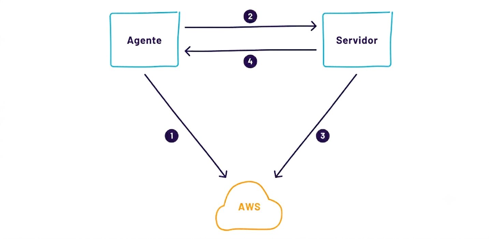*\*

*Figura 4.7: Node attestation de um nó em execução na AWS.*

O fluxo da node attestation na AWS segue três etapas:

1.  O agente coleta a prova de identidade do nó ao chamar uma API da AWS.

2.  O agente envia essa prova de identidade ao servidor.

3.  O servidor valida a prova de identidade obtida no passo 2 chamando a API da AWS e, em seguida, cria um SPIFFE ID para o agente.

4.  Retornar com o SPIFFE ID para o agente

### Workload Attestation

A workload attestation é o processo de determinar a identidade do workload que resultará na emissão e entrega de um documento de identidade. A attestation ocorre toda vez que um workload chama e estabelece uma conexão com a SPIFFE Workload API (em cada chamada RPC que o workload faz à API), e o processo a partir daí é conduzido por um conjunto de plugins no SPIRE Agent.

No momento em que o agente recebe uma nova conexão de um workload chamador, ele utiliza recursos do sistema operacional para determinar exatamente qual processo abriu a nova conexão. No caso do Linux, o agente faz uma chamada de sistema para recuperar o ID do processo, o identificador de usuário e o identificador globalmente único do sistema remoto que chama em um socket específico. O agente fornece aos plugins attestors o ID do workload chamador, e então a attestation se distribui entre os plugins, fornecendo informações adicionais sobre o processo chamador e retornando-as ao agente na forma de selectors.

Cada plugin attestor é responsável por introspectar o chamador e gerar um conjunto de selectors que o descrevem. Por exemplo, um plugin pode olhar para detalhes do nível do kernel e gerar selectors como o usuário e o grupo em que o processo está rodando. Outro plugin pode se comunicar com o Kubernetes e gerar selectors como o namespace e o service account em que o processo está rodando. Um terceiro plugin pode se comunicar com o daemon do Docker e gerar selectors para ID de imagem Docker, labels Docker e variáveis de ambiente do container.

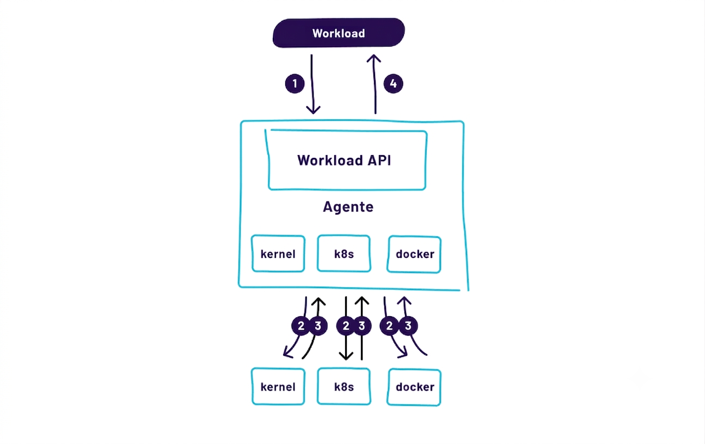

*Figura 4.8: Workload attestation.*

O fluxo da workload attestation segue quatro etapas:

5.  Um workload chama a Workload API para solicitar um SVID.

6.  O agente interroga o kernel do nó para obter os atributos do processo chamador.

7.  O agente obtém os selectors descobertos.

8.  O agente determina a identidade do workload comparando os selectors descobertos com os registration entries e retorna o SVID correto ao workload.

## Registration Entries

Para que o SPIRE emita identidades de workload, ele precisa primeiro ser informado sobre os workloads esperados ou permitidos em seu ambiente: quais workloads devem rodar onde, quais devem ser seus SPIFFE IDs e qual deve ser sua forma geral. O SPIRE aprende essas informações por meio de registration entries — objetos criados e gerenciados via APIs do SPIRE que contêm essas informações.

Para cada registration entry, há três atributos essenciais:

- Parent ID — informa ao SPIRE onde um workload específico deve estar rodando e, por extensão, quais agentes estão autorizados a solicitar SVIDs em seu nome.

- SPIFFE ID — quando esse workload for visto, qual SPIFFE ID deve ser emitido para ele?

- Selectors — informações que ajudam o SPIRE a identificar o workload, provenientes do processo de attestation.

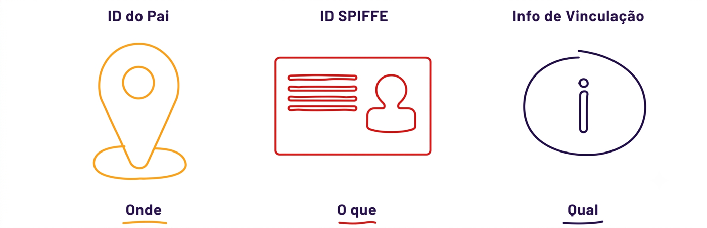

*Figura 4.9: Os três atributos essenciais de registration entries.*

Registration entries vinculam SPIFFE IDs aos nós e workloads que devem representar. Uma registration entry pode descrever um grupo de nós ou um workload, onde o último frequentemente referencia o primeiro por meio de um Parent ID.

**<u>Node entries</u>**

Registration entries que descrevem um nó (ou um grupo de nós) usam selectors gerados pela node attestation para atribuir um SPIFFE ID, que pode ser referenciado posteriormente ao registrar workloads. Um único nó pode ter um conjunto de selectors que correspondem a múltiplas node entries, permitindo que ele participe de mais de um grupo. Isso oferece grande flexibilidade ao decidir exatamente onde um dado workload tem permissão de rodar.

O SPIRE vem com uma variedade de node attestors prontos para uso. Exemplos de node selectors disponíveis incluem: no Google Cloud Platform (GCP), atributos do nó na plataforma; no Kubernetes, o nome do cluster Kubernetes do qual o nó faz parte; na Amazon Web Services (AWS), o Security Group AWS do nó. Node entries têm seu Parent ID definido como o SPIFFE ID do SPIRE Server, pois é o servidor que realiza a attestation e afirma que o nó em questão corresponde aos selectors definidos pela entry.

**<u>Workload entries</u>**

Registration entries que descrevem um workload usam selectors gerados pela workload attestation para atribuir um SPIFFE ID aos workloads quando determinadas condições são atendidas. O Parent ID de uma workload entry descreve onde esse workload está autorizado a rodar — seu valor é o SPIFFE ID de um nó ou conjunto de nós. Os SPIRE Agents rodando nesses nós recebem uma cópia dessa workload entry, incluindo os selectors que devem ser atestados antes de emitir um SVID para essa entry específica.

Quando um workload chama o agente, o agente realiza a workload attestation e cruza os selectors descobertos com os selectors definidos na entry. Se o workload possui o conjunto completo de selectors definidos, as condições são atendidas e o workload recebe um SVID com o SPIFFE ID definido.

Ao contrário da node attestation, o SPIRE Agent suporta carregar muitos plugins de workload attestor simultaneamente. Isso permite misturar e combinar selectors em workload entries. Por exemplo, uma workload entry pode exigir que um workload esteja em um namespace específico do Kubernetes, tenha um label específico aplicado à sua imagem Docker e tenha um SHA sum específico.

## Modelo de Ameaças SPIFFE/SPIRE

*O conjunto específico de ameaças que SPIFFE e SPIRE enfrentam é situacional. Entender o modelo geral de ameaças é um passo importante para afirmar que suas necessidades específicas podem ser atendidas e para descobrir onde mitigações adicionais podem ser necessárias.*

## Premissas

SPIFFE e SPIRE destinam-se a ser usados como base para identidade distribuída e autenticação consistente em arquiteturas de design cloud native (<https://github.com/cncf/toc/blob/master/DEFINITION.md>) . O SPIRE suporta Linux e a família BSD (incluindo macOS). O Windows não é suportado atualmente, embora alguns protótipos iniciais tenham sido feitos nessa área.

O SPIRE adere ao modelo de segurança de redes zero trust, no qual se assume que a comunicação de rede é hostil ou presumivelmente totalmente comprometida. Dito isso, também se assume que o hardware em que os componentes SPIRE rodam, bem como seus operadores, são confiáveis. Se implantes de hardware ou ameaças internas fazem parte do modelo de ameaças, devem-se fazer considerações cuidadosas sobre o posicionamento físico dos SPIRE Servers e a segurança de seus parâmetros de configuração.

Pode haver confiança implícita em plataformas ou softwares de terceiros, dependendo dos métodos escolhidos de node e workload attestation. Afirmar confiança por meio de múltiplos mecanismos independentes fornece uma maior garantia de confiança. Por exemplo, aproveitar node attestation baseada em AWS ou GCP implica que a plataforma de computação é assumida como confiável, e aproveitar Kubernetes para workload attestation implica que a implantação Kubernetes é assumida como confiável.

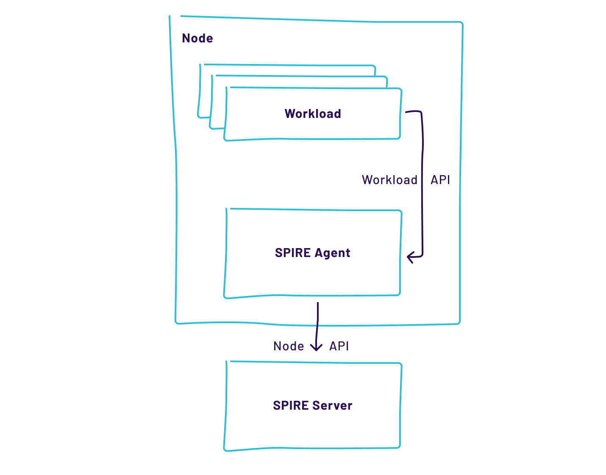

*Figura 4.10: Componentes considerados no modelo de ameaças.*

## Fronteiras de Segurança

Fronteiras de segurança são formalmente compreendidas como a linha de interseção entre duas áreas com diferentes níveis de confiança. Existem três fronteiras de segurança principais definidas pelo SPIFFE/SPIRE: uma entre workloads e agentes, uma entre agentes e servidores, e outra entre servidores em diferentes trust domains. Neste modelo, workloads são totalmente não confiáveis, assim como servidores em outros trust domains e, como mencionado anteriormente, a comunicação de rede é sempre totalmente não confiável.

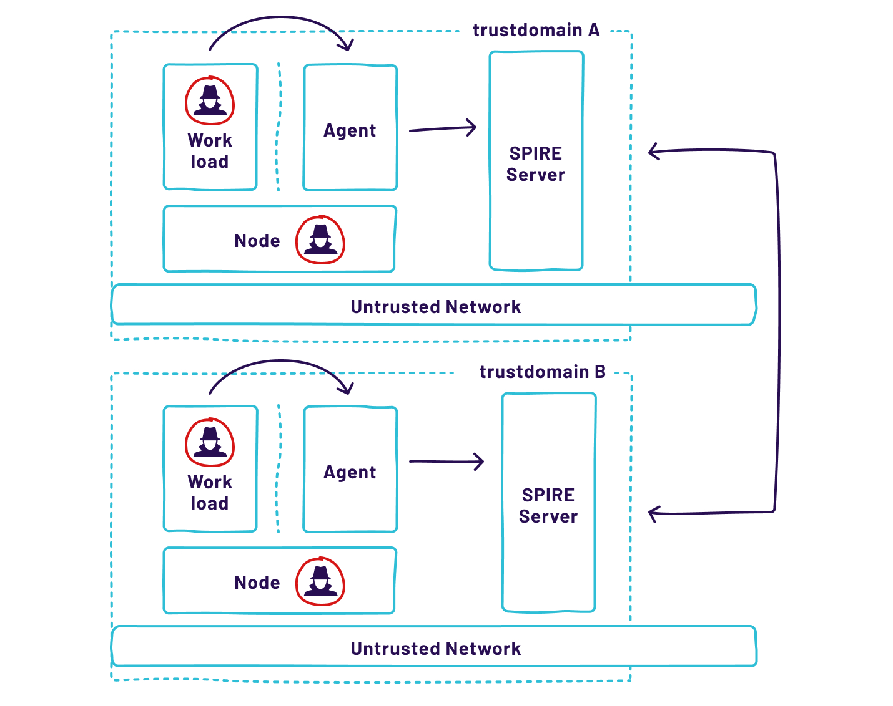*\
Figura 4.11: Fronteiras de segurança do SPIFFE/SPIRE.*

|  |  |
|----|----|
| **Fronteira** | **Comportamento e garantias** |
| **Workload ↔ Agent** | Workloads são totalmente não confiáveis. O agent identifica o workload via verificações fora de banda (kernel, SO) — nunca confia em dados fornecidos pelo próprio workload. Qualquer selector cujo valor possa ser manipulado pelo workload é inerentemente inseguro. |
| **Agent ↔ Server** | Agents são mais confiáveis que workloads, mas menos que servers. Um agent comprometido só pode obter identidades dos workloads autorizados a rodar naquele nó — não identidades arbitrárias. Segue o princípio de menor privilégio. |
| **Server ↔ Server (trust domains diferentes)** | Cada SPIRE Server só assina SVIDs para seu próprio trust domain. Chaves recebidas de trust domains externos permanecem escopadas ao domínio de origem. Diferentemente do Web PKI, as chaves não são simplesmente misturadas num único repositório. |

## Impacto do Comprometimento de Componentes

Embora os workloads sejam sempre considerados comprometidos, espera-se que os agentes não o sejam. Se um agente for comprometido, o atacante poderá acessar qualquer identidade que o respectivo agente esteja autorizado a gerenciar. Em implantações em que há uma relação 1:1 entre workload e agente, isso é uma preocupação menor. Em implantações em que agentes gerenciam múltiplos workloads, esse é um ponto importante a compreender.

Agentes são autorizados a gerenciar uma identidade quando são referenciados como pai (parent) dessa identidade. Por essa razão, é uma boa prática manter o escopo de Parent IDs de registration entries o mais restrito possível, razoavelmente.

Em caso de comprometimento de um servidor, o atacante poderá emitir identidades arbitrárias dentro desse trust domain. O SPIRE Server é, sem dúvida, o componente mais sensível de todo o sistema — por isso, recomenda-se fortemente que os SPIRE Servers sejam colocados em hardware distinto dos workloads não confiáveis que gerenciam. O SPIRE resolve o comprometimento de nó, pois os workloads não são confiáveis, mas se os SPIRE Servers rodam no mesmo host que workloads não confiáveis, os servidores perdem a proteção que a fronteira agente/servidor anteriormente conferia.

### O Caveat do Agente

O SPIRE lida com o comprometimento de nós ao escoparmos os privilégios de um agente apenas para as identidades com as quais ele está diretamente autorizado a gerenciar. Porém, se um atacante puder comprometer múltiplos agentes — ou talvez todos eles —, a situação é decisivamente pior.

Os SPIRE Agents não têm qualquer caminho de comunicação entre si, o que limita significativamente a possibilidade de movimento lateral. Essa é uma decisão de design importante destinada a mitigar o impacto de uma possível vulnerabilidade em um agente. No entanto, deve-se entender que certas configurações ou escolhas de implantação podem prejudicar essa mitigação em parte ou totalmente. Por exemplo, o SPIRE Agent suporta expor um endpoint de métricas do Prometheus; no entanto, se todos os agentes expõem esse endpoint e houver uma vulnerabilidade nele, o movimento lateral se torna trivial na ausência de controles de rede adequados. Por essa razão, expor o SPIRE Agent a conexões de rede de entrada é fortemente desaconselhado.
