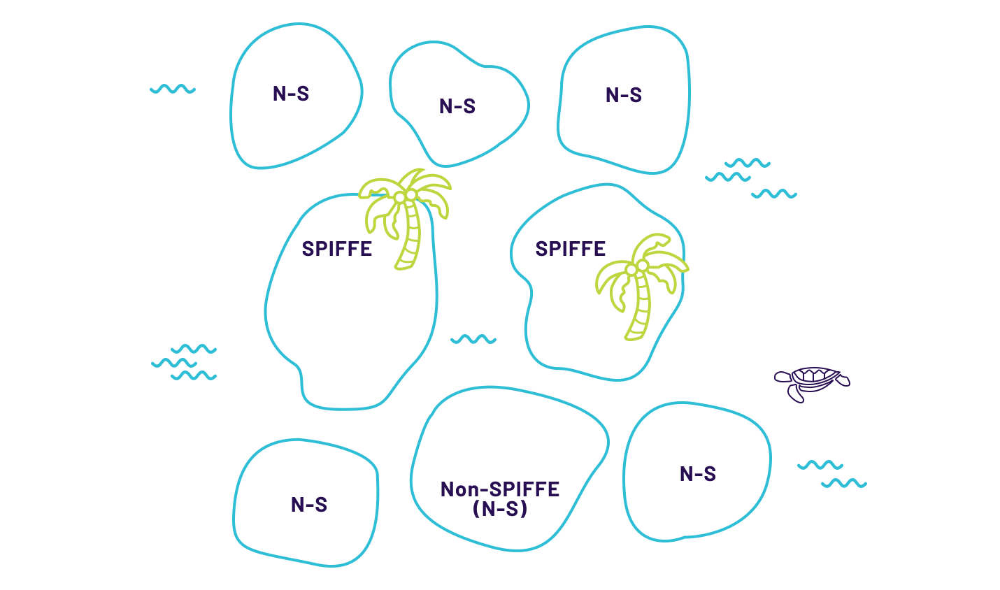
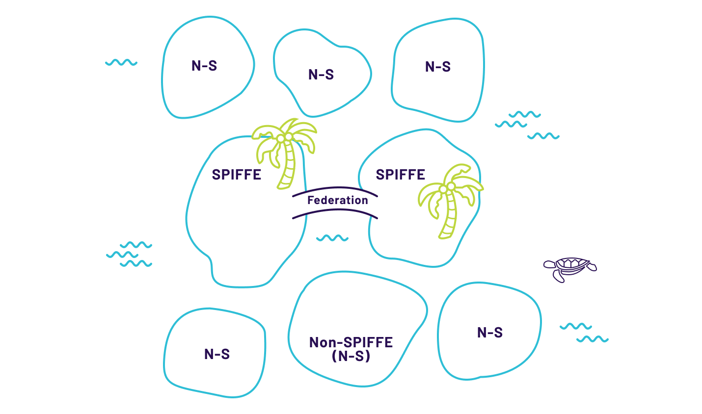
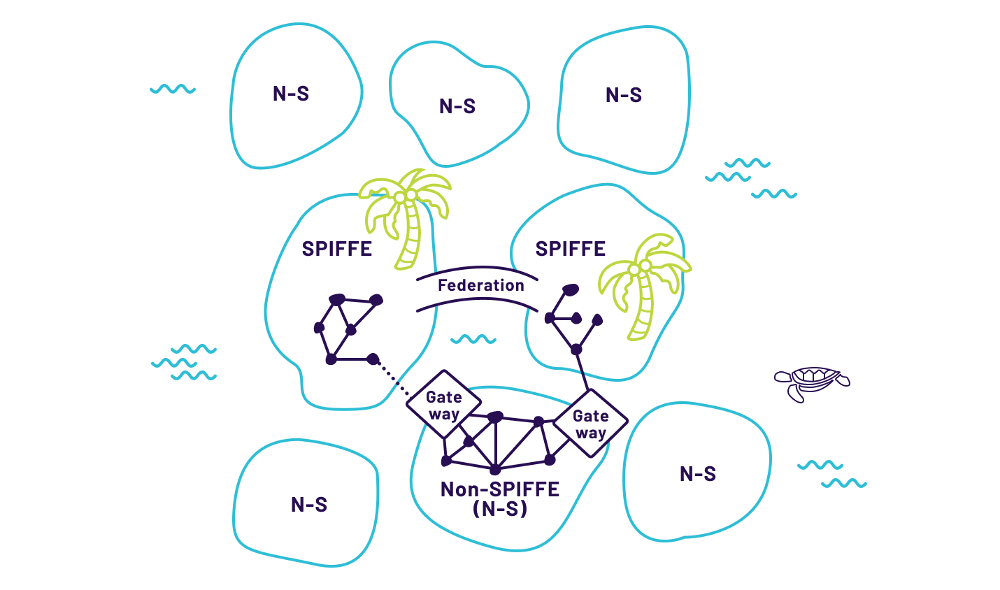
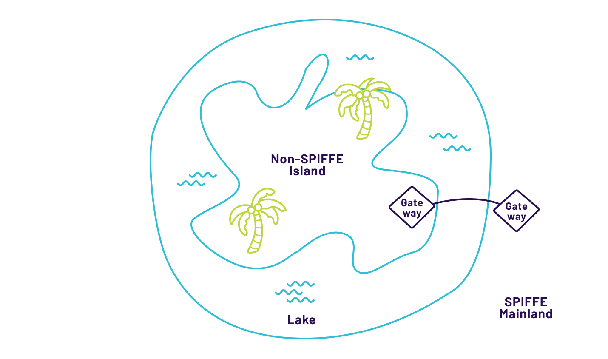
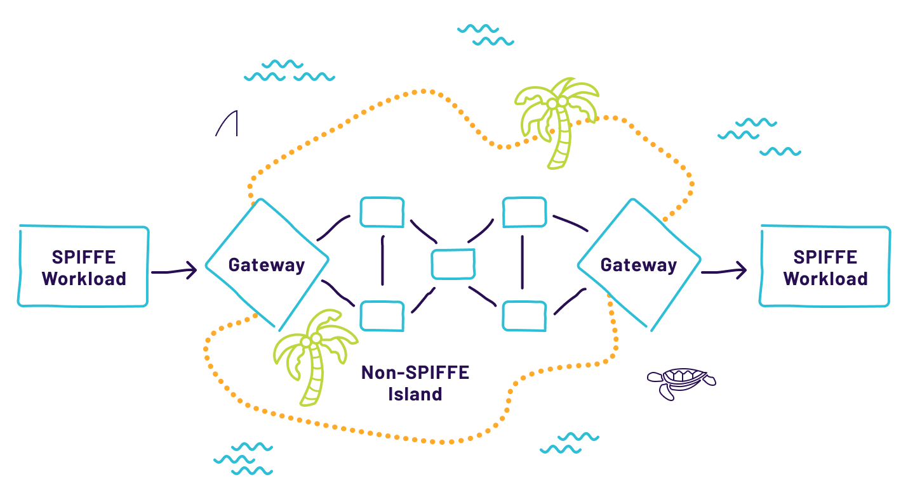
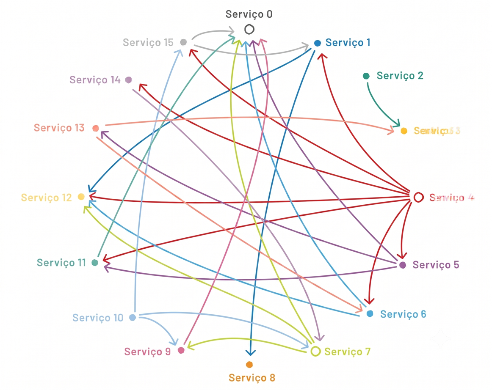

# Capítulo 5 — Antes de Começar

## Prepare as pessoas

Se você leu os capítulos anteriores, deve estar animado para começar a usar o SPIRE para gerenciar identidades de forma que possam ser aproveitadas em diversos tipos de sistemas e em todos os serviços da sua organização. No entanto, antes de começar, é preciso considerar que implantar o SPIRE representa uma grande mudança na infraestrutura, com potencial para afetar muitos sistemas diferentes. Este capítulo trata de como iniciar o planejamento de uma implantação do SPIRE: obter adesão, habilitar o suporte ao SPIRE de forma não disruptiva e, em seguida, usá-lo para implementar novos controles de segurança.

## Monte a equipe e identifique os stakeholders

Para implantar o SPIRE, você precisará identificar os stakeholders das equipes de segurança, de desenvolvimento de software e de DevOps. Algumas perguntas essenciais a responder antes de começar:

- Quem irá manter os SPIRE Servers?

- Quem irá implantar os agentes?

- Quem irá escrever os registration entries?

- Quem irá integrar as funcionalidades SPIFFE nas aplicações?

- Como isso impactará os pipelines de CI/CD existentes?

- Se ocorrer uma interrupção de serviço, quem irá resolvê-la?

- Quais são os requisitos de desempenho e os objetivos de nível de serviço (SLOs)?

Neste livro, assim como em muitos posts de blogs públicos e palestras em conferências, há exemplos de organizações que implantaram o SPIRE com sucesso — que podem servir tanto como padrão a seguir quanto como material útil para evangelizar o SPIRE junto aos seus colegas.

## Apresente seu caso e obtenha adesão

O SPIRE corta transversalmente vários silos tradicionais de TI; portanto, espere ver mais colaboração entre as equipes de DevOps, desenvolvimento de software e segurança. É importante que trabalhem juntas para garantir uma implantação bem-sucedida e transparente. Cada uma dessas equipes tem necessidades e prioridades diferentes que precisarão ser atendidas para obter sua adesão.

Ao planejar a implantação do SPIRE, você precisará entender quais resultados são mais importantes para o negócio e enquadrá-los como motivadores do projeto e como valor da solução que você entregará. Cada equipe precisa enxergar os benefícios do SPIRE tanto para si mesma quanto para o negócio como um todo.

|  |  |
|----|----|
| **Equipe** | **Argumentos mais convincentes** |
| **🔒 Equipe de Segurança** | Elimina o gerenciamento manual de centenas ou milhares de certificados. Nenhuma credencial facilmente roubada ou mal utilizada. Prova auditável de que os serviços certos se comunicam com segurança. Limita o raio de impacto mesmo que um serviço seja comprometido. |
| **💻 Equipe de Desenvolvimento** | Elimina a espera por tickets ou workflows manuais para provisionar certificados. Chega ao fim o gerenciamento de segredos em secret stores. Novos caminhos arquiteturais: serviços que antes não podiam se comunicar com segurança agora podem, via identidades SPIFFE. |
| **⚙️ Equipe de DevOps** | Serviços podem ser implantados em qualquer data center, provedor de nuvem ou região — as decisões de implantação passam a ser independentes dos requisitos de segurança. Todas as requisições chegam tagueadas com um SPIFFE ID, facilitando logging, medição e monitoramento em larga escala. |

**Crie um Plano**

O primeiro objetivo ao planejar uma implantação do SPIRE é determinar se todos os serviços precisam ser SPIFFE-aware, ou se 'ilhas' de serviços não-SPIFFE ainda podem satisfazer os requisitos. Mover todos os serviços para SPIFFE é a opção mais direta, mas pode ser desafiador implementá-los de uma só vez, especialmente em organizações muito grandes.

## Planejando Ilhas e Pontes

Alguns ambientes são complexos, com múltiplas organizações representadas ou com uma combinação de sistemas legados e novos desenvolvimentos. Nesses cenários, frequentemente há o desejo de habilitar SPIFFE apenas em um subconjunto do ambiente. Dois modelos arquiteturais devem ser considerados, dependendo do nível de integração entre os sistemas e de sua complexidade: as 'Ilhas Independentes' e as 'Ilhas Conectadas'.

Cada ilha é considerada um trust domain próprio e, em cada uma, há workloads ou 'residentes'.

### Ilhas Independentes

*Figura 5.1: Duas implantações SPIFFE independentes (Ilhas Independentes).*

O modelo de ilhas independentes permite que os trust domains operem de forma independente entre si. Esta é frequentemente a opção mais fácil porque cada ilha pode executar o SPIRE da forma que faz sentido para aquela ilha. Não há comunicação entre os trust domains — cada um resolve seus problemas de identidade de forma autônoma.

### Ilhas Conectadas (Bridged Islands)

*Figura 5.2: Duas implantações SPIFFE independentes conectadas por meio de Federation, permitindo que os serviços de cada ilha confiem uns nos outros e se comuniquem.*

*Figura 5.3: Adicionar gateways a uma ilha não-SPIFFE é uma forma de conectar ilhas SPIFFE e não-SPIFFE.*

*Figura 5.4: Um ecossistema SPIFFE-habilitado (o continente) com uma bolsa de serviços não-SPIFFE no interior (a ilha no lago). Para que se comuniquem, é necessário um gateway.*

*Figura 5.5: Arquitetura de Ilhas Conectadas.*

O modelo de ilhas conectadas permite que um serviço não-SPIFFE em uma ilha não-SPIFFE fale com um gateway. O gateway então encaminha a requisição para o residente SPIFFE-habilitado a que se destina. Da perspectiva desse residente, o gateway enviou a requisição. Os serviços habilitados para SPIFFE podem autenticar-se no gateway e enviar mensagens a serviços na ilha não-SPIFFE.

Com a arquitetura de Ilhas Conectadas, gateways são criados em ilhas não-SPIFFE. Existem muitas razões pelas quais essas ilhas não-SPIFFE podem não conseguir adotar facilmente uma arquitetura SPIFFE: pode haver software legado que não possa ser facilmente modificado ou atualizado; a ilha pode estar usando seu próprio ecossistema de identificação, como Kerberos; ou o sistema pode estar executando workloads em tecnologias pouco adequadas aos modelos de solução SPIFFE existentes.

Quando um workload habilitado para SPIFFE quer falar com um workload na ilha não habilitada para SPIFFE, ele cria uma conexão autenticada com o gateway, que então cria uma conexão com o workload-alvo. Essa conexão com o workload-alvo pode não estar autenticada ou pode usar a solução de identidade não SPIFFE daquela ilha. Similarmente, quando um workload não-SPIFFE quer se conectar a um workload habilitado para SPIFFE, o workload não-SPIFFE se conecta ao gateway, que então cria uma conexão SPIFFE autenticada com o workload SPIFFE-habilitado-alvo.

<strong>🔁 Contexto de autenticação é encerrado no gateway</strong>

Neste cenário, a autenticação entre o gateway e o workload SPIFFE-habilitado é encerrada no gateway. Isso significa que o workload SPIFFE-habilitado pode verificar que está falando com o gateway apropriado, mas não pode verificar que está falando com o workload correto do outro lado. Da mesma forma, o workload alvo só sabe que o serviço de gateway enviou uma requisição — perdendo o contexto de autenticação do workload SPIFFE-habilitado original.

Em casos em que requisições e workflows passam por uma ilha não-SPIFFE, pode ser útil utilizar JWT-SVIDs para propagação entre requisições. Ainda melhor: usar X509-SVIDs para assinar documentos (como HTTP Message Request Signing) em vez de apenas usar mTLS serviço a serviço — de modo que a autenticidade da mensagem inteira possa ser validada pelos workloads SPIFFE-habilitados do outro lado.

## Documentação e Instrumentação

Ao se preparar para uma implantação, é importante instrumentar os serviços para que métricas e logs de fluxo sejam emitidos de forma que:

- Os responsáveis pela implantação saibam quais (e quantos) serviços estão habilitados para SPIFFE e quais não estão.

- Um desenvolvedor cliente saiba quais serviços que ele chama estão habilitados para SPIFFE e quais não estão.

- Um dono de serviço saiba quantos de seus clientes estão chamando o endpoint SPIFFE-habilitado e quantos ainda estão chamando o endpoint legado.

Também é importante criar ferramentas para auxiliar em tarefas comuns de debug e resolução de problemas. Introduzir o SPIFFE na sua organização deve empoderar os desenvolvedores e remover obstáculos — deixar stakeholders com a impressão de que você está adicionando trabalho ou criando atrito vai, em última análise, desacelerar ou interromper a adoção mais ampla.

|  |  |
|----|----|
| **Passo de planejamento** | **Considerações e observações** |
| **Definir para quais recursos de segurança o SPIFFE será usado** | Identidades SPIFFE podem ser usadas para criar conexões mTLS, autorização, logs de auditoria e outras finalidades. |
| **Determinar os formatos de SVID a usar e para qual finalidade** | O mais comum é usar X509-SVIDs para mTLS — verifique se isso se aplica ao seu caso e se haverá outros usos. |
| **Determinar o número de workloads que precisarão de identidades** | Nem todo workload precisa de identidade, especialmente no início da implantação. |
| **Determinar o número de trust domains separados necessários** | Cada trust domain precisa de sua própria implantação de SPIRE Server. Os detalhes para tomar essa decisão estão no próximo capítulo. |
| **Mapear linguagens, frameworks e tecnologias IPC em uso** | Para X509-SVIDs com mTLS, identifique quais web servers (Apache, NGINX, Tomcat, Jetty etc.) e bibliotecas de cliente estão em uso. Verifique compatibilidade com verificação de hostname DNS se aplicável. |

## Implicações de Desempenho

As implicações de desempenho devem ser consideradas no planejamento da sua implantação. Como parte da preparação, verifique benchmarks de uma variedade de workloads representativos das aplicações que sua organização executa em produção. Isso garante que você esteja ao menos ciente — e, idealmente, preparado para lidar — com quaisquer problemas de desempenho que possam surgir durante a implantação.

### Desempenho do TLS

Em muitas organizações, a primeira preocupação dos desenvolvedores e das equipes de operação é que estabelecer conexões mTLS entre serviços será muito lento. Em hardware moderno, com implementações de TLS atuais, o impacto no desempenho do TLS é mínimo. Grandes empresas como Google e Facebook já demonstraram publicamente que TLS em escala tem overhead desprezível em termos de CPU, memória e rede.

Em geral, as implicações de desempenho dependem de múltiplos fatores, incluindo topologia de rede, API gateways, firewalls L4-L7 e muitos outros. Os protocolos utilizados, sua implementação e o tamanho dos certificados e das chaves também podem afetar o desempenho.

> *"Em nossas máquinas frontend em produção, SSL/TLS representa menos de 1% da carga da CPU, utiliza menos de 10 KB de memória por conexão e gera menos de 2% de sobrecarga na rede. Muitas pessoas acreditam que SSL/TLS consome muito poder de processamento, e esperamos que esses números ajudem a esclarecer esse mito." — Adam Langley, Google, Overclocking SSL (ver:https://www.imperialviolet.org/2010/06/25/overclocking-ssl.html), 2010*
>
> *"Implementamos TLS em grande escala utilizando balanceadores de carga tanto de hardware quanto de software. Constatamos que as implementações TLS modernas baseadas em software, executadas em processadores convencionais (commodity CPUs), são suficientemente rápidas para lidar com tráfego HTTPS intenso sem necessidade de recorrer a hardware criptográfico especializado." — Doug Beaver, Facebook, HTTP2 Expression of Interest (ver: https://lists.w3.org/Archives/Public/ietf-http-wg/2012JulSep/0251.html), 2012*

A tabela abaixo fornece dados sobre o overhead para duas fases diferentes em comparação com TCP:

|  |  |  |  |  |
|----|----|----|----|----|
| **Fase TLS** | **Overhead de protocolo** | **Latência** | **CPU** | **Memória** |
| Handshake | 2 kB (TLS) / 3 kB (mTLS) / +1 kB por cert adicional | 12–17 ms | ~0,5% a mais que TCP | \<10 kB/conn |
| Transferência de dados | 22 B/pacote | \<3 µs | \<1% a mais que TCP | \<10 kB/conn |

**Fazendo a Mudança para SPIFFE e SPIRE**

*Existe uma rica história de estudos sobre como organizações reagem, realizam e processam mudanças, bem como sobre a aceitação e adoção de novas tecnologias. Fazer jus a esses tópicos está além do escopo deste livro, mas seria negligência não mencioná-los dada sua relevância para uma implantação SPIFFE bem-sucedida.*

## Convencendo a Mudança a Ocorrer

Existem várias formas de convencer outros de que uma mudança deve ocorrer dentro da sua organização. A seguir estão as alavancas que podem ser utilizadas para promover a adoção do SPIFFE e SPIRE:

- Utilidade percebida — o quanto alguém acredita que o SPIFFE será útil para melhorar seu desempenho no trabalho. A capacidade de demonstrar resultados tangíveis ajuda a melhorar a utilidade percebida.

- Facilidade de uso percebida — o quanto alguém acredita que o SPIFFE será fácil de usar. A dedicação à experiência do usuário por parte de desenvolvedores e operadores é essencial.

- Influência de pares — a percepção de outros respeitados na organização quanto à adoção do SPIFFE. Ter capital político acumulado na organização é valioso. Muitas vezes, convencer as pessoas certas é mais importante do que tentar convencer a todos.

- Imagem — o grau em que adotar o SPIFFE elevará o status de alguém na organização.

- Voluntariedade — a medida em que os potenciais adotantes percebem a adoção como voluntária ou obrigatória. O efeito disso depende da cultura da empresa e das personalidades individuais.

*Figura 5.6: Curva de adoção de tecnologia (adaptada da curva normal de Rogers e do Ciclo da Ilusão de Gartner). A área azul sob o gráfico representa a quantidade de mudança e o número de adotantes do SPIFFE (ver:https://en.wikipedia.org/wiki/Technology_adoption_life_cycle). A linha vermelha representa o entusiasmo e as expectativas dos adotantes do SPIFFE.*

## Atores de Adoção

Os atores de adoção correspondem à curva de tecnologia e podem ajudar a definir expectativas sobre como a transição para SPIFFE e SPIRE ocorrerá. Além dos atores cobertos na curva de adoção de tecnologia, foram adicionados dois mais que você provavelmente enfrentará:

|  |  |
|----|----|
| **Ator** | **Características e estratégia recomendada** |
| **🚀 Inovadores** | Você mesmo — leu este livro e está liderando o processo. Necessitam de suporte 'luva branca': escolha voluntários com bom relacionamento da categoria Low Hanging Fruit para os primeiros passos. |
| **🌱 Early Adopters** | Distile as lições dos inovadores em documentação acessível, ferramentas úteis e canais de suporte escaláveis. Invista em habilitar as ferramentas precursoras para que os desenvolvedores sejam desbloqueados. |
| **👥 Maioria precoce e tardia** | O processo de habilitação já é uma máquina azeitada. CI/CD, orquestradores, service meshes e plataformas de containers devem estar habilitados para SPIFFE, cobrindo todo o ciclo de vida da aplicação. |
| **🐢 Retardatários** | Cultura conservadora, personalidade individual ou exigências de compliance. Não tire conclusões precipitadas — investigue a causa raiz e trate-a adequadamente. |
| **⚡ Convertidos forçados** | O último cliente de um serviço já habilitado pode se sentir forçado. Garanta que a experiência de adoção deles seja positiva e ofereça suporte adicional. |
| **🚧 Resistentes** | Acontecerão. Facilite e incentive a adoção, destaque exemplos de sucesso. Espere fornecer suporte e acompanhamento extra enquanto são guiados pelo processo. |

## Considerações para Escolher Quem Migra Quando

Manter a máxima compatibilidade em toda a organização é crítico ao selecionar quem migra e quando. Os serviços devem manter suas interfaces de API e portas existentes como estão e introduzir suas APIs habilitadas para SPIFFE em novas portas. Isso permite uma transição suave e facilita o rollback se necessário. Equipes de serviço com clientes de muitas outras equipes devem esperar manter e suportar ambos os endpoints por um período prolongado (mais de 6 meses). Uma vez que todos os clientes de um serviço se tornem habilitados a SPIFFE e as APIs não-SPIFFE deixem de ser usadas, os endpoints legados podem ser desligados.

<strong>⚠ Não desligue endpoints legados prematuramente</strong>

Preste atenção especial a batch jobs, tarefas agendadas e outros tipos de padrões de chamada infrequentes ou irregulares. Você não quer ser a pessoa que causou a falha de um job de reconciliação de fim de trimestre ou fim de ano fiscal.

Se o seu ambiente for grande ou complexo demais para uma abordagem totalmente simultânea, é importante ser criterioso ao escolher a ordem em que os serviços se tornam habilitados a SPIFFE. Pode ser útil pensar em termos de grandes rochas (big rocks), frutos baixos (low-hanging fruit) e precursores e habilitadores.

### Grandes Rochas (Big Rocks)

Grandes rochas são os serviços com o maior número de clientes únicos e os clientes que se conectam ao maior número de serviços únicos. Atacar as grandes rochas cedo pode ser tentador para acelerar a adoção, mas pode resultar em morder mais do que se consegue mastigar, causando problemas e desestimulando outros a adotar o SPIFFE.

*Figura 5.7: Grafo simplificado das chamadas entre microsserviços.*

Observando o grafo de chamadas, as grandes rochas podem ser identificadas pelos nós com mais conexões: serviços chamados por muitos clientes, clientes que chamam muitos serviços, e serviços que são simultaneamente cliente e servidor. Migrar esses serviços traz tanto benefícios quanto riscos:

- Benefícios: escolha atrativa, potencial de adoção rápida, alcance amplo e motivação para que outros adotem.

- Riscos: manter 2 endpoints por um período prolongado, aumento do custo de manutenção, complexidade, sobrecarga organizacional, adoção forçada e equipes descontentes.

### Frutos Baixos (Low Hanging Fruit)

Os frutos mais baixos são os serviços com um ou poucos clientes, ou clientes que se conectam a um ou poucos serviços. Esses são geralmente os mais fáceis de guiar na transição e os adotantes iniciais ideais. Ao decidir quais serviços minimamente conectados migrar primeiro, é sábio escolher aqueles para os quais será mais fácil manter endpoints duplos (legado e SPIFFE) ou aqueles que terão que manter uma pilha dupla por menor tempo.

- Benefícios: menos risco, transição completa mais fácil, boas oportunidades de aprendizado e de prática.

- Riscos: a implantação pode ser percebida como lenta e não ser suficientemente visível nem impactante para motivar os principais donos de serviços.

### Acelerando a Adoção

Vários precursores e habilitadores podem impulsionar a adoção do SPIFFE em ambientes complexos e heterogêneos. Cada um vem com um conjunto diferente de benefícios e desafios. As considerações acima também se aplicam aqui — escolha sistemas que terão o impacto mais amplo e não desligue funcionalidades não-SPIFFE até ter certeza de que todos os consumidores não-SPIFFE foram convertidos.

Precursores incluem ferramentas e serviços (como CI/CD e motores de workflow) que ajudam outros a adotar o SPIFFE. As ferramentas de desenvolvimento e operação devem ser disponibilizadas aos primeiros adotantes e aprimoradas iterativamente à medida que os early adopters entram. O objetivo é que as ferramentas e serviços habilitadores tenham atingido maturidade quando a maioria precoce chegar.

**<u>Ferramentas para desenvolvedores</u>**

Ter ferramentas que ajudem a melhorar a produtividade é essencial para uma implantação bem-sucedida de SPIFFE. Reúna uma lista de ferramentas existentes na sua organização, usadas ao longo do ciclo de vida da aplicação — do desenvolvimento às operações e ao fim de vida — e considere quais devem ser habilitadas para SPIFFE e se novas ferramentas precisam ser construídas, compradas ou implantadas. O tempo e esforço dedicados à criação, integração e melhoria de ferramentas frequentemente têm um efeito multiplicador, economizando tempo e esforço de outros.

**<u>Sistemas de Integração e Implantação Contínua (CI/CD)</u>**

A implementação do SPIFFE em ferramentas de CI/CD pode ter um grande impacto na adoção do SPIFFE pelos demais serviços da organização, pois a maioria das equipes interage regularmente com sistemas de CI/CD. Por outro lado, isso significa que é uma grande tarefa tornar todos os consumidores dos sistemas CI/CD SPIFFE-aware — e pode levar muito tempo para desativar todas as integrações não-SPIFFE.

**<u>Orquestradores de containers</u>**

Se sua organização já usa um orquestrador de contêineres, como o Kubernetes, você já está no meio do caminho! Orquestradores facilitam a colocação de proxies SPIFFE-aware à frente dos seus workloads, de modo que os desenvolvedores não precisem se preocupar com isso.

**<u>Service Mesh</u>**

Arquiteturas de service mesh para microsserviços em larga escala são particularmente relevantes como habilitadoras de uma implantação de SPIFFE, porque introduzir suporte a SPIFFE no service mesh é uma ótima maneira de implantar suporte de forma ampla sem precisar envolver as equipes de desenvolvimento. A relevância do service mesh também vem com riscos: quebrar um service mesh pode ter efeitos de longo alcance em um ambiente e resultar em falhas catastróficas.

**Planejando as Operações do SPIRE**

## Executando o SPIRE dia após dia

Recomenda-se que a equipe responsável por gerenciar e prestar suporte à infraestrutura SPIRE se envolva o mais cedo possível. Dependendo da estrutura da sua organização, pode ser o caso de sua equipe de segurança ou de plataforma ser responsável por todo o ciclo de vida.

Outro aspecto a considerar é como você divide as operações que envolvam mudanças que afetem a segurança, o desempenho e a disponibilidade do sistema. Controles e aprovações mais rigorosos podem ser necessários para alterar qualquer coisa relacionada à sua PKI, HSM, rotações de chaves e operações relacionadas. Você já pode ter um processo de gestão de mudanças para isso — e, se não tiver, este é um excelente momento para começar a implementá-lo.

Sua equipe precisa criar Runbooks para diferentes cenários de falha e testá-los para saber o que fazer e quais indicadores essenciais monitorar. Entender os dados de telemetria e métricas disponíveis do SPIRE Server e do Agent e o que esses dados significam, ajudará suas equipes a evitar indisponibilidades.

## Testando a resiliência

Exercícios de injeção de falhas ajudam os operadores a analisar o comportamento do sistema sob determinadas condições de falha. A lista a seguir é um ponto de partida — não um guia completo — para construir a checklist do seu ambiente e modelo de implantação específicos. É melhor executar todos esses testes com diferentes durações de inatividade: mais curtas que metade do TTL configurado e mais longas:

1.  Se a implantação SPIRE usar uma única instância do banco de dados, derrube-a.

2.  Se estiver usando um banco de dados em cluster com uma réplica de escrita e múltiplas réplicas de leitura, derrube a instância de escrita.

3.  Simule a perda de um banco de dados e teste a recuperação de dados. O que acontece se você não consegue recuperar os dados ou só consegue recuperá-los a partir de um backup de um mês atrás?

4.  Derrube vários dos SPIRE Servers em uma implantação de alta disponibilidade (HA).

5.  Derrube o Load Balancer em uma implantação HA.

6.  Derrube os agentes após serem atestados, ou simule a perda completa do SPIRE Server.

7.  Se estiver usando uma upstream authority, simule a falha da upstream authority.

8.  Simule o comprometimento, a rotação e a revogação de CAs raiz e intermediárias.

Defina quais métricas são mais úteis em cada cenário de teste, documente os intervalos esperados de valores saudáveis e perigosos e meça-os ao longo do tempo. Esses cenários devem ser bem documentados, com os outputs esperados bem definidos, e implementados por meio de testes automatizados executados periodicamente.

## Logging

Como em todos os sistemas, o logging é uma parte essencial do SPIRE. No entanto, os logs produzidos pelo SPIRE também servem como evidência em auditorias e incidentes de segurança. A inclusão de informações de emissão de identidade, bem como de detalhes de attestation observáveis, pode ser usada para comprovar o estado de determinados workloads e serviços. Como os logs podem ser considerados evidência, considere as seguintes questões ao montar uma solução de logging:

- A retenção de logs deve atender aos requisitos legais da sua organização.

- O sistema de logging deve ter alta disponibilidade tanto na admissão de logs quanto no armazenamento.

- Os logs devem ser à prova de adulteração e precisam fornecer evidência disso.

- O sistema de logging deve ser capaz de fornecer uma cadeia de custódia.

## Monitoramento

Além da saúde usual dos componentes SPIRE para garantir que o sistema esteja funcionando corretamente, você deve configurar o monitoramento das configurações de servidores, agentes e trust bundles para detectar mudanças não autorizadas — pois esses componentes são a base da segurança do sistema. Além disso, o monitoramento da emissão de identidades e da comunicação entre servidores e agentes pode ser realizado para detectar anomalias.

O SPIRE oferece suporte flexível para relatórios de métricas por meio de telemetria, permitindo a coleta de métricas com múltiplos coletores. Os coletores de métricas atualmente suportados são Prometheus, Statsd, DogStatsd e M3. Múltiplos coletores podem ser configurados simultaneamente, tanto nos servidores quanto nos agentes.

<table>
<colgroup>
<col style="width: 25%" />
<col style="width: 74%" />
</colgroup>
<tbody>
<tr>
<td><strong>Componente</strong></td>
<td><strong>Métricas disponíveis</strong></td>
</tr>
<tr>
<td><strong>Server</strong></td>
<td><ul>
<li>
Operações de Management API
</li>
<li>
Operações de banco de dados por API
</li>
<li>
Operações de API de emissão de SVID
</li>
<li>
Rotação e gerenciamento de chaves
</li>
</ul></td>
</tr>
<tr>
<td><strong>Agent</strong></td>
<td><ul>
<li>
Interações com o Server
</li>
<li>
Rotação de SVID e manutenção de cache
</li>
<li>
Workload attestation
</li>
</ul></td>
</tr>
</tbody>
</table>
