# Capítulo 6 — Projetando uma Implantação SPIRE

*O design da sua implantação SPIRE deve atender aos requisitos técnicos da sua equipe e organização, incorporando requisitos de disponibilidade, confiabilidade, segurança, escalabilidade e desempenho. Esse design servirá de base para todas as atividades de implantação.*

## Seu esquema de nomeação de identidades

Conforme vimos no Capítulo 4, um SPIFFE ID é uma string estruturada que representa o nome de identidade de um workload. A seção do identificador do workload (a parte de caminho do URI), somada ao nome do trust domain (a parte do host do URI), pode ser composta para transmitir significado sobre a propriedade de um serviço, indicar em qual plataforma ele roda, quem o possui, sua finalidade pretendida ou outras convenções. Ela é propositalmente flexível e personalizável.

Seu esquema de nomeação pode ser hierárquico, como nos caminhos de arquivos. Dito isso, para reduzir a ambiguidade, os esquemas de nomes não devem terminar com uma barra (/) no final. A seguir, três convenções distintas que você pode seguir — ou criar a sua própria:

### Identificando serviços diretamente

Você pode achar útil identificar um serviço diretamente pela funcionalidade que apresenta e o ambiente em que roda. Por exemplo:

spiffe://staging.exemplo.com/pagamentos/mysql

spiffe://staging.exemplo.com/pagamentos/web-fe

Os dois SPIFFE IDs acima referem-se a dois componentes diferentes — o serviço MySQL e o frontend web — de um serviço de pagamentos rodando em ambiente de staging. 'staging' representa o ambiente e 'payments' o serviço de alto nível.

### Identificando donos do serviço

Orquestradores e plataformas de alto nível frequentemente têm seus próprios conceitos de identidade (como service accounts do Kubernetes, ou service accounts do AWS/GCP). Nesse caso, é útil mapear diretamente as identidades SPIFFE para essas identidades. Por exemplo:

| spiffe://k8s-workload-cluster.exemplo.com/ns/staging/sa/default |
|-----------------------------------------------------------------|

Nesse exemplo, o administrador do trust domain example.com está executando um cluster Kubernetes k8s-workload-cluster.example.com, que tem um namespace 'staging' e, dentro dele, um service account (SA) chamado 'default'.

### Identidade SPIFFE opaca

O caminho SPIFFE pode ser opaco, e os metadados podem ser mantidos em um banco de dados secundário, consultável para recuperar quaisquer metadados associados ao identificador SPIFFE. Por exemplo:

| spiffe://exemplo.com/9eebccd2-12bf-40a6-b262-65fe0487d4 |
|---------------------------------------------------------|

**Modelos de Implantação do SPIRE**

Apresentamos aqui os três modelos mais comuns de execução do SPIRE em produção. O foco será nas arquiteturas de implantação do servidor, uma vez que, geralmente, há um agente instalado em cada nó.

## Quantos: Trust Domains Grandes vs. Menores

O número de trust domains tende a ser relativamente fixo — revisado ocasionalmente, sem grandes variações ao longo do tempo. Já o número de nós em um trust domain e o número de workloads oscilam frequentemente conforme a carga e o crescimento.

Escolher entre centralizar em um único trust domain grande ou distribuir e isolar em múltiplos trust domains menores depende de vários fatores: limites de domínios administrativos, número de workloads, requisitos de disponibilidade, número de provedores de nuvem e requisitos de autenticação.

| **Critério** | **Trust Domain Único** | **SPIRE Aninhado** | **SPIRE Federado** |
|:--:|:--:|:--:|:--:|
| **Tamanho da implantação** | Grande | Muito Grande | Grande |
| **Multi-região** | Não | Sim | Sim |
| **Multi-cloud** | Não | Sim | Sim |

*Tabela 6.1: Tabela de decisão para o dimensionamento do trust domain.*

## Modelo 1: Trust Domain Único — Cluster SPIRE Único

Um único SPIRE Server, em configuração de alta disponibilidade, é o melhor ponto de partida para ambientes com um único trust domain.

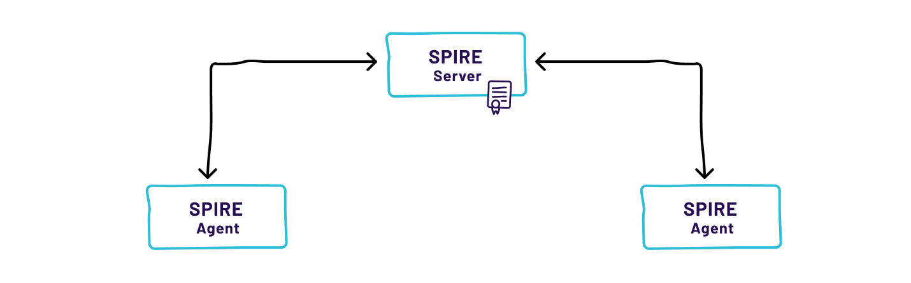

*Figura 6.1: Trust domain único.*

Porém, ao implantar um único SPIRE Server em um trust domain que abrange regiões, plataformas e ambientes de provedores de nuvem, podem surgir problemas de escalabilidade quando agentes dependem de um SPIRE Server distante. Nesse cenário, a solução consiste em configurar os SPIRE Servers em uma topologia aninhada.

## Modelo 2: SPIRE Aninhado (Nested SPIRE)

Uma topologia aninhada para seus SPIRE Servers mantém a comunicação entre agentes e servidores o mais próxima possível. Nessa configuração, os SPIRE Servers de nível superior guardam os certificados e chaves raiz, enquanto os servidores downstream solicitam um certificado de assinatura intermediário para usar como sua autoridade de assinatura X.509. Se o nível superior cair, os servidores intermediários continuam operando — o que confere resiliência à topologia.

A topologia aninhada é ideal para implantações multi-cloud. Graças à capacidade de combinar node attestors, os servidores downstream podem residir e fornecer identidades a workloads e agentes em diferentes ambientes de provedores de nuvem.

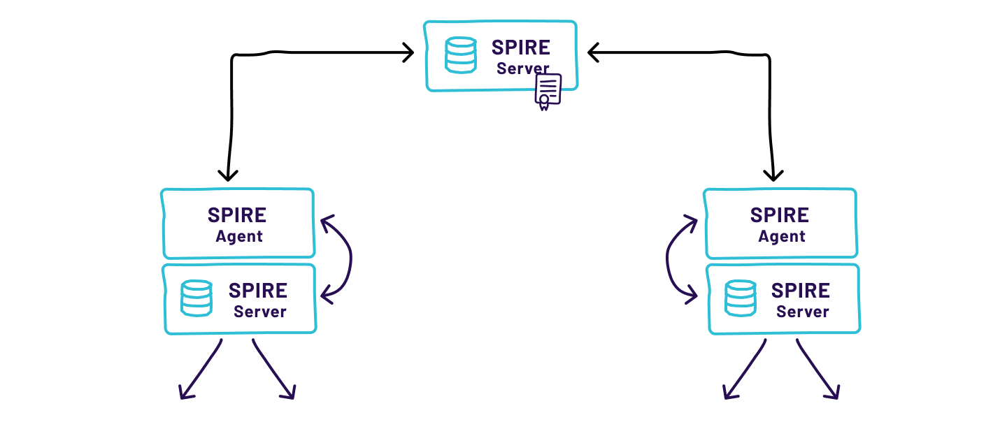

*Figura 6.2: Topologia SPIRE aninhada.*

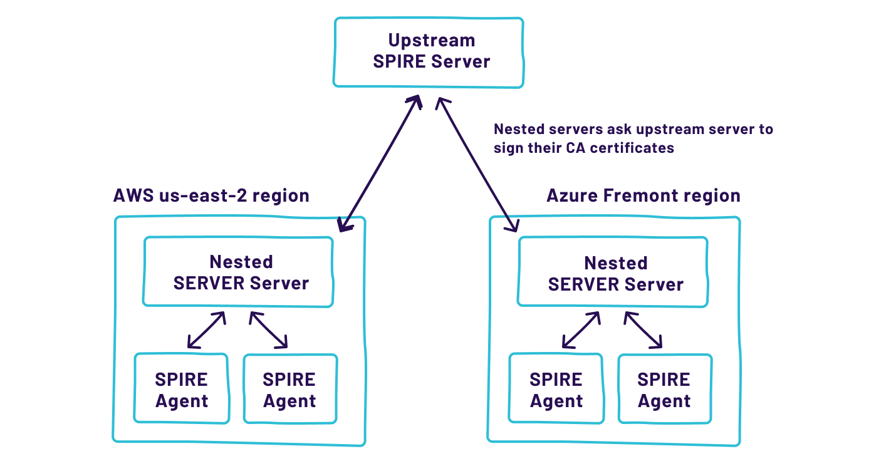

*Figura 6.3: Arquitetura com um SPIRE Server upstream e dois SPIRE Servers aninhados. Cada servidor aninhado pode ter sua própria configuração (relevante para AWS e Azure) e, se um falhar, o outro não será afetado.*

<strong>⚠ SPIRE aninhado não adiciona segurança extra</strong>

Embora o SPIRE aninhado aumente a flexibilidade e escalabilidade, ele não fornece segurança adicional. Como o X.509 não oferece uma forma de restringir os poderes das autoridades certificadoras intermediárias, todo SPIRE Server pode gerar qualquer certificado. Se um SPIRE Server for comprometido, toda a rede pode estar vulnerável — independentemente de quão reforçado seja o servidor upstream. Por isso, é essencial que cada SPIRE Server seja mantido seguro.

## Modelo 3: SPIRE federado

Implantações podem exigir múltiplas roots of trust — por exemplo, quando uma organização tem diferentes divisões com administradores distintos, ou quando há ambientes separados de staging e produção que ocasionalmente precisam se comunicar. Outro caso de uso é a interoperabilidade SPIFFE entre organizações, como entre um provedor de nuvem e seus clientes.

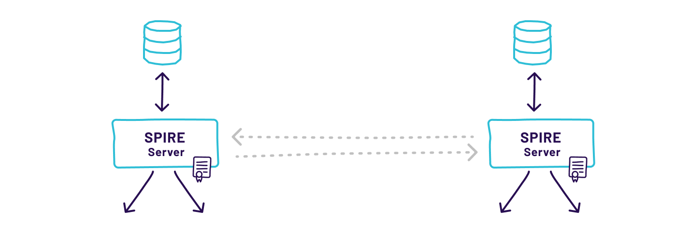

*Figura 6.4: SPIRE Server usando trust domains federados.*

Esses casos exigem um método bem definido e interoperável para que um workload em um trust domain autentique outro workload em um trust domain diferente. No SPIRE federado, a confiança entre trust domains é estabelecida primeiro autenticando o bundle endpoint respectivo, seguida da obtenção do bundle do trust domain externo via endpoint autenticado.

## SPIRE Servers Standalone

A forma mais simples de executar o SPIRE é em um servidor dedicado — especialmente se houver um único trust domain e o número de workloads não for elevado. Você pode co-hospedar um data store no mesmo nó usando SQLite ou MySQL, simplificando a implantação. No entanto, ao usar o modelo de co-hospedagem, lembre-se de considerar replicação ou backups do banco de dados: se o nó for perdido, você poderá executar rapidamente o SPIRE Server em outro nó, mas todos os agentes e workloads precisarão reatestar para obter novas identidades caso o banco de dados seja perdido.

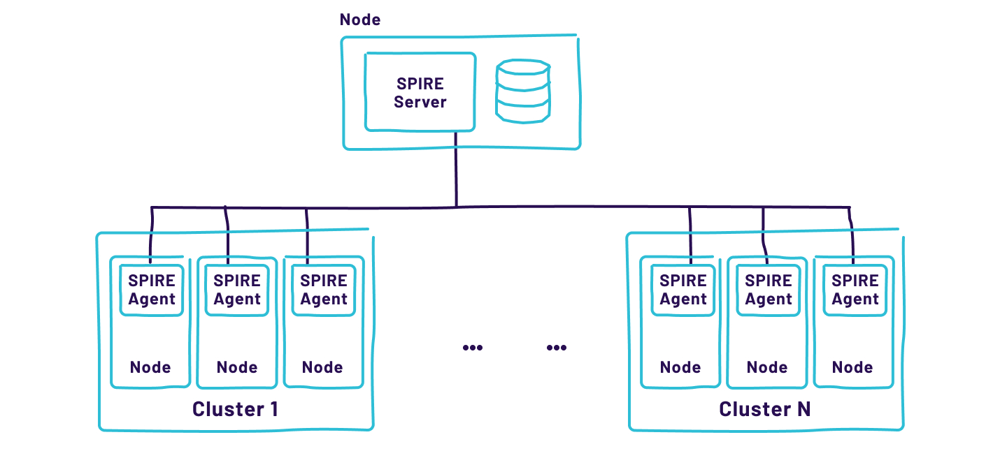

*Figura 6.5: Um único SPIRE Server dedicado.*

### Evitando ponto único de falha

A simplicidade sempre vem com um trade-off. Se houver apenas um SPIRE Server e ele for perdido, tudo é perdido e precisará ser reconstruído. A disponibilidade do sistema pode ser melhorada com mais de um servidor, que compartilharão um data store e conectividade segura com replicação de dados.

Para escalar o SPIRE Server horizontalmente, configure todos os servidores no mesmo trust domain para ler e gravar no mesmo data store compartilhado. O data store é onde o SPIRE Server persiste informações dinâmicas de configuração, como registration entries e políticas de mapeamento de identidade. O SQLite vem empacotado com o SPIRE Server e é o data store padrão.

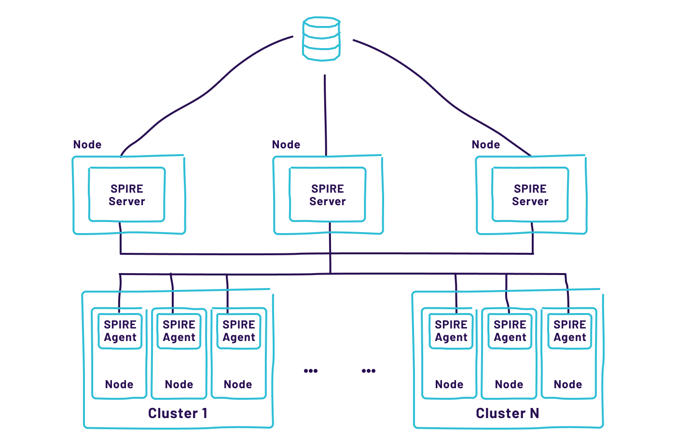

*Figura 6.6: Múltiplas instâncias de SPIRE Server em alta disponibilidade (HA).*

**Modelagem do Data Store**

Ao trabalhar no design do data store, seu foco principal deve ser a redundância e alta disponibilidade. Você precisa determinar se cada cluster de SPIRE Server terá um data store dedicado ou compartilhado. A escolha do tipo de banco de dados pode ser influenciada pelos requisitos de disponibilidade de todo o sistema e pela capacidade da equipe de operações — por exemplo, se ela tem experiência em suportar e escalar MySQL, esse deve ser a escolha principal.

| **Modelo** | **Vantagens** | **Desafios** |
|:---|:---|:---|
| Data store dedicado por cluster | ✅ Isolamento — falha em uma região não afeta outra ✅ Autonomia por ambiente (AWS, GCP, VPC) | ⚠ Agentes precisam re-atestar ao migrar entre clusters ⚠ Registration entries precisam ser restaurados por backup |
| Data store compartilhado | ✅ Resolve problemas de sincronização entre clusters ✅ Agentes não precisam re-atestar em failover | ⚠ Design e operação mais complexos ⚠ Requer infraestrutura de banco em cada domínio de disponibilidade |

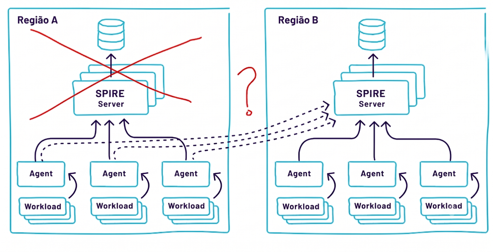*\
Figura 6.7: O que acontece quando é necessário migrar todos os agentes de um cluster para outro? \[Datastore Dedicado por cluster\]*

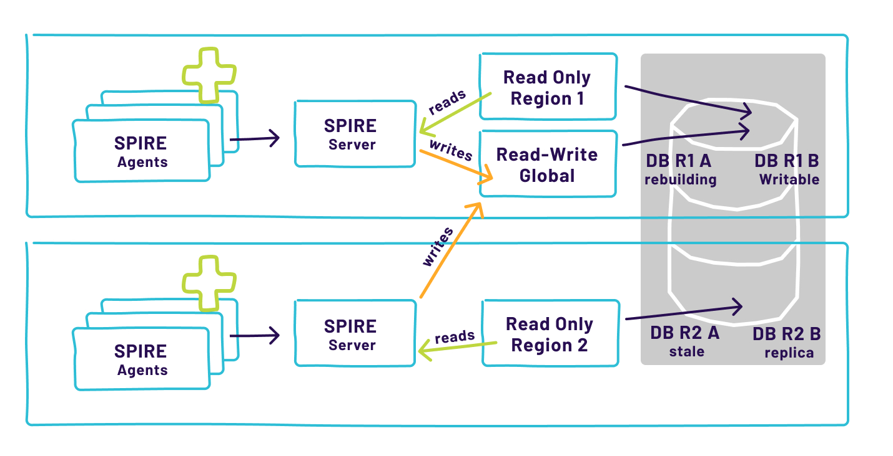

*Figura 6.8: Dois clusters usando um esquema de data store global compartilhado. \[Data store compartilhado\]*

**Gerenciamento de Falhas**

Quando ocorre uma interrupção na infraestrutura, a principal preocupação é como continuar emitindo SVIDs aos workloads que precisam deles para operarem corretamente. O cache de SVIDs do SPIRE Agent em memória foi projetado para ser a principal linha de defesa contra interrupções de curto prazo.

O SPIRE Agent busca periodicamente os SVIDs autorizados do SPIRE Server, ficando preparado para entregá-los aos workloads quando necessário — antes de qualquer requisição de SVID por um workload.

## Desempenho e Confiabilidade do Cache

O cache de SVIDs oferece duas vantagens: desempenho e confiabilidade. Quando um workload solicita seu SVID, o agente não precisa solicitar ao SPIRE Server que o mint — ele já o terá em cache, evitando uma roundtrip ao servidor. Além disso, se o SPIRE Server não estiver disponível no momento em que o workload requisita seu SVID, isso não afetará a emissão do SVID, pois o agente já o terá em cache.

Há uma distinção importante entre X509-SVIDs e JWT-SVIDs: JWT-SVIDs não podem ser gerados antecipadamente, pois o agente não conhece o audience específico necessário ao workload. Por isso, o agente pré-armazena apenas X509-SVIDs em cache. No entanto, o SPIRE Agent mantém um cache de JWT-SVIDs já emitidos, permitindo servi-los sem contatar o SPIRE Server enquanto o JWT-SVID em cache for válido.

## Time-to-live (TTL)

Um atributo importante de um SVID é seu time-to-live (TTL). O SPIRE Agent renovará um SVID no cache se o tempo de vida restante for inferior à metade do TTL — uma abordagem conservadora que garante a renovação antes da expiração.

<strong>⚖ Trade-off entre segurança e disponibilidade no TTL</strong>

TTLs mais longos oferecem mais tempo para remediar interrupções de infraestrutura, mas expõem SVIDs (e chaves associadas) por um período maior.

TTLs mais curtos reduzem a janela de tempo que um ator malicioso pode aproveitar um SVID comprometido, mas exigem respostas mais rápidas a interrupções.

Não existe um TTL 'mágico' que seja a melhor escolha para todas as implantações. A decisão deve ser tomada considerando o trade-off aceitável entre a janela de tempo para resolver interrupções e a exposição dos SVIDs emitidos.

## SPIRE no Kubernetes

O Kubernetes é um orquestrador de containers que pode gerenciar implantação e disponibilidade de software em muitos provedores de nuvem diferentes, e também em hardware físico. O SPIRE inclui diversas formas de integração com Kubernetes.

## SPIRE Agents no Kubernetes

O Kubernetes inclui o conceito de DaemonSet — um contêiner implantado automaticamente em todos os nós, com uma cópia rodando por nó. Essa é a forma perfeita de executar o SPIRE Agent, pois deve haver um agente por nó. À medida que novos nós do Kubernetes entram online, o scheduler inicia automaticamente novas cópias do SPIRE Agent.

Primeiro, cada agente precisa de uma cópia do Bootstrap Trust Bundle. A maneira mais fácil de distribuí-lo é por meio de um ConfigMap do Kubernetes. Uma vez que o agente tenha o Bootstrap trust bundle, ele precisa provar sua própria identidade ao servidor. O Kubernetes oferece dois tipos de tokens de autenticação:

- Service Account Tokens (SATs) — não são ideais para fins de segurança, pois permanecem válidos indefinidamente e têm escopo ilimitado.

- Projected Service Account Tokens (PSATs) — são muito mais seguros, mas requerem uma versão recente do Kubernetes e a feature flag específica habilitada.

O SPIRE suporta tanto SATs quanto PSATs para node attestation.

## SPIRE Server no Kubernetes

O SPIRE Server interage com o Kubernetes de duas formas: ao atualizar seu trust bundle, ele precisa postá-lo em um ConfigMap do Kubernetes; e, à medida que os agentes entram online, precisa validar seus tokens SAT ou PSAT usando a TokenReview API. Ambos são configurados via plugins do SPIRE e requerem os privilégios de API do Kubernetes relevantes.

O SPIRE Server pode rodar completamente no Kubernetes, ao lado dos workloads. No entanto, por segurança, pode ser desejável executá-lo em um cluster Kubernetes separado ou em hardware standalone — dessa forma, se o cluster principal for comprometido, as chaves privadas do SPIRE não correm risco.

*Figura 6.9: SPIRE Server no mesmo cluster dos workloads.*

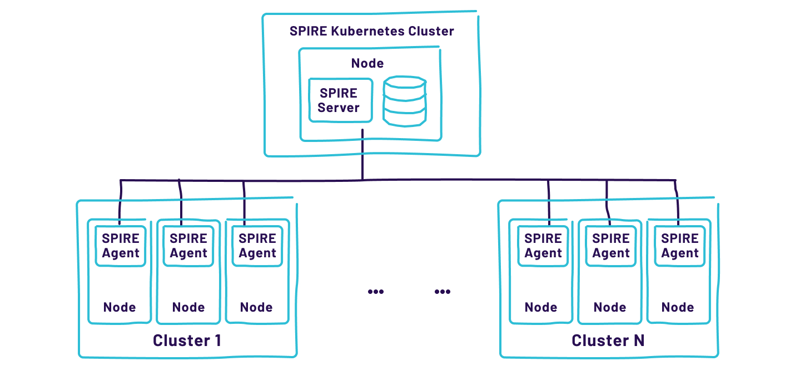

*Figura 6.10: SPIRE Server em um cluster separado por motivos de segurança.*

## Workload Attestation no Kubernetes

O SPIRE Agent inclui um plugin Kubernetes Workload Attestor. Esse plugin usa chamadas de sistema para identificar o PID do workload e, em seguida, faz chamadas locais ao Kubelet para obter o nome do pod, a imagem e outras características — que podem ser usadas como selectors nos registration entries.

## Registration Entries Automáticos no Kubernetes

Uma extensão do SPIRE chamada Kubernetes Workload Registrar pode criar automaticamente entradas de registro de nó e de workload, atuando como ponte entre o servidor de API do Kubernetes e o SPIRE Server. Ela suporta vários métodos de identificação de pods em execução e oferece flexibilidade nas entradas que cria.

## Adicionando Sidecars

Para workloads que ainda não foram adaptados para usar a Workload API, o Kubernetes facilita a adição de sidecars que o fazem. Um sidecar pode ser um proxy SPIFFE-aware como o Envoy. Alternativamente, pode ser um sidecar desenvolvido junto ao SPIRE, chamado 'SPIFFE Helper', que monitora a Workload API e reconfigura o workload quando o SVID do workload muda.

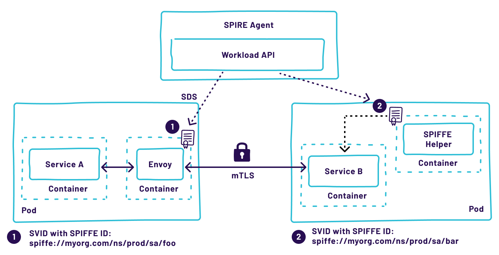

*Figura 6.11: Workloads em um cluster k8s, com containers sidecar implantados.*

**Considerações de Desempenho do SPIRE**

À medida que o número de SPIRE Agents conectados ao servidor cresce, aumenta também a carga sobre o servidor, o data store e a rede. Múltiplos fatores contribuem para a carga: número de nós, número de workloads por nó e frequência de rotação de chaves.

Ao usar JWT-SVIDs com o modelo SPIRE aninhado, as chaves públicas precisam ser mantidas sincronizadas — o que aumenta a quantidade de informações trocadas entre o agente e o servidor.

Por padrão, o tempo de sincronização entre o agente e o servidor é de 5 segundos. Se isso estiver gerando pressão excessiva no sistema, esse valor pode ser aumentado. Fique atento a alguns fatores críticos de desempenho:

- TTLs de SVID muito curtos aumentam a carga de assinatura no SPIRE Server na mesma proporção da frequência de rotação.

- Adicionar um novo workload a todos os nós simultaneamente pode provocar um pico de carga em todo o sistema.

- JWT-SVIDs não são gerados preventivamente no agente e precisam ser assinados sob demanda, o que pode aumentar a latência quando o agente e o servidor estão sobrecarregados.

- Usar JWT-SVIDs com a topologia aninhada exige sincronização de chaves públicas entre todos os servidores, aumentando o tráfego interno.

**Plugins de Attestor**

O SPIRE disponibiliza vários plugins de attestor para Node attestation e workload attestation. A escolha do plugin depende dos requisitos de attestation e do suporte fornecido pela infraestrutura subjacente.

Para workload attestation, a escolha depende principalmente do tipo de workloads orquestrados: em um cluster Kubernetes, usa-se o Kubernetes workload attestor; em uma plataforma OpenStack, o OpenStack Attestor — e assim por diante.

Para node attestation, é importante determinar os requisitos de segurança e conformidade. Em cenários que exigem geofencing de workloads, usar um node attestor de um provedor de nuvem que possa atestar a localização geográfica fornece essas garantias. Em indústrias altamente regulamentadas, pode ser necessário usar attestation baseada em hardware — como o Trusted Platform Module (TPM) —, que pode incluir a medição do estado do software do sistema (firmware, versão do kernel, módulos do kernel e até conteúdo do sistema de arquivos).

## Projetando a Attestation para Diferentes Plataformas de Nuvem

Em ambientes de nuvem, é uma boa prática verificar a identidade do nó com base nos metadados fornecidos pelo provedor de nuvem. O SPIRE oferece uma maneira simples de fazer isso com node attestors personalizados projetados especificamente para cada nuvem. A maioria dos provedores de nuvem disponibiliza uma API que permite identificar o chamador.

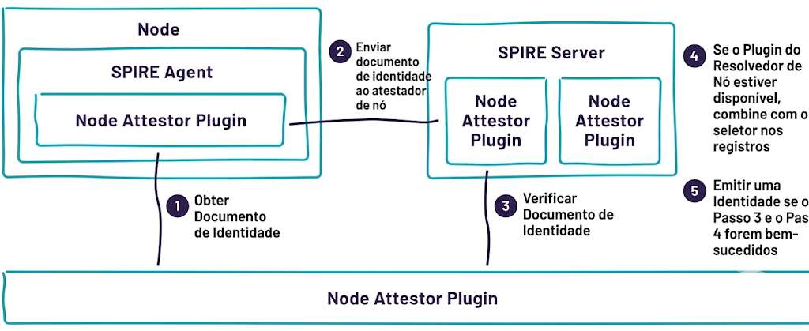

*Figura 6.12: Arquitetura e fluxo do Node Attestor.*

Node Attestors e Resolvers estão disponíveis para Amazon Web Services (AWS), Azure e Google Cloud Platform (GCP). O propósito do attestor é atestar o nó antes de emitir uma identidade para o SPIRE Agent rodando nele. Uma vez estabelecida a identidade, o SPIRE Server pode ter um plugin Resolver instalado, que permite criar selectors adicionais mapeados aos metadados do nó — cujos metadados disponíveis são específicos de cada nuvem.

Em contrapartida, se um provedor de nuvem não oferece suporte à attestation de nó, é possível fazer o bootstrap com um join token — que, no entanto, oferece um conjunto muito limitado de garantias.

**Gerenciamento de Registration Entries**

O SPIRE Server suporta duas formas de adicionar registration entries: via interface de linha de comando (CLI) ou por meio de uma Registration API (que permite acesso apenas a administradores). O SPIRE precisa de entradas de registo para operar.

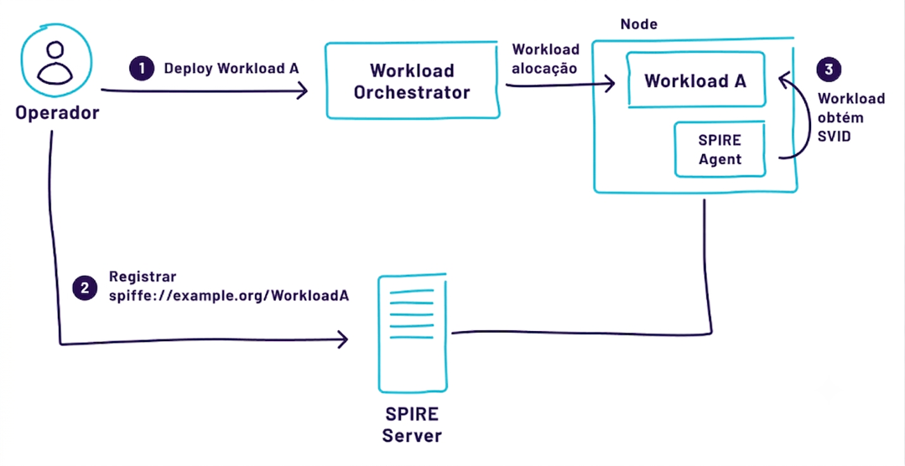

*Figura 6.13: Registro manual de workloads.*

Um processo manual não escala em implantações grandes ou quando a infraestrutura cresce rapidamente — além de estar sujeito a erros e incapaz de rastrear todas as mudanças. Usar um processo automatizado para criar registration entries via API do SPIRE é a escolha mais adequada para implantações com um grande número de entries.

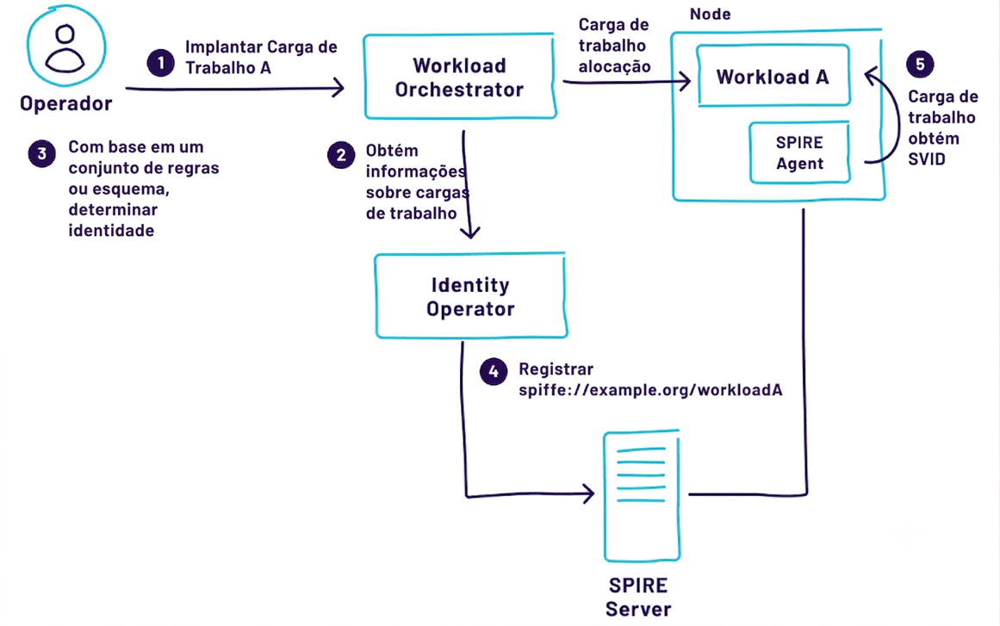

*Figura 6.14: Exemplo de criação automática de registration entries de workload usando um 'Identity Operator' que se comunica com o orquestrador de workloads.*

**Considerações de segurança e modelagem de ameaças**

Qualquer decisão de design e arquitetura afetará o modelo de ameaças do sistema como um todo, e possivelmente o de outros sistemas que interagem com ele. A seguir, as principais áreas de atenção ao projetar uma implantação SPIRE segura.

## Design de PKI

A estrutura da sua PKI — como você define os trust domains para estabelecer fronteiras de segurança, onde você mantém suas chaves privadas e com que frequência as rotaciona — são questões centrais nessa fase. Cada organização terá uma hierarquia de certificados diferente, pois cada uma tem requisitos distintos.

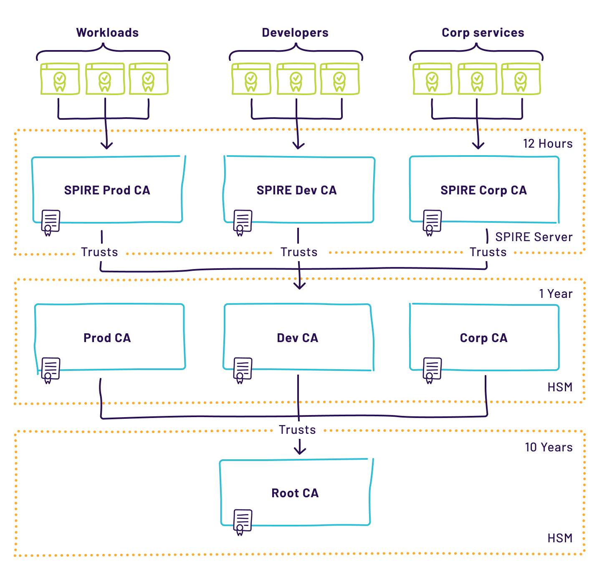

*Figura 6.15: Exemplo de implantação do SPIRE com três trust domains, cada um usando uma CA corporativa diferente, todas usando a mesma CA raiz. Em cada camada, os certificados têm um TTL mais curto.*

## TTL, Revogação e Renovação

Ao lidar com PKI, questões de expiração, reemissão e revogação de certificados sempre surgem. As seguintes considerações influenciam as decisões nessa área:

- Overhead de desempenho para expiração/reemissão — quanto overhead de desempenho pode ser tolerado. Quanto menor o TTL, maior o overhead.

- Latência de entrega dos documentos — o TTL deve ser maior do que a latência esperada de entrega dos documentos de identidade, para que os serviços não fiquem sem identidade válida.

- Maturidade do ecossistema de PKI — há mecanismos de revogação em vigor? Estão sendo mantidos e atualizados?

- Apetite de risco da organização — se a revogação não estiver habilitada, qual é o tempo aceitável para que uma identidade comprometida e detectada permaneça válida?

- Vida útil esperada dos objetos — o TTL não deve ser definido por um período excessivamente longo, com base na vida útil esperada dos objetos.

## Blast Radius

Durante a fase de design da PKI, é muito importante considerar como o comprometimento de um dos componentes afetará o restante da infraestrutura. Por exemplo, se o SPIRE Server mantém chaves em memória e o servidor for comprometido, todos os SVIDs downstream precisam ser cancelados e reemitidos. Para minimizar o impacto desse tipo de ataque, você pode projetar a infraestrutura SPIRE com múltiplos trust domains para diferentes segmentos de rede, Virtual Private Clouds ou provedores de nuvem.

## Tabela de Considerações de Segurança

| **Área de atenção** | **Consideração de segurança** |
|:---|:---|
| 🔑 Chaves privadas | Nunca armazene chaves da CA raiz em disco simples. Use um KMS (software ou hardware) ou o plugin Upstream Authority para integrar com PKI existente. Key Managers são configuráveis via plugins no SPIRE Server. |
| 🗄 Data store | Comprometimento do data store permite que um atacante registre workloads arbitrários e adicione chaves ao trust bundle. Use TLS na conexão com o banco, autenticação robusta e restrinja quem tem acesso. Em produção, nunca coexista o banco no mesmo host do SPIRE Server. |
| 📦 Trust bundle do agente | O bootstrap trust bundle distribuído ao agente deve ser protegido contra adulteração. Um atacante que adicionar chaves a ele pode realizar ataques man-in-the-middle sobre todos os workloads atendidos por esse agente. |
| ⚙ Configuração do agente | O arquivo de configuração do agente deve ser mantido seguro. Se um atacante modificá-lo, pode apontar o agente para um SPIRE Server comprometido e controlar as identidades emitidas. |
| 📊 Telemetria e health checks | Health checks e plugins de telemetria (como Prometheus) podem expor portas adicionais. O modelo de ameaças assume que o agente expõe apenas a Workload API via Unix socket local. Qualquer exposição extra deve ser cuidadosamente avaliada para evitar DoS, RCE e vazamentos de memória. |
| 🔀 Plugins de node attestor | A escolha do attestor desloca a root of trust para o sistema subjacente. Garanta que esse sistema atenda aos padrões de segurança e disponibilidade da organização. Para join tokens, avalie rigorosamente os procedimentos operacionais de criação e uso. |

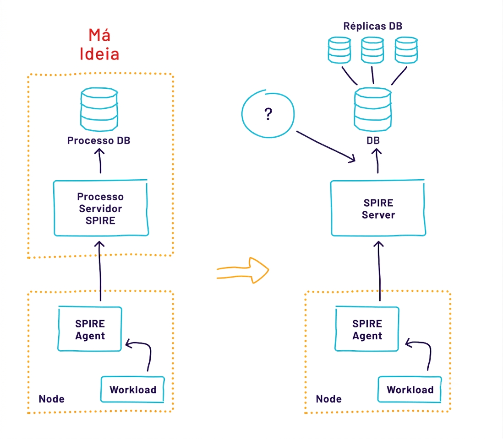*\
Figura 6.16: Tipicamente, o data store do SPIRE Server é um banco de dados conectado via rede por razões de disponibilidade e desempenho — o que representa um desafio de segurança a ser endereçado.*

*\*
