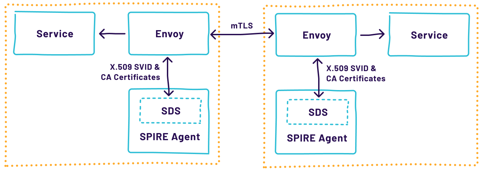
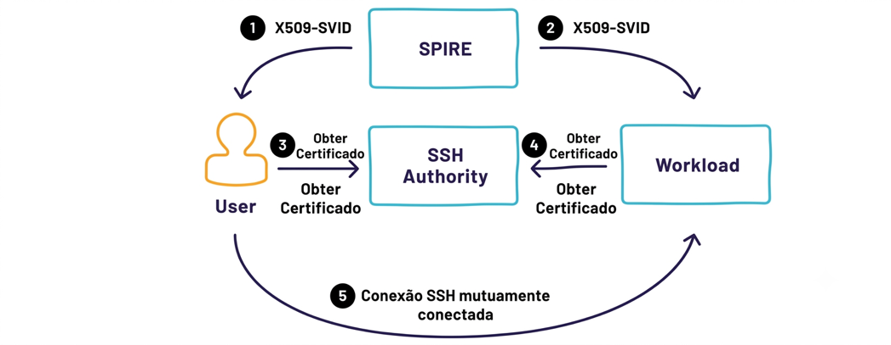

# Capítulo 7 — Integrando com Outros

*O SPIFFE foi projetado do zero para ser plugável e extensível. Este capítulo apresenta as integrações mais comuns, com uma visão geral de alto nível e uma estratégia para conduzir o trabalho de integração.*

## Habilitando Software para Usar SVIDs

Há muitas opções ao se considerar como adaptar o software para usar SVIDs. A tabela abaixo apresenta uma visão comparativa das abordagens principais:

|  |  |  |  |
|----|----|----|----|
| **Abordagem** | **Quando usar** | **Vantagens** | **Desafios** |
| **🔧 Suporte nativo SPIFFE** | Serviços novos ou facilmente refatoráveis; sensíveis à latência; que precisam de controle granular na camada de aplicação. | Máximo controle e flexibilidade | Requer modificação do código-fonte |
| **🔀 Proxies SPIFFE-aware (Envoy, Ghostunnel)** | Código de terceiros não modificável; custo de refatoração muito alto. | Sem alteração no código da aplicação | Overhead adicional de proxy; segurança entre proxy e app deve ser garantida em proxies standalone |
| **🕸 Service Mesh** | Ambientes com múltiplas linguagens; quando gerenciamento de proxies é necessário em escala. | Injeção e gerenciamento automático de proxies | Complexidade operacional; risco de falha catastrófica se o mesh quebrar |
| **🤝 Programas helper (SPIFFE Helper)** | Apps que suportam TLS via arquivos em disco (MySQL, PostgreSQL, NGINX, Apache). | Sem modificação de código; ampla compatibilidade | Menos granularidade; não permite filtrar por SPIFFE ID específico |

## Suporte nativo ao SPIFFE

Essa abordagem requer a modificação dos serviços existentes para torná-los SPIFFE-aware. É a escolha preferencial quando as modificações necessárias são mínimas ou podem ser introduzidas em uma biblioteca ou framework comum usado nos serviços da aplicação. A integração nativa é a melhor abordagem para serviços do plano de dados sensíveis à latência, ou para serviços que desejam utilizar identidade na camada de aplicação.

O SPIFFE fornece bibliotecas, como GO-SPIFFE (para Go) e JAVA-SPIFFE (para Java), que facilitam o desenvolvimento de workloads habilitados para SPIFFE. Essas bibliotecas têm exemplos de uso do SPIFFE com clientes e servidores gRPC e HTTPS. Não se está limitado a Go e Java — esforços comunitários estão em andamento para bibliotecas SPIFFE em Python, Rust e C.

## Proxies SPIFFE-aware

Quando o custo de refatoração é considerado muito alto, ou o serviço executa código de terceiros que não pode ser modificado, a escolha pragmática é colocar um proxy que suporte SPIFFE na frente da aplicação. Dependendo do modelo de implantação, pode ser um proxy standalone ou um conjunto de proxies colocalizados. Proxies colocalizados têm a vantagem de que o tráfego entre o proxy e o serviço não seguro permanece local — com proxies standalone, a segurança entre o proxy e a aplicação ainda deve ser garantida.

### Ghostunnel

O Ghostunnel é um proxy L3/L4 com suporte nativo completo a toda a especificação SPIFFE, incluindo suporte à SPIFFE Workload API e Federation. É a melhor opção para aplicações que não precisam de funcionalidades L7.

### Envoy

Para aplicações que requerem funcionalidades L7, o Envoy é recomendado. Embora o Envoy não suporte nativamente a SPIFFE Workload API, o SPIRE implementa a Secret Discovery Service API (SDS API) — uma API do Envoy usada para recuperar e manter certificados e chaves privadas. Por meio da SDS API, o SPIRE pode enviar certificados TLS, chaves privadas e certificados de CA confiáveis diretamente para o Envoy, cuidando da rotação das chaves e certificados de curta duração sem necessidade de reinicialização.

*Figura 7.1: Diagrama de alto nível de dois proxies Envoy entre dois serviços, usando a implementação SDS do SPIRE Agent para estabelecer mTLS.*

## Service Mesh

Proxies L7, como o Envoy, podem realizar muitas funções além da segurança SPIFFE — como descoberta de serviços, autorização de requisições e balanceamento de carga. Um service mesh é uma implantação orientada de uma frota de proxies e de um plano de controle associado. Eles tipicamente permitem a injeção e a configuração automáticas de proxies colocalizados à medida que os workloads são implantados.

A maioria das implementações de service mesh utiliza autenticação SPIFFE para o tráfego serviço a serviço. Alguns usam o SPIRE para isso; outros implementaram provedores de identidade SPIFFE específicos para seus produtos. Service meshes não são alternativas diretas ao SPIFFE/SPIRE — são complementares, com SPIFFE/SPIRE atuando como a solução de identidade para abstrações de nível mais alto no mesh.

## Programas Helper

Para workloads que não suportam nativamente a SPIFFE Workload API, mas que suportam o uso de certificados para autenticação, um programa helper rodando ao lado do workload pode fazer a ponte. O SPIFFE Helper busca SVIDs da Workload API e os grava em disco, onde podem ser lidos pela aplicação. O helper continua rodando, garantindo que os certificados em disco sejam atualizados continuamente à medida que ele executa. Quando uma atualização ocorre, o helper pode sinalizar a aplicação ou executar um comando configurável.

Muitas aplicações prontas para uso que suportam TLS podem ser configuradas para usar SPIFFE dessa forma — como MySQL, PostgreSQL, Apache HTTPD e NGINX. Ferramentas de linha de comando, como openssl, x509curl e grpcurl, também podem ser usadas.

<strong>⚠ Limitação do SPIFFE Helper</strong>

Essa abordagem oferece menos flexibilidade do que a integração nativa. Por exemplo, ao usar o SPIFFE Helper para configurar o Apache HTTPD para mTLS, não é possível configurar o mod_ssl para aceitar apenas clientes com SPIFFE IDs específicos.

**Usando SVIDs com software não SPIFFE-aware**

Como os SVIDs são baseados em tipos de documentos conhecidos, é relativamente comum encontrar software que suporta o tipo de documento, mas não é necessariamente SPIFFE-aware. O SPIFFE/SPIRE foi projetado para lidar bem com esse caso.

## Uso Dual do X509-SVID

Muitos sistemas não-SPIFFE suportam TLS ou mTLS, mas dependem de certificados com informações de identidade no Common Name (CN) do subject ou em um DNS name na extensão Subject Alternative Name (SAN). O SPIRE suporta a emissão de certificados X.509 com valores específicos de CN e DNS SAN configuráveis por workload (como parte de um registration entry).

Isso permite o uso de X509-SVIDs com software que não entende diretamente como usar SPIFFE IDs. Por exemplo, clientes HTTPS frequentemente esperam que o certificado apresentado corresponda ao nome DNS da requisição. Em outro exemplo, MySQL e PostgreSQL podem usar o Common Name para identificar um cliente mTLS. Aproveitando esse recurso do SPIRE, esses casos de uso podem ser atendidos com os mesmos SVIDs usados para casos de uso SPIFFE.

## Uso Dual do JWT-SVID

De forma semelhante ao X509-SVID, os JWT-SVIDs também suportam esse tipo de dualidade. Enquanto JWT-SVIDs usam o claim padrão subject (sub) para armazenar o SPIFFE ID, a metodologia de validação é semelhante e compatível com OpenID Connect (OIDC).

A API de Federation do SPIFFE expõe chaves públicas por meio de um documento JWKS, servido por um endpoint HTTPS — o mesmo mecanismo usado para obter chaves públicas para validação de OIDC. Assim, qualquer tecnologia que suporte OIDC Identity Federation também suportará a aceitação de JWT-SVIDs, independentemente de ser SPIFFE-aware.

<strong>🔗 Integração com AWS IAM via OIDC</strong>

Configurando o IAM em uma conta AWS para aceitar identidades do SPIRE como provedor de identidade OIDC, torna-se possível usar JWT-SVIDs da SPIFFE Workload API para assumir roles do AWS IAM. Isso é particularmente poderoso quando o workload que precisa acessar recursos AWS não está rodando na AWS — eliminando efetivamente a necessidade de armazenar, compartilhar e gerenciar AWS access keys de longa duração.

**O que construir sobre SPIFFE**

*Uma vez que o SPIFFE existe como base de identidade universal em seu ecossistema, é hora de pensar no que construir sobre ele. As possibilidades descritas abaixo não estão necessariamente prontas para uso — algumas peças de integração precisarão ser implementadas, e os detalhes variam de uma implantação para outra.*

## Logging, Monitoramento e Observabilidade

O SPIFFE pode fornecer prova verificável de identidade a outros sistemas — o que é uma vantagem para os seguintes componentes:

- Infraestrutura de métricas

- Infraestrutura de logging

- Observabilidade distribuída

- Medição de uso (metering)

- Rastreamento distribuído (distributed tracing)

Você pode usar SVIDs para garantir comunicação segura cliente-servidor nesses sistemas. Mas também pode enriquecer todos esses componentes com o SPIFFE ID, o que traz vantagens como correlacionar eventos em múltiplas plataformas e runtimes, identificar aplicações que ainda não usam identidades SPIFFE, e detectar anomalias operacionais e ataques em qualquer ponto da infraestrutura.

## Auditoria

Para qualquer sistema de segurança construído sobre o SPIRE, os logs não são apenas informações — são evidências do que aconteceu. Ter um local centralizado para armazenar logs é essencial para análise forense em caso de incidente.

O SPIFFE pode enriquecer dados de auditoria fornecendo não-repúdio por meio de chamadas autenticadas a sistemas de auditoria centralizados. Por exemplo, ao usar um X509-SVID e mTLS para estabelecer sessões com sistemas de auditoria, podemos ter certeza da origem de cada linha de log — atacantes não podem simplesmente manipular labels ou outros dados enviados.

## Certificate Transparency

O Certificate Transparency (CT) ajuda a detectar ataques à infraestrutura de certificados, fornecendo um framework aberto para monitorar e auditar certificados X.509 em tempo quase real. Permite detectar certificados obtidos de forma maliciosa a partir de uma CA comprometida, além de identificar CAs desonestas que emitem certificados indevidamente. (veja: https://www.certificatetransparency.org/what-is-ct)

Existem diferentes possibilidades de integração do SPIRE com Certificate Transparency. Uma delas é registrar informações sobre todos os certificados emitidos pelo sistema, protegidas por um mecanismo criptográfico especial conhecido como Merkle Tree Hashes, para prevenir adulterações. Outra abordagem é aplicar CT a todos os sistemas, impedindo conexões TLS e mTLS com aplicações que não tenham informações de certificado registradas no servidor CT.

## Segurança da Cadeia de Suprimentos (Supply Chain Security)

Embora a maior parte da cobertura de uso pretendido do SPIFFE se concentre na segurança das comunicações entre sistemas de software em tempo de execução, também é crítico proteger o software durante os estágios anteriores à implantação. Comprometimentos da cadeia de suprimentos são um vetor de ataque real — é desejável proteger a integridade da cadeia de suprimentos de software para impedir que atores maliciosos introduzam backdoors ou bibliotecas vulneráveis no código.

Você pode considerar usar o SPIFFE para fornecer a root of trust para assinatura e emitir identidades para os componentes de software dos sistemas de cadeia de suprimentos. Isso pode funcionar em conjunto com softwares complementares, como The Update Framework (TUF), serviços de assinatura de artefatos, como Notary, ou logs de cadeia de suprimentos, como In-Toto.

É possível integrar o SPIRE com componentes de supply chain em dois níveis: identificando os diferentes elementos do sistema para proteger a maquinaria e o plano de controle; e garantindo que apenas binários de procedência conhecida recebam identidades, personalizando selectors — por exemplo, verificando metadados de supply chain por meio de workload attestors customizados.

## Integrando SPIFFE para Usuários

O foco principal da arquitetura SPIFFE e SPIRE é a identidade de software. A identidade do usuário não é considerada, pois o problema já é bem resolvido, e há diferenças significativas na forma como a identidade é emitida para humanos versus software. Dito isso, isso não significa que você não possa distribuir identidades SPIFFE a usuários.

## Identidade Verificável para Usuários

Como os usuários devem interagir em um ecossistema habilitado para SPIFFE? Lembre-se de que SPIFFE significa “Secure Production Identity Framework for Everyone”. Embora a maior parte deste livro foque em identidade para software, é igualmente válido e até desejável que SVIDs sejam dados aos usuários — permitindo que tudo o que as workloads podem fazer com SVIDs também possa ser feito por pessoas, como acesso via mTLS a serviços. Isso é especialmente útil para desenvolvedores que precisam acessar os mesmos recursos que seus softwares usarão após a implantação.

Assim como a especificação SPIFFE é aberta quanto ao esquema de SPIFFE IDs, cabe a você como representar humanos. Pode ser suficiente ter o nome de usuário como caminho do SPIFFE ID:

spiffe://exemplo.com/users/zero_the_turtle

# Ou com trust domain separado para usuários:

spiffe://users.exemplo.com/zero_the_turtle

Em um cenário ideal, seu provedor SSO existente é capaz de emitir JWTs para seus usuários (como um provedor de identidade OIDC). Nesse caso, se você puder configurar o claim sub para usar um SPIFFE ID, pode não ser necessário realizar nenhum trabalho adicional para gerar SVIDs para seus usuários.

Se não for possível obter JWTs SPIFFE diretamente do provedor de identidade, mas você tiver um token de identidade verificável, pode utilizar um attestor SPIRE personalizado que aceite esse token como meio rudimentar de attestation. Como último recurso, você pode construir um serviço integrado à sua solução SSO existente que produza SVIDs para os usuários com base na sua sessão autenticada. (https://github.com/JackOfMostTrades/spiffe-user-demo)

*Figura 7.2: Exemplo de uso de um token de ID OIDC para autenticação no SPIRE.*

## Usando SPIFFE e SPIRE com SSH

O OpenSSH suporta autenticação com autoridades de certificação e certificados. Embora o formato dos certificados OpenSSH seja diferente do X.509, é possível construir um serviço para criar certificados SSH usando SVIDs como mecanismo de autenticação — permitindo que você utilize suas identidades SPIFFE também para SSH.

Veja mais em https://github.com/openssh/opensshportable/blob/master/PROTOCOL.certkeys

Para usuários que precisam de acesso SSH a workloads no ecossistema, esse modelo fornece credenciais efêmeras, de curta duração e auditáveis para acesso SSH, além de um único ponto de controle para aplicar políticas de controle de acesso ou autenticação multifator. Também permite que os workloads recuperem certificados SSH do lado do servidor (host), eliminando a necessidade dos usuários confirmarem a confiança em uma chave de host desconhecida na primeira conexão.

*Figura 7.3: Usando SVIDs para inicializar certificados SSH.*

## Interfaces Web de Microsserviços

Embora a maior parte deste livro trate da autenticação workload-a-workload, frequentemente também há necessidade de usuários autenticarem-se em workloads via navegador. Fornecer uma boa experiência requer uma ponte entre uma forma de autenticação compatível com o browser e a autenticação mTLS do SPIFFE.

A maneira mais fácil de conseguir isso é ter uma porta de API que use mTLS e outra que aceite um método de autenticação compatível com browser, como um mecanismo SSO baseado na web ou OAuth2/OIDC. Um filtro pós-autenticação para requisições na porta secundária deve fornecer uma camada de tradução entre o principal de autenticação baseado no browser e um SPIFFE ID correspondente — garantindo que a aplicação subjacente seja agnóstica ao mecanismo específico de autenticação utilizado.
