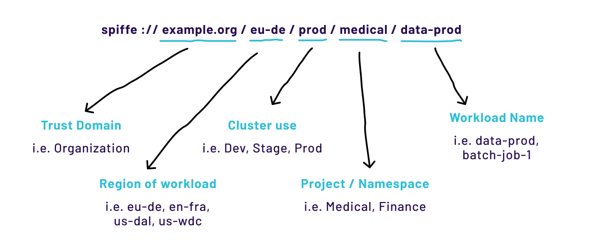
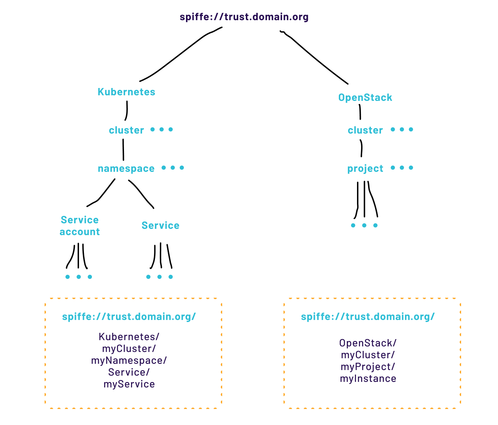

# Capítulo 8 — Usando Identidades SPIFFE para Informar a Autorização

## Construindo autorização Sobre o SPIFFE

O SPIFFE foca na emissão e na interoperabilidade de identidades criptográficas seguras para software, mas não aborda diretamente o uso ou o consumo dessas identidades. O SPIFFE frequentemente atua como a pedra angular de um sistema de autorização robusto, e os SPIFFE IDs, em si, desempenham um papel importante nessa história.

## Autenticação vs. Autorização (AuthN vs. AuthZ)

Uma vez que um workload tenha uma identidade criptográfica segura, ele pode provar sua identidade a outros serviços — o que é autenticação. Uma vez autenticado, o serviço pode escolher quais ações são permitidas — isso é autorização. Em alguns sistemas, qualquer entidade autenticada também é autorizada. Como o SPIFFE concede identidades automaticamente aos serviços ao iniciarem, é vital entender claramente que nem toda entidade capaz de se autenticar deve ser autorizada.

## Modelos de Autorização

|  |  |  |  |
|----|----|----|----|
| **Modelo** | **Como funciona** | **Vantagens** | **Desafios** |
| Allowlist | Lista de SPIFFE IDs autorizados por recurso. | Simples, fácil de entender. Ideal para ecossistemas pequenos. | Não escala: cada novo serviço pode exigir atualização de muitas listas. |
| RBAC(Role-Based) | Serviços são atribuídos a papéis; acesso é controlado por papel. | Escala melhor: novos serviços são atribuídos a papéis existentes. | SPIFFE ID deve ser estático — papéis devem ser mapeados externamente, não codificados no ID. |
| ABAC(Attribute-Based) | Decisões baseadas em atributos (região, ambiente, organização) codificados ou derivados do SPIFFE ID. | Muito flexível; suporta políticas complexas e situacionais. | Maior complexidade de design e manutenção das políticas. |
| OPA (Open Policy Agent) | Motor de políticas CNCF com linguagem Rego; integra com Envoy e SPIRE. | Políticas elaboradas com ABAC/RBAC; unit-testáveis; gerenciadas via CI/CD. | Curva de aprendizado da linguagem Rego; infraestrutura adicional. |

### Allowlists

Em ecossistemas pequenos, ou ao começar com SPIFFE e SPIRE, manter as coisas simples é a melhor opção. Uma allowlist é uma lista de identidades autorizadas associada a cada recurso. A vantagem é a simplicidade — mas a escalabilidade se torna um obstáculo quando a organização tem centenas ou milhares de identidades: cada novo serviço pode exigir a atualização de muitas listas.

|                                                             |
|-------------------------------------------------------------|
| ghostunnel server --allow-uri spiffe://example.com/blog/web |

### RBAC — Controle de Acesso Baseado em Papéis

No RBAC, os serviços são atribuídos a papéis e o controle de acesso é definido com base nesses papéis. Embora seja possível codificar o papel de um serviço no seu SPIFFE ID, isso geralmente é uma prática ruim — o SPIFFE ID é estático, enquanto os papéis podem precisar mudar. O melhor é usar um mapeamento externo de IDs de SPIFFE para os papéis.

### ABAC — Controle de Acesso Baseado em Atributos

No ABAC, as decisões de autorização baseiam-se em atributos associados a um serviço. Em conjunto com o RBAC, o ABAC pode ser uma ferramenta poderosa para fortalecer as políticas de autorização. Por exemplo, para cumprir requisitos legais, pode ser necessário limitar o acesso a um banco de dados a serviços de uma região específica — essa informação de região pode ser um atributo no modelo ABAC codificado no esquema de SPIFFE ID.

**Projetando esquemas de SPIFFE ID para autorização**

A especificação SPIFFE não especifica nem limita quais informações podem ser codificadas em um SPIFFE ID. As únicas limitações decorrem do tamanho máximo da extensão SAN e dos caracteres permitidos.

<strong>⚠ Cuidado extremo ao codificar metadados de autorização no SPIFFE ID</strong>

Use cautela extrema ao codificar metadados de autorização no formato do SPIFFE ID da sua organização. O SPIFFE ID é estático e pode ser difícil de migrar — mudanças no esquema afetam todos os sistemas que dependem da identidade.

## Exemplos de Esquemas SPIFFE

Para tomar uma decisão de autorização com base em substrings do SPIFFE ID, é preciso definir o significado de cada parte da identidade. Um esquema pode ser ordenado — onde a primeira parte representa a região, a segunda o ambiente, e assim por diante:

spiffe://trust.domain.org/&lt;regiao&gt;/&lt;dev|staging|prod&gt;/&lt;organizacao&gt;/&lt;workload&gt;

Exemplo:

spiffe://trust.domain.org/us-east/prod/pagamentos/checkout-api

*Figura 8.1: Componentes de um SPIFFE ID e seus possíveis significados em uma organização.*

*Figura 8.2: Ilustração de outro esquema potencial de SPIFFE ID, variando conforme o orquestrador (Kubernetes vs. OpenShift).*

## Evolução do Esquema — Compatibilidade e Versionamento

Organizações mudam, e os requisitos do esquema de identidade também. Dois mecanismos ajudam a lidar com isso:

### Esquema baseado em pares chave-valor

Pares chave-valor são, por natureza, não ordenados, o que facilita a adição de novos campos sem grandes mudanças. Usando um delimitador conhecido (como ':'):

|  |
|----|
| spiffe://trust.dominio.org/ambiente:dev/regiao:br-sp/org:pagamentos/nome:checkout |

Com esse modelo, novos campos podem ser adicionados sem alterar a estrutura subjacente do esquema. Consumidores processam a identidade como um conjunto de pares chave-valor.

### Versionamento

Outra solução é incorporar versionamento ao esquema — o que permite evoluí-lo mantendo compatibilidade com versões anteriores. O restante dos sistemas segue o mapeamento entre versões e entidades codificadas:

spiffe://trust.domain.org/v1/regiao/ambiente/org/workload

spiffe://trust.domain.org/v2/regiao/datacenter/ambiente/org/workload

**Exemplos de autorização com HashiCorp Vault**

O Vault é um secret store: administradores podem usá-lo para armazenar com segurança segredos, como senhas, chaves de API e chaves privadas de que os serviços podem precisar. Como muitas organizações ainda precisam armazenar segredos com segurança, usar SPIFFE para acessar o Vault é uma necessidade comum.

## Configurando o Vault para Identidades SPIFFE

O Vault lida com tarefas de autenticação e autorização de identidade ao tratar requisições de clientes. Via TLS Certificate Auth Method ou JWT/OIDC Auth Method, ele pode ser configurado para reconhecer e validar JWTs e X509-SVIDs gerados pelo SPIFFE. O trust bundle precisa ser configurado nessas interfaces para que os SVIDs possam ser autenticados.

## Exemplo RBAC com SPIFFE no Vault

O Vault permite criar regras que definem quais identidades podem acessar quais segredos. Em um exemplo de política RBAC simples, duas identidades específicas recebem acesso a um conjunto de permissões:

{

"display_name": "medical-access-role",

"allowed_common_names": [

"spiffe://example.org/eu-de/prod/medical/data-proc-1",

"spiffe://example.org/eu-de/prod/medical/data-proc-2"

],

"token_policies": "medical-use"

}

Essa regra concede às duas identidades acesso ao secret medical-use. O Vault cuida do mapeamento de dois SPIFFE IDs distintos para a mesma política de controle de acesso — o que torna isso RBAC, em vez de uma simples allowlist.

## Exemplo ABAC com SPIFFE no Vault

Em alguns casos, é mais fácil projetar políticas de autorização baseadas em atributos. Com o uso de wildcards, é possível criar uma política que autorize workloads com um determinado prefixo de SPIFFE ID — útil para batch jobs efêmeros que recebem sufixos aleatórios:

{

"display_name": "medical-access-role",

"allowed_common_names": [

"spiffe://example.org/eu/prod/medical/batch-job*"

],

"token_policies": "medical-use"

}

Outra variação usa wildcard regional para autorizar apenas data-proc workloads em qualquer data center da UE — de modo que novos data centers europeus são automaticamente cobertos pela política existente:

|  |
|----|
| "allowed_common_names": \["spiffe://example.org/eu-\*/prod/medical/data-proc"\] |

## Open Policy Agent (OPA)

O Open Policy Agent (OPA) é um projeto da CNCF que oferece autorização avançada. Usando uma linguagem de domínio específico chamada Rego, ele avalia eficientemente as propriedades de uma requisição entrante e determina a quais recursos ela deve ter acesso. Com Rego, é possível projetar políticas elaboradas, incluindo ABAC e RBAC — e armazená-las em arquivos de texto, gerenciá-las via CI/CD e submetê-las a testes unitários.

# Permite que o serviço Backend acesse o serviço DB

allow {

http_request.path == "/good/db"

http_request.method == "GET"

svc_spiffe_id == "spiffe://domain.test/eu-du/backend-server"

}

O proxy Envoy integra-se tanto ao SPIRE quanto ao OPA, permitindo começar imediatamente sem alterar o código dos serviços. Para políticas de autorização mais elaboradas, o OPA é uma excelente escolha.

## Resumo do Capítulo 8

A autorização é um tópico enorme e complexo por si só, muito além do escopo deste livro. Porém, como em muitos outros aspectos do ecossistema que interage com a identidade, é útil entender a relação da identidade com a autorização e, de forma mais ampla, com as políticas. Neste capítulo, foram apresentadas diversas formas de pensar sobre autorização usando identidades SPIFFE, bem como considerações de design relacionadas a elas — o que ajudará a orientar melhor o design da sua solução de identidade para atender às necessidades de autorização e de política da sua organização.
