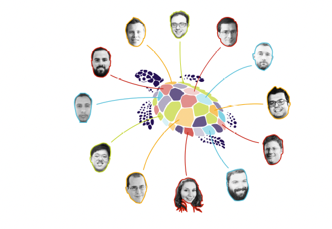

# Notas de Tradução

Esta é uma tradução independente para o português do Brasil de Solving the Bottom Turtle — a SPIFFE Way to Establish Trust in Your Infrastructure via Universal Identity (1ª edição, 2020), escrito coletivamente por Daniel Feldman, Emily Fox, Evan Gilman, Ian Haken, Frederick Kautz, Umair Khan, Max Lambrecht, Brandon Lum, Agustín Martínez Fayó, Eli Nesterov, Andres Vega e Michael Wardrop. A obra original está licenciada sob a Creative Commons Attribution 4.0 International (CC BY 4.0), e esta tradução é distribuída sob os mesmos termos. A referência canônica continua sendo o texto original em inglês, disponível em thebottomturtle.io.

Estas notas reúnem as decisões de tradução adotadas ao longo do livro. O objetivo é preservar a precisão técnica de uma área cujo vocabulário é, em grande parte, usado em inglês no dia a dia, sem sacrificar a fluência da leitura. Para a definição dos principais termos, consulte também o Glossário, ao final do livro.

## Sobre o título e a metáfora da tartaruga

O título original, Solving the Bottom Turtle, remete à anedota “it’s turtles all the way down” (“são tartarugas até lá embaixo”): o mundo se apoia sobre uma tartaruga, que se apoia em outra, e assim por diante, infinitamente. Em segurança, ocorre algo parecido — cada segredo precisa de outro segredo para protegê-lo, em uma regressão sem fim. A “tartaruga do fundo” (bottom turtle) é a base sólida que sustenta todas as demais, papel que SPIFFE e SPIRE se propõem a desempenhar. Mantivemos a metáfora e o nome próprio Zero, a Tartaruga (Zero the Turtle), personagem da capa que representa essa fundação de confiança.

## Termos mantidos em inglês

Boa parte do vocabulário de SPIFFE/SPIRE e de computação nativa em nuvem não possui tradução consagrada em português e circula em inglês entre profissionais da área. Para evitar ambiguidade e preservar a correspondência com a documentação oficial, os termos a seguir foram mantidos no original:

SPIFFE / SPIRE — Nomes próprios do padrão (Secure Production Identity Framework for Everyone) e de sua implementação de referência. Não são traduzidos nem flexionados.

Trust Domain, Trust Bundle, Federation — Componentes nomeados pela especificação SPIFFE; mantidos como aparecem na documentação.

Workload — Mantido nos nomes compostos da especificação (Workload API, Workload Attestation). Em texto corrido, quando o sentido é genérico, também aparece como “carga de trabalho”.

Node Attestation / Workload Attestation — Processos de atestação de nó e de carga de trabalho no SPIRE; mantidos por serem termos técnicos da ferramenta.

Registration Entries — Entradas de registro mantidas pelo SPIRE Server.

SPIRE Server / SPIRE Agent — Os dois componentes do SPIRE.

Service Mesh, Sidecar, Overlay Network — Padrões de arquitetura amplamente conhecidos por seus nomes em inglês.

Zero Trust — Modelo de segurança consagrado em inglês.

Blast Radius — O “raio de impacto” de um comprometimento; mantido como jargão.

Allowlist, Secret Manager, Standalone — Mantidos por uso corrente na área.

Big Rocks / Low Hanging Fruit / Bridged Islands — Metáforas de planejamento de adoção; mantidas com uma tradução de apoio entre parênteses na primeira ocorrência (“grandes rochas”, “frutos ao alcance da mão”, “ilhas conectadas”).

## Siglas

As siglas técnicas foram preservadas em sua forma original e, quando útil, acompanhadas da expansão em português na primeira ocorrência: SVID (Documento de Identidade Verificável SPIFFE), JWT (JSON Web Token), TLS / mTLS (Segurança da Camada de Transporte / TLS Mútuo), PKI (Infraestrutura de Chave Pública), RBAC (Controle de Acesso Baseado em Papéis), ABAC (Controle de Acesso Baseado em Atributos), OIDC (OpenID Connect), OPA (Open Policy Agent) e CNCF (Cloud Native Computing Foundation).

## Termos traduzidos

Conceitos gerais de segurança, por terem equivalentes estáveis em português, foram traduzidos: authentication → autenticação; authorization → autorização; access control → controle de acesso; secret → segredo; trust → confiança; workload (genérico) → carga de trabalho; cryptographic identity → identidade criptográfica; microservices → microsserviços. As definições completas estão no Glossário.

## Código, comandos e nomes próprios

Blocos de código, comandos, caminhos de arquivo, nomes de campos de configuração e URLs foram mantidos exatamente como no original. Nomes de produtos e projetos (Kubernetes, HashiCorp Vault, Envoy, Ghostunnel, Kerberos, Active Directory, OAuth) não são traduzidos. Os nomes das empresas nos estudos de caso (Uber, Pinterest, ByteDance, Anthem, Square) permanecem inalterados.

Tradução para o português do Brasil por Aslan Carlos M. Ramos — <aslancarlos@gmail.com>.\
A tradução inicial, o livro e suas atualizações podem ser consultados no repositório: <https://github.com/aslancarlos/SPIFFEBook>

Esta tradução é um trabalho da comunidade. Eventuais correções e melhorias são bem-vindas, respeitada a licença CC BY 4.0 da obra original.

Facilitação do Book Sprint: Barbara Rühling

Editores de texto: Raewyn Whyte e Christine Davis

Design do livro HTML: Manuel Vazquez

Ilustrações e design da capa: Henrik Van Leeuwen

Fontes: Work Sans criada por Wei Huang; Iosevka por Belleve Invis

## Participantes do Book Sprint

Daniel Feldman é Engenheiro de Software Principal na Hewlett Packard Enterprise

Emily Fox é Co-Presidente do Special Interest Group for Security (SIG-Security) da Cloud Native Computing Foundation (CNCF)

Evan Gilman é engenheiro Staff na VMware

Ian Haken é engenheiro Sênior de Segurança de Software na Netflix

Frederick Kautz é Head de Infraestrutura de Edge na Doc.ai

Umair Khan é gerente Sênior de Marketing de Produto na Hewlett Packard Enterprise

Max Lambrecht é engenheiro de Software Sênior na Hewlett Packard Enterprise

Brandon Lum é engenheiro de Software Sênior na IBM

Agustín Martínez Fayó é engenheiro de software Principal na Hewlett Packard Enterprise

Eli Nesterov é gerente de Engenharia de Segurança na ByteDance

Andres Vega é gerente de Linha de produtos na VMware

Michael Wardrop é engenheiro Staff na Cohesity

**Sobre o Livro**

Este livro apresenta o padrão SPIFFE para identidade de serviços e o SPIRE, a implementação de referência do SPIFFE. Esses projetos fornecem um plano uniforme de controle de identidade para infraestruturas modernas e heterogêneas. Ambos são de código aberto e fazem parte da Cloud Native Computing Foundation (CNCF).

À medida que as organizações expandem suas arquiteturas de aplicações para aproveitar ao máximo as novas tecnologias de infraestrutura, seus modelos de segurança também precisam evoluir. O software passou de um monólito rodando em um único servidor para dezenas ou centenas de microsserviços fortemente integrados, distribuídos por milhares de máquinas virtuais em nuvens públicas ou em data centers privados.

Nesse novo mundo de infraestrutura, SPIFFE e SPIRE ajudam a manter os sistemas seguros.

Este livro busca condensar a experiência dos maiores especialistas em SPIFFE e SPIRE para oferecer uma compreensão profunda do problema de identidade e de como resolvê-lo. Com esses projetos, desenvolvedores e operadores podem construir software usando novas tecnologias de infraestrutura, ao mesmo tempo em que permitem que as equipes de segurança abandonem processos manuais custosos e demorados.
